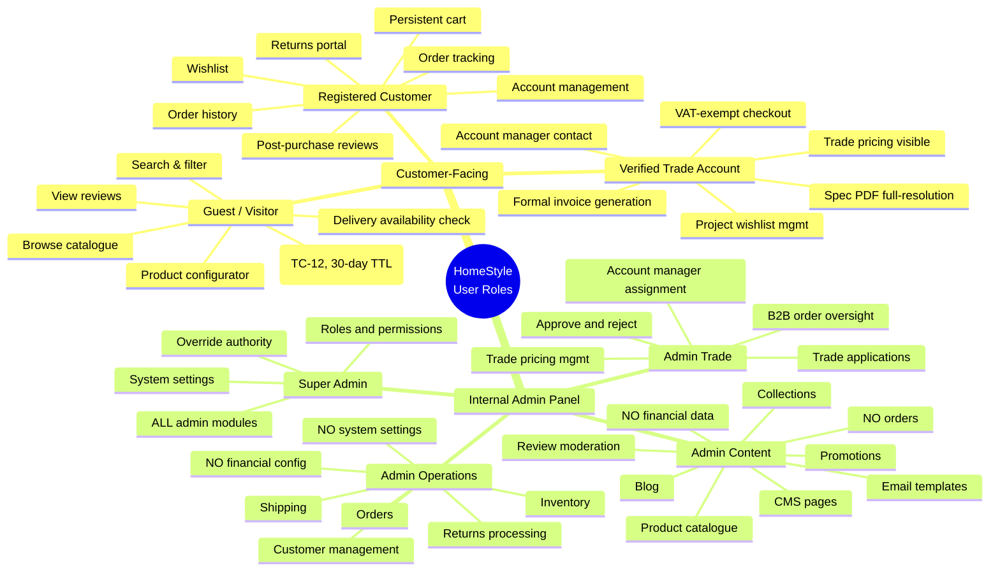

# HomeStyle — User Roles: Mindmap & Use Case Diagram

```
Document Type:   Supporting BA Artefact (Role Model)
Version:         1.0
Status:          Draft
Author:          BA Team
Last Updated:    2026-05-12
Stakeholders:    Product Owner, Tech Lead, Security, QA, Customer Success
Related Refs:    BRD §7 User Roles, BR-001..BR-013, F_09.* (Admin specs), F_10.* (Trade specs)
```

---

## 1. Purpose

HomeStyle has **seven** distinct roles spanning two very different concerns:

- **Customer-facing roles** (storefront) — Guest, Registered Customer, Verified Trade Account
- **Internal roles** (admin panel) — Admin — Operations, Admin — Content, Admin — Trade, Super Admin

A single permission table cannot make this clear to stakeholders, so this document provides two complementary views:

1. A **Mermaid mindmap** for at-a-glance role boundaries and capability grouping (stakeholder view).
2. A **PlantUML use case diagram** for actor → system interactions, including role generalization (engineering view).

The full role × resource permission matrix lives in `HomeStyle_Permission_Matrix.xlsx`.

---

## 2. Role Inheritance Principle

Customer-facing roles are **strictly additive**: each higher role inherits everything from the role below it.

```
Guest  ⊂  Registered Customer  ⊂  Verified Trade Account
```

Internal admin roles are **scope-restricted**, not additive: Ops, Content, and Trade each see only their own module set. **Super Admin** is the only internal role that holds the union of all admin capabilities plus roles & permissions and system settings.

```
{ Ops Capabilities } ∪ { Content Capabilities } ∪ { Trade Capabilities } ∪ { System Admin }  ⊂  Super Admin
```

> Reinforces BR-003, BR-009, BR-010, BR-011.

---

## 3. Mindmap — Big Picture of Roles

> Renders in any Mermaid-capable viewer (GitHub, Notion, VS Code with Mermaid extension, Mermaid Live Editor).



---

## 4. Role-by-Role Capability Card

### 4.1 Customer-Facing

| Role | Auth | Inherits From | Adds |
|------|------|---------------|------|
| Guest / Visitor | Session token (TC-12, 30-day TTL) | — | Browse, configurator, delivery check, reviews, session cart |
| Registered Customer | JWT | Guest | Persistent cart, order history, tracking, wishlist, returns portal, reviews, account mgmt |
| Verified Trade Account | JWT + B2B verification | Registered Customer | Trade pricing, VAT-exempt checkout, project wishlist, spec PDF (full-res), account mgr contact, formal invoice |

### 4.2 Internal Admin

| Role | Scope | Has | Explicitly Denied |
|------|-------|-----|-------------------|
| Admin — Operations | Order fulfillment & customer ops | Orders, Inventory, Shipping, Returns, Customers | Financial config, System settings (BR-009) |
| Admin — Content | Catalogue & marketing content | Catalogue, Collections, CMS, Blog, Emails, Promotions, Review moderation | Orders, Financial data (BR-010) |
| Admin — Trade | B2B portal lifecycle | Trade applications (approve/reject), Trade pricing, Account mgr assignment, B2B order oversight | Catalogue editing, CMS, Customer financial config |
| Super Admin | Entire platform | All of the above + Roles & permissions + System settings | — (only role allowed to modify roles & permissions, BR-011) |

---

## 5. UML Use Case Diagram

> PlantUML source. Render via [PlantUML Online](https://www.plantuml.com/plantuml/uml/) or `plantuml` CLI.

```plantuml
@startuml HomeStyle_User_Roles_UseCase
title HomeStyle — User Roles Use Case Diagram
left to right direction
skinparam packageStyle rectangle
skinparam actorStyle awesome

' ============ ACTORS ============
actor "Guest / Visitor"           as Guest
actor "Registered Customer"       as Customer
actor "Verified Trade Account"    as Trade
actor "Admin — Operations"        as Ops
actor "Admin — Content"           as Content
actor "Admin — Trade"             as TradeAdmin
actor "Super Admin"               as Super

' ============ GENERALIZATION ============
' Customer-facing roles are additive (inherit)
Customer  --|> Guest
Trade     --|> Customer

' Super Admin holds the union of admin scopes
Super     --|> Ops
Super     --|> Content
Super     --|> TradeAdmin

' ============ STOREFRONT USE CASES ============
rectangle "HomeStyle Storefront (B2C / B2B)" {
  usecase "Browse catalogue"             as UC_Browse
  usecase "Use product configurator"     as UC_Config
  usecase "Check delivery availability"  as UC_Delivery
  usecase "View reviews"                 as UC_ReadRev
  usecase "Manage session cart"          as UC_SessCart

  usecase "Manage persistent cart"       as UC_PerCart
  usecase "Place order"                  as UC_Order
  usecase "View order history"           as UC_History
  usecase "Track order"                  as UC_Track
  usecase "Submit return"                as UC_Return
  usecase "Post review"                  as UC_PostRev
  usecase "Manage wishlist"              as UC_Wish
  usecase "Manage account"               as UC_Account

  usecase "View trade pricing"           as UC_TradePx
  usecase "VAT-exempt checkout"          as UC_VAT
  usecase "Manage project wishlist"      as UC_ProjWish
  usecase "Download spec PDF (full-res)" as UC_Spec
  usecase "Contact account manager"      as UC_AcctMgr
  usecase "Generate formal invoice"      as UC_Invoice
}

' ============ ADMIN PANEL USE CASES ============
rectangle "Admin Panel" {
  ' Operations
  usecase "Manage orders"                as A_Orders
  usecase "Manage inventory"             as A_Inv
  usecase "Configure shipping"           as A_Ship
  usecase "Process returns"              as A_Returns
  usecase "Manage customers"             as A_Customers

  ' Content
  usecase "Manage product catalogue"     as A_Catalog
  usecase "Manage collections"           as A_Coll
  usecase "Manage CMS pages"             as A_CMS
  usecase "Manage blog"                  as A_Blog
  usecase "Manage email templates"       as A_Email
  usecase "Manage promotions"            as A_Promo
  usecase "Moderate reviews"             as A_ModRev

  ' Trade
  usecase "Approve / reject trade application" as A_TradeApp
  usecase "Manage trade pricing tiers"   as A_TradePxMgmt
  usecase "Assign account manager"       as A_AssignMgr
  usecase "Oversee B2B orders"           as A_B2B

  ' Super Admin only
  usecase "Manage roles & permissions"   as A_Roles
  usecase "Configure system settings"    as A_Sys
  usecase "Manage financial configuration" as A_Fin
}

' ============ ASSOCIATIONS ============
' Guest (inherited by Customer & Trade)
Guest --> UC_Browse
Guest --> UC_Config
Guest --> UC_Delivery
Guest --> UC_ReadRev
Guest --> UC_SessCart

' Registered Customer (inherited by Trade)
Customer --> UC_PerCart
Customer --> UC_Order
Customer --> UC_History
Customer --> UC_Track
Customer --> UC_Return
Customer --> UC_PostRev
Customer --> UC_Wish
Customer --> UC_Account

' Verified Trade Account
Trade --> UC_TradePx
Trade --> UC_VAT
Trade --> UC_ProjWish
Trade --> UC_Spec
Trade --> UC_AcctMgr
Trade --> UC_Invoice

' Admin — Operations
Ops --> A_Orders
Ops --> A_Inv
Ops --> A_Ship
Ops --> A_Returns
Ops --> A_Customers

' Admin — Content
Content --> A_Catalog
Content --> A_Coll
Content --> A_CMS
Content --> A_Blog
Content --> A_Email
Content --> A_Promo
Content --> A_ModRev

' Admin — Trade
TradeAdmin --> A_TradeApp
TradeAdmin --> A_TradePxMgmt
TradeAdmin --> A_AssignMgr
TradeAdmin --> A_B2B

' Super Admin — exclusive use cases
Super --> A_Roles
Super --> A_Sys
Super --> A_Fin

' ============ NOTES ============
note right of Trade
  Inherits all Customer use cases.
  Trade pricing replaces standard pricing
  in product list, PDP, and cart.
  (BR-003, BR-004)
end note

note bottom of Super
  Only role permitted to modify
  roles & permissions (BR-011).
  Inherits Ops + Content + Trade scopes.
end note

note bottom of Ops
  BR-009: No access to financial
  config or system settings.
end note

note bottom of Content
  BR-010: No access to orders
  or financial data.
end note

@enduml
```



---

## 6. How to Read These Diagrams Together

| If you're a... | Look at... | What it tells you |
|----------------|------------|-------------------|
| Product Owner / Stakeholder | Section 3 mindmap | Whether a capability belongs to the right role and is in the right scope bucket |
| Tech Lead / Backend Dev | Section 5 use case + Excel matrix | What endpoints/resources each role needs RBAC rules for |
| QA Lead | Both + Excel matrix detail tab | Negative test cases (e.g., Admin — Content tries `GET /orders` → 403) |
| Security Reviewer | Section 4.2 "Explicitly Denied" + BR-009/010/011 | Cross-role privilege escalation tests |

---

## 7. Assumptions

| # | Assumption |
|---|------------|
| A-01 | Admin role assignment is single-role per user (no user holds Ops + Content simultaneously). Confirm with PO. |
| A-02 | A user with a Verified Trade Account cannot simultaneously hold an Admin role on the same account (separation of duties). |
| A-03 | Super Admin can impersonate other roles for support; impersonation is audit-logged. To be confirmed. |
| A-04 | Trade pricing visibility (BR-003) is enforced at API layer, not only in UI. |
| A-05 | "Manage promotions" sits under Content (per BRD §7), not Trade — even though trade-specific promotions exist. |

---

## 8. Open Questions

| # | Question | Owner |
|---|----------|-------|
| OQ-01 | Should we introduce a `Finance Admin` role separate from Super Admin for refunds > threshold? Current model puts financial config under Super Admin only. | Product Owner |
| OQ-02 | Does Admin — Operations need *read-only* access to financial reports for reconciliation, or is that strictly Super Admin? | Finance + PO |
| OQ-03 | Trade promotions — managed by Admin — Content or Admin — Trade? | PO |
| OQ-04 | Should review moderation be split: Content moderates copy, Ops moderates abuse complaints? | CS + PO |
| OQ-05 | Is there a `Customer Service Agent` sub-role under Operations with reduced scope (e.g., view-only on orders, full on returns)? | CS Lead |
| OQ-06 | GDPR data-erasure execution — which role triggers the workflow? Super Admin only? Or Ops with audit? | DPO + Legal |

---

## 9. Related Artefacts

- `HomeStyle_Permission_Matrix.xlsx` — Module-level and resource-level CRUD/Approve matrix
- `HomeStyle_BRD_v4.md` §7 — Source of role definitions
- `F_09.*` — Admin module feature specs
- `F_10.*` — Trade admin feature specs
