# HomeStyle — Business Requirements Document
**Premium Design Furniture | Custom Web Application | v4.0**

| Field | Value |
|---|---|
| Version | 4.0 |
| Status | Draft — Pending Client Approval |
| Date | April 2026 |
| Build Type | Custom Web Application (Full-Stack) |
| Target Market | United States & Europe |
| Author | Product Owner / BA |
| Classification | Confidential |

> **Change Control:** All post-approval changes must be submitted via a Change Request (CR) form, reviewed by the Project Sponsor, and versioned incrementally.

---

## Table of Contents

1. [Document Revision History](#1-document-revision-history)
2. [Executive Summary & Business Case](#3-executive-summary--business-case)
3. [Business Objectives & Goals](#4-business-objectives--goals)
4. [Platform Decision — Custom Web Application](#5-platform-decision--custom-web-application)
5. [Target Market & User Personas](#6-target-market--user-personas)
6. [User Roles](#7-user-roles)
7. [Project Scope & Phase Roadmap](#8-project-scope--phase-roadmap)
8. [Open Business Decisions](#9-open-business-decisions-pending-client-sign-off)
9. [Client Responsibilities & Deliverables](#10-client-responsibilities--deliverables)
10. [Business Assumptions & Constraints](#11-business-assumptions--constraints)
11. [Key Business Processes](#12-key-business-processes)
12. [Business Capabilities](#13-business-capabilities-high-level-requirements)
13. [System Email & Notification Triggers](#14-system-email--notification-triggers)
14. [Returns & Exchange — Business Rules](#15-returns--exchange--business-rules)
15. [Non-Functional Requirements](#16-non-functional-requirements)
16. [Time Constraints & Validation Rules](#17-time-constraints--validation-rules)
17. [Domain-Specific Considerations](#18-domain-specific-considerations)
18. [Key Performance Indicators](#19-key-performance-indicators-kpis)
19. [Stakeholder Register & RACI](#20-stakeholder-register--raci)
20. [Warranty & Aftercare Specification (Phase 2)](#21-warranty--aftercare-specification-phase-2)
21. [Approvals](#22-approvals)

---

## 1. Document Revision History

| Version | Date | Description | Author |
|---|---|---|---|
| 1.0 | Apr 2026 | Initial Draft | PO / BA |
| 2.0 | Apr 2026 | Full revision: GDPR gaps, Returns flow, Guest Checkout decision, Currency model, Phase roadmap | PO / BA |
| 3.0 | Apr 2026 | Platform changed to custom-built web application. Tech stack section added. | PO / BA |
| 4.0 | Apr 2026 | Domain repositioned to premium design furniture (B2C + B2B trade). Personas, product configuration model, shipping, pricing, and B2B portal scope updated. Time constraints fully integrated (TC-01 to TC-38). | PO / BA |
| 4.1 | May 2026 | Section 13 Business Capabilities expanded from 14 to 53 BCs. Added subsections 13.4–13.11 covering Account & Identity, Trade Portal workflow detail, Notifications, Admin Catalogue / Orders / Security & Reporting, Compliance (GDPR/CCPA), and Platform Integrations. | PO / BA |
| 4.2 | May 2026 | Section 12 expanded with 7 admin processes (12.4–12.10): Order Fulfillment & Dispatch, Made-to-Order Production, Product Catalogue & Configurator Management, Inventory & Stock Replenishment, Review Moderation, GDPR DSAR & Erasure Processing, and SLA Monitoring & Escalation. Each process includes a stage table and a Mermaid BPMN swim-lane diagram. | PO / BA |
| 4.3 | May 2026 | Added Section 21 — Warranty & Aftercare Specification (Phase 2). Full BA spec: B2C + Trade warranty types, coverage rules, registration & claim BPMN flows, resolution matrix, service partner network, paid Extended Warranty plans, BR-W01–W13, TC-W01–W10, BC-54–65, E-13–21, KPIs, and Phase 2 client deliverables. Phase 2 roadmap updated to reference Warranty module. Approvals section renumbered to 22. | PO / BA |
| 4.4 | May 2026 | Senior-BA refactor of catalogue and operations core (per e-commerce domain best practice). Section 18.1 refactored to 5-level catalogue hierarchy (Family → Product → Option Types → SKU → Bundle) with EAV attributes. Section 18.4 refactored to full inventory state machine with Physical/Reserved/ATP layers and Soft/Hard Lock distinction. New 18.5 Order Routing & Allocation, 18.6 WMS, 18.7 DIM Weight, 18.8 Overselling Prevention. New 18.9 consolidated Business Rules (BR-PRD-01..10, BR-INV-01..10, BR-FUL-01..10, BR-WHS-01..10). New processes 12.11 Order Routing, 12.12 Pick Pack Ship, 12.13 Goods Receipt & Putaway (each with BPMN). New capabilities BC-66..87 across 3 new subsections (13.12 Catalogue Hierarchy, 13.13 Inventory & Routing, 13.14 WMS). New TC values TC-INV-01..03, TC-FUL-01..02, TC-WHS-01..05 in Section 17.6. | PO / BA |
| 4.5 | May 2026 | Added Mermaid BPMN swim-lane diagrams to processes 12.1 (Customer Purchase Journey), 12.2 (Trade Account Application & Approval), and 12.3 (Returns & Exchange). All 13 processes in Section 12 now have both a stage table and a BPMN diagram for stakeholder review consistency. | PO / BA |

---

## 3. Executive Summary & Business Case

### 3.1 The Business Opportunity

The global premium furniture market is projected to exceed $50 billion by 2028, driven by a growing consumer segment that demands both superior craftsmanship and a seamless digital purchasing experience. Design-conscious buyers, interior architects, and corporate workspace planners are increasingly researching, configuring, and purchasing premium furniture entirely online — yet most heritage design brands remain anchored in showroom-first, offline operations.

HomeStyle occupies a strong position: an established catalogue of award-winning design pieces, a network of certified trade partners, and deep supplier relationships with European craftmakers. The missing layer is a modern, conversion-optimised digital platform that can serve both discerning end consumers and professional trade buyers at scale.

### 3.2 Why Custom-Built

| Dimension | Platform (e.g. Shopify) | Custom Web Application |
|---|---|---|
| Ownership | Platform-owned; subject to pricing & policy changes | 100% client-owned IP; no vendor lock-in |
| Product Configuration | Limited variant depth (max 3 options); no nested configurator | Unlimited configuration depth for complex design products |
| B2B Trade Portal | Requires third-party apps; limited capability | Native B2B portal with trade pricing, project wishlists, and VAT exemption |
| Data Ownership | Data stored on platform; limited export control | All data owned and controlled by the client |
| Future Roadmap | Phase 2+ features constrained by platform | Phase 2/3 features fully buildable as planned |

### 3.3 Business Impact & ROI Narrative

| Metric | Current State (Offline / Showroom) | Target State (12 Months Post-Launch) |
|---|---|---|
| Revenue Channel | 100% offline / showroom & trade reps | 35–45% from online channel (B2C + B2B) |
| Customer Reach | Local / regional; trade via rep network | Nationwide US + key EU markets; direct trade self-serve |
| Order Processing | Manual (phone / email / showroom) | Fully automated via custom admin panel; trade orders self-served |
| Product Configuration | Configured in showroom with sales rep | Self-serve digital configurator for all variant combinations |
| Customer Data | Fragmented / unstructured across reps | Unified in proprietary database — client-owned |

### 3.4 Proposed Solution

A two-sided custom web application built to serve premium design furniture at scale:

- **Customer Storefront:** SSR web application (Next.js) delivering a premium shopping experience — collection-based navigation, high-fidelity product visualisation, deep product configurator (material, finish, fabric grade, base, size), multi-currency checkout with time-enforced inventory holds, white-glove delivery, order tracking, and a full returns portal.
- **Trade Portal:** A dedicated B2B section of the storefront allowing verified interior designers, architects, and corporate buyers to access trade pricing, project wishlists, specification sheets, and VAT exemption checkout — available from Phase 1 as a core differentiator.
- **Admin & Operations Panel:** Custom-built back-office web application for product catalogue, orders, inventory, shipping, customers, trade account approvals, promotions, content, and reporting — with granular role-based access and configurable SLA timers.
- **REST API Layer:** Versioned RESTful API (`/api/v1/`) serving all applications, with Stripe payment integration, shipping carrier APIs, transactional email service, and time-based background job scheduler.

---

## 4. Business Objectives & Goals

| # | Objective | Success Metric |
|---|---|---|
| BO-01 | Establish a fully owned online sales channel for both B2C and trade buyers | Online channel contributes ≥35% of total revenue within 12 months |
| BO-02 | Reach US and European customers and trade professionals | 8,000 registered customers + 500 verified trade accounts within 6 months |
| BO-03 | Automate order & fulfillment operations | Order processing time reduced by 60% vs. manual baseline; SLA compliance ≥95% |
| BO-04 | Deliver a superior digital experience befitting a premium design brand | CSAT ≥4.7/5; cart abandonment ≤60%; refund resolution ≤12 business days |
| BO-05 | Enable data-driven business decisions | Weekly reports consumed by management via admin dashboard |
| BO-06 | Achieve full legal compliance (GDPR / CCPA) | Zero violations; GDPR erasure processed within 30 days |
| BO-07 | Own all customer and business data outright | All data stored in client-controlled database; zero vendor data lock-in |
| BO-08 | Establish and grow a verified trade community | Trade portal active from launch; trade revenue ≥20% of online channel by Month 12 |

---

## 5. Platform Decision — Custom Web Application

### 5.1 Decision Summary

Following evaluation of available e-commerce platforms, the client has selected a fully custom web application. All functionality will be designed, developed, tested, and deployed as proprietary software. There is no dependency on any e-commerce SaaS platform.

> **DECISION CONFIRMED:** Fully custom-built web application. Final and approved by Project Sponsor. All downstream documents (SRS, API Spec, Architecture Diagram, Database Schema) reflect a custom-build approach.

### 5.2 Recommended Technology Stack

| Layer | Recommended Technology | Rationale |
|---|---|---|
| Frontend (Storefront + Trade Portal) | Next.js (React) + TypeScript | SSR/SSG for SEO; shared component library across B2C and trade views |
| Product Configurator | React + Three.js (r128) or custom SVG | Interactive material/finish selector with real-time visual preview |
| Admin Panel | React + TypeScript (SPA) | Rich interactive UI; role-based routing; trade account approval workflows |
| Backend / API | Node.js + NestJS | JavaScript full-stack consistency; strong ORM support; modular architecture for B2C + B2B logic |
| Database (Primary) | PostgreSQL | ACID compliance; strong relational model for complex product configurations, orders, trade accounts |
| Database (Cache) | Redis | Session storage; cart caching; inventory hold TTL keys; rate limiting |
| File / Image Storage | AWS S3 + CloudFront CDN | Scalable object storage; global CDN for product images, finish swatches, specification PDFs |
| Payment Processing | Stripe (REST API) | Multi-currency; B2B invoicing via Stripe; VAT-exempt checkout for trade accounts |
| Search Engine | Elasticsearch or Algolia | Full-text search with faceted filters across complex product attributes and finish options |
| Tax Calculation | Stripe Tax or TaxJar API | US sales tax by state + EU VAT calculation; VAT exemption flag for verified trade accounts |
| Shipping API | EasyPost or ShipEngine | Multi-carrier; white-glove delivery partners; freight carriers for large items |
| Authentication | JWT + OAuth 2.0 | Stateless API auth; social login; separate trade account verification flow |
| Hosting / Infra | AWS (ECS / RDS / S3 / CloudFront) | Production-grade infrastructure; auto-scaling; managed DB; global CDN |

---

## 6. Target Market & User Personas

### 6.1 Target Market

| Dimension | United States | Europe (EU + UK) |
|---|---|---|
| Currency | USD ($) | EUR (€) and GBP (£) |
| Tax Model | Sales tax added at checkout by state | VAT included in displayed price |
| Data Privacy Law | CCPA (California) | GDPR — full compliance required |
| Payment Methods | Visa, MC, Amex, Apple Pay, Google Pay | Visa, MC, iDEAL (NL), SEPA Direct Debit, Apple Pay |
| B2B Buyers | Interior designers, corporate workspace buyers, architects | Interior architects, contract furniture specifiers, hospitality buyers |

### 6.2 Persona 1 — The Design Enthusiast (Primary B2C, US)

> **Alexandra, 38 — Creative Director, New York, NY**
> Purchase frequency: 1–3×/year | Budget: $2,000–$10,000/order | Channel: Design publications, Instagram, direct referral

- **Goals:** Curate a living space that reflects her design sensibility. Wants to explore material combinations and verify quality before committing to high-value purchases.
- **Pain Points:** Fears receiving a piece that looks different in person. Frustrated by vague lead times on made-to-order items. Expects white-glove delivery as standard, not an upsell.
- **Key Needs:** High-fidelity material swatches, deep product configurator, confirmed lead time at checkout, white-glove delivery, verified reviews from design professionals.

### 6.3 Persona 2 — The Interior Architect (Primary B2B, EU)

> **Pieter, 44 — Interior Architect, Amsterdam, Netherlands**
> Purchase frequency: 8–15 orders/year | Budget: €5,000–€80,000/project | Channel: Trade network, direct relationship

- **Goals:** Specify and order furniture for multiple concurrent client projects. Needs to manage project wishlists, access specification PDFs and CAD files, and order at trade pricing with VAT exemption.
- **Pain Points:** Wastes time managing orders across email and phone. Cannot get VAT-exempt invoices without contacting a rep. Needs reliable lead times to coordinate with construction schedules.
- **Key Needs:** Verified trade account, project wishlist management, trade pricing, VAT-exempt checkout, specification PDF download, account manager contact, reliable lead time display.

### 6.4 Persona 3 — The Corporate Workspace Buyer (B2B, US)

> **Marcus, 51 — Head of Real Estate & Facilities, San Francisco, CA**
> Purchase frequency: 2–4 large projects/year | Budget: $50,000–$500,000/project | Channel: Trade referral, direct outreach

- **Goals:** Furnish new office locations with premium pieces that communicate brand identity. Needs bulk pricing, purchase order support, and delivery coordination across multiple sites.
- **Key Needs:** Trade account, bulk order quoting, PO-based payment option, multi-site delivery coordination, dedicated account manager, formal invoicing.

---

## 7. User Roles

| Role | Description & Permissions |
|---|---|
| Guest / Visitor | Unauthenticated user. Can browse products, search, use product configurator, view product details, check delivery availability, view reviews, and add items to a session-based cart. Guest cart preserved via server-side session token (TC-12: 30-day TTL). |
| Registered Customer | Authenticated via JWT. All guest permissions plus: persistent cart, order history, order tracking, wishlist, returns portal, post-purchase reviews, and account management. |
| Verified Trade Account | Authenticated B2B user (interior designer, architect, corporate buyer). All customer permissions plus: trade pricing visible at product and cart level, VAT-exempt checkout, project wishlist management, specification PDF download (full resolution), account manager contact, formal invoice generation. |
| Super Admin | Full access to all admin panel modules including trade account approval/rejection, user management, product catalogue, orders, inventory, shipping, promotions, reports, CMS, roles & permissions, and system settings. |
| Admin — Operations | Role-based access: orders, inventory, shipping, returns, and customer management. No access to financial configuration or system settings. |
| Admin — Content | Role-based access: product catalogue, collections, CMS pages, blog, email templates, promotions, and review moderation. No access to orders or financial data. |
| Admin — Trade | Role-based access: trade account applications (approve/reject), trade pricing management, account manager assignment, and B2B order oversight. |

---

## 8. Project Scope & Phase Roadmap

### 8.1 Phase Delivery Roadmap

> **SCOPE BOUNDARY:** Features not listed under Phase 1 are explicitly deferred. Any request to include deferred features requires a formal Change Request (CR) and re-estimation.

| Phase | Timeline | Features Included | Status |
|---|---|---|---|
| Phase 1 — MVP | Months 1–6 | Full custom storefront + admin panel, product catalogue, deep product configurator, cart with time-enforced inventory holds, checkout with SLA timers, Stripe payments, multi-currency, trade portal (verified trade accounts, trade pricing, VAT exemption, project wishlists, spec PDF download), order management with SLA tracking, customer accounts (JWT auth), wishlist, ratings & reviews, returns & exchange portal, shipping config, discount codes, CMS pages, GDPR consent, system email notifications, admin dashboard & reports, role-based access. | In Scope |
| Phase 2 — Growth | Months 7–12 | **Warranty & Aftercare module** (see Section 21 for full spec): auto-registration, self-service claim portal, admin review queue with SLA, service partner network, paid Extended Warranty plans, DOA fast-track, trade extended terms. Plus: WebAR / 3D room visualiser, loyalty program, multi-language (DE, FR, IT), AI product recommendations, live chat with trade account managers, CAD file download (DWG/DXF). | Deferred |
| Phase 3 — Scale | Year 2+ | Native mobile app, multi-vendor marketplace, BNPL payments, ERP integration, advanced trade analytics, custom project mood boards. | Future |

### 8.2 Phase 1 — In-Scope: Customer Storefront

- User registration and login (email/password + social OAuth via Google and Facebook)
- Email verification flow and password reset
- Product browsing: collection-based category navigation (by room, by designer, by material, by style)
- Full-text product search with auto-suggest, filters (price, material, finish, size, colour, rating, lead time, availability), and sorting
- Product detail page: multi-image gallery, material/finish swatch selector, dimension table (inches + cm), finish and fabric grade configurator, lead time display, specification PDF download (TC-09: 15-min presigned URL), delivery availability checker, reviews
- Shopping cart: add/remove/update quantity and configuration; session-based guest cart merged on login
- Wishlist: save configured products, share via link, move items to cart
- Guest checkout (pending OD-01)
- Multi-step checkout: address → delivery method selection → payment
- White-glove delivery as default option for all large furniture; standard delivery for accessories
- Lead time confirmed and displayed at checkout for each configured item
- Multi-currency display and checkout (USD / EUR / GBP)
- US sales tax via Stripe Tax / TaxJar; EU VAT-inclusive pricing with VAT breakdown at checkout
- Payment via Stripe: credit/debit cards, Apple Pay, Google Pay, iDEAL (NL), SEPA Direct Debit (EU)
- Discount code input at checkout
- Order confirmation page and confirmation email
- Order history and order detail view with lead time status
- Real-time shipment tracking via carrier tracking link
- Returns & exchange request portal
- Post-purchase product reviews (one per customer per product, post-delivery unlock)
- GDPR cookie consent banner and preference centre
- CMS-managed pages: About Us, Designer Profiles, FAQ, Delivery Info, Returns Policy, Privacy Policy, Terms & Conditions

### 8.3 Phase 1 — In-Scope: Trade Portal

- Trade account application form (company name, profession, tax/VAT registration number, portfolio URL)
- Admin-reviewed trade account approval workflow (TC-TRA-01: review within 2 business days)
- Trade pricing displayed at product and cart level once authenticated as verified trade account
- VAT-exempt checkout flow for verified EU trade accounts with valid VAT registration
- Project wishlist: named wishlists per project, shareable with clients, moveable to cart
- Specification PDF download: full-resolution PDFs including technical drawings, material specifications, and finish options
- Formal invoice generation with company name, VAT number, and purchase order reference
- Account manager contact details visible in trade account dashboard

### 8.4 Phase 1 — In-Scope: Admin Panel

- Secure admin login with mandatory 2FA (TOTP)
- Dashboard: real-time KPI cards (today's revenue, order count, new customers, low-stock alerts, pending trade applications), sales trend chart
- Product management: full CRUD, multi-image upload to S3, configurator option management (materials, finishes, fabric grades, base options), per-currency pricing, lead time per configuration, stock levels, specification PDF upload
- Trade account management: review applications, approve/reject with reason, assign account manager, manage trade pricing tiers
- Order management: list/search/filter, status updates, lead time tracking, shipment creation, packing slip print, invoice download
- Returns management: view requests, approve/reject, issue Stripe refund, track return status
- Customer management: view/search, order history, activate/deactivate, trade account status
- Promotions: discount code CRUD — percentage and fixed, trade-only codes, usage limits, expiry
- Shipping configuration: zones, flat-rate and weight-based rates, white-glove partner management
- Review moderation: approve, reject, flag, or respond to reviews before storefront publication
- Reports: revenue by date range/product/category, trade vs consumer split, top-selling configurations — exportable to PDF and Excel

### 8.5 Out of Scope — Phase 1

- WebAR / 3D room placement (Phase 2)
- CAD file download — DWG/DXF (Phase 2)
- Multi-language storefront — German, French, Italian (Phase 2)
- Loyalty / rewards program (Phase 2)
- Native iOS / Android mobile app (Phase 3)
- ERP / accounting software integration (Phase 3)
- Custom project mood boards (Phase 3)

---

## 9. Open Business Decisions (Pending Client Sign-Off)

> **ACTION REQUIRED:** All items below must be confirmed by the client within 2 weeks of BRD approval. Unresolved decisions will block SRS sign-off.

| # | Decision | Options | Dev Impact | Owner |
|---|---|---|---|---|
| OD-01 | Guest Checkout | A) Allow checkout without account / B) Require registration before checkout | Option A: guest order model in DB; session cart merge logic required | Business Owner |
| OD-02 | Currency / Exchange Rate Model | A) Live rates via Fixer.io API (auto-converted) / B) Admin manually sets fixed prices per currency | Option A: scheduled rate-sync job required | Biz Owner + Finance |
| OD-03 | Made-to-Order Pre-Order Handling | A) Allow pre-orders with confirmed lead time shown / B) Show 'Out of Stock / Contact Us' only | Option A: pre-order inventory state + lead time queue required | Business Owner |
| OD-04 | Discount Code Stacking | A) One code per order only / B) Codes can stack with sale prices / C) Codes cannot stack with sale prices | Determines promotion engine logic; Option B most complex | Biz Owner + Marketing |
| OD-05 | Trade Account Pricing Model | A) Single trade tier (fixed % discount) / B) Multiple tiers (designer / architect / corporate) with different discounts | Option B: pricing tier table + tier assignment logic required | Biz Owner + Finance |
| OD-06 | VAT Exemption Verification | A) Self-declared VAT number (admin verified manually) / B) Automated VAT number validation via EU VIES API | Option B: VIES API integration required at trade account application | Biz Owner + Legal |
| OD-07 | Return Window Duration | Confirm exact return eligibility window (default: 30 days from delivery — TC-19) | Affects server-side eligibility calculation and all customer-facing return messaging | Biz Owner + Legal |
| OD-08 | Made-to-Order Return Policy | A) No returns on configured / made-to-order items / B) Exchange or store credit only / C) Standard 30-day policy applies | Determines return eligibility logic per order type | Biz Owner + Legal |
| OD-09 | Lead Time Display | A) Show range (e.g. '8–12 weeks') from product DB / B) Real-time lead time via supplier API / C) 'Contact us for lead time' for bespoke items | Option B: supplier API integration per product category required | Biz Owner + Ops |
| OD-10 | Admin-Configurable Time Values | Confirm which TC values are hard-coded vs. configurable via System Settings panel | Configurable values require a System Settings module in admin panel | Biz Owner + Dev Lead |

---

## 10. Client Responsibilities & Deliverables

| # | Deliverable | Specification | Required By |
|---|---|---|---|
| CR-01 | Product Photography | Min. 8 high-res images per product (all angles, lifestyle, detail shots). Minimum 3000×3000px, JPEG/WebP. Material swatch photography per finish option. | Month 2 |
| CR-02 | Finish & Material Swatch Images | High-resolution swatch images per material and finish option (min. 500×500px, on white background). Required for product configurator. | Month 2 |
| CR-03 | Specification PDFs | One technical PDF per product model: dimensions (mm + inches), material spec, finish options, weight, assembly instructions. Filename matching SKU code. | Month 3 |
| CR-04 | Product Data CSV | Full catalogue: product name, designer credit, description, SKU, price per currency, dimensions, weight, materials, configuration options, lead times per configuration, stock qty. | Month 1 |
| CR-05 | Stripe Account | Active Stripe account with identity verification. Client provides restricted API keys to dev team. | Month 2 |
| CR-06 | Cloud Hosting Account | AWS account created and dev team granted programmatic access. S3 buckets, RDS instance, and domain configured. | Week 2 |
| CR-07 | Lead Time Data | Confirmed lead time ranges per product/configuration from supplier agreements. Required for checkout lead time display (OD-09). | Month 2 |
| CR-08 | Trade Account Criteria | Defined criteria for trade account eligibility (profession types, required documentation, pricing tier assignment rules per OD-05). | Month 2 |
| CR-09 | Legal Documents | Privacy Policy, T&Cs, Returns Policy, Trade Account T&Cs, Cookie Policy — drafted and approved by Legal before launch. | Month 4 |
| CR-10 | EU VAT & US Tax Config | VAT registration numbers per EU country. List of US states with sales tax nexus. | Month 2 |
| CR-11 | Shipping & White-Glove Partners | Active carrier accounts + white-glove delivery partner details with service zones and API credentials. | Month 3 |
| CR-12 | Brand Guidelines | Logo (SVG + PNG), brand colours, typography, visual identity standards, photography style guide. | Week 2 |
| CR-13 | Designer Credits & IP Rights | Confirmation of rights to display designer names and biographies on product pages and designer collection pages. | Month 2 |

---

## 11. Business Assumptions & Constraints

### 11.1 Assumptions

- Physical warehouse, inventory management, and supplier relationships are pre-established and operational before launch.
- Products are managed with unique SKU codes that incorporate configuration variant codes (e.g. `HS-CHAIR-001-WAL-BLK` for walnut base, black fabric).
- Primary language of the platform is English for all Phase 1 markets.
- Stripe handles PCI DSS compliance for all card payment processing.
- AWS will be used as the primary cloud infrastructure provider.
- Lead times for made-to-order items are confirmed by operations and stored in the product DB at launch.
- Trade account verification is a manual admin process in Phase 1 (no automated VIES API unless OD-06 confirmed).
- All time constraint default values in Section 17 are working defaults pending client confirmation per OD-10.

### 11.2 Constraints

- **Timeline:** Phase 1 (MVP) launch target is 6 months from project kickoff.
- **Compliance:** GDPR and CCPA compliance are non-negotiable prerequisites for EU and California customer data processing.
- **Security:** PCI DSS compliance mandatory. No card data stored on application servers. Admin 2FA mandatory.
- **Accessibility:** WCAG 2.1 Level AA required across all customer-facing pages.
- **API Design:** REST API versioned from day one (`/api/v1/`) for future mobile app and third-party integrations.

### 11.3 Risk Register

| Risk | Likelihood | Impact | Mitigation Strategy | Owner |
|---|---|---|---|---|
| Scope creep delaying Phase 1 MVP | High | High | Formal CR process; all new requests go to Phase 2 backlog. | PO / BA |
| Client delays providing product assets (swatches, spec PDFs, lead time data) | High | High | Hard deadlines in Section 10; block dependent sprints until assets confirmed. | PO / BA |
| Made-to-order lead time data inaccurate at launch | Medium | High | CR-07 hard deadline; ops team sign-off on lead times before go-live. | Ops Team |
| Trade account verification volume exceeds admin capacity | Medium | Medium | TC-TRA-01: 2-day SLA; auto-escalation to Super Admin. Batch approval UI for admin. | Admin — Trade |
| Inventory oversell during high-traffic checkout | Medium | High | TC-13: Redis TTL inventory hold enforced server-side. Load tested pre-launch. | Dev Lead |
| GDPR non-compliance (EU storefront) | Low | Critical | Legal review of cookie consent, privacy policy, social login legal basis before EU launch. | Legal |
| Data breach or payment security incident | Low | Critical | PCI DSS via Stripe; TLS 1.3; no card data server-side; TC-03/TC-11 admin security. | Dev Lead |

---

## 12. Key Business Processes

### 12.1 Customer Purchase Journey (To-Be — with Timer Events)

| # | Stage | Process Detail + Time Constraints |
|---|---|---|
| 1 | Discovery | Customer arrives via organic search, paid ad, design publication, or trade referral. Next.js serves SSR product/collection pages for SEO. |
| 2 | Product Evaluation | Views product detail page: high-fidelity images, material/finish swatch selector, dimension table, lead time for selected configuration, specification PDF (TC-09: 15-min presigned URL), delivery checker, verified reviews. |
| 3 | Product Configuration | Customer selects material, finish, fabric grade, base type, and size. System updates price, lead time, and stock availability in real time per configuration. Configured item added to cart or wishlist. |
| 4 | Cart & Authentication | Item added to cart. Guest cart: Redis session (TC-12: 30-day TTL). Registered: persisted in DB. Cart is NOT an inventory reservation at this stage. |
| 5 | Checkout — Address [TC-13 starts] | On checkout page load: system creates `inventory_hold` in Redis (TC-13: 15-min TTL). Countdown shown at ≤5 minutes. Lead time per configured item displayed and locked. |
| 6 | Checkout — Payment [TC-14: 30-min hard expiry] | Stripe PaymentIntent created server-side. Customer enters payment via Stripe Elements. Discount code re-validated server-side. Tax calculated. TC-15: 30-second Stripe API timeout. TC-16: idempotency key prevents duplicate charges. |
| 7 | Order Confirmation | Payment confirmed via webhook. Order record created. Inventory decremented. Cart cleared. Confirmation email dispatched with confirmed lead time (TC-29: retry policy). |
| 8 | Fulfillment [TC-17: 4-hr SLA] | Admin confirms order. For in-stock items: proceed to packing. For made-to-order: order placed with supplier; lead time clock starts. |
| 9 | Dispatch [TC-18: 48-hr SLA for in-stock] | Admin enters shipment details. White-glove delivery partner notified. Shipping confirmation email sent with tracking link. For made-to-order: dispatch SLA starts from confirmed production completion. |
| 10 | Post-Purchase | Order status: Delivered. TC-24: 7 days later, review prompt sent. TC-19: Return portal available for 30 days (standard items). Made-to-order return eligibility per OD-08. |

**BPMN — Customer Purchase Journey:**

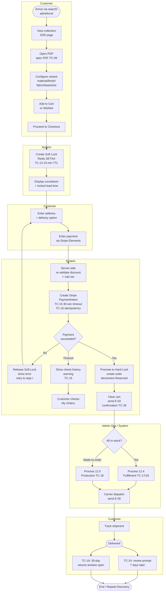

### 12.2 Trade Account Application & Approval Process

- Prospective trade buyer submits application: company name, profession type, tax/VAT registration number, portfolio or company website URL, intended use.
- System creates trade application record with status `pending_review`. Admin — Trade receives dashboard alert and email.
- **TC-TRA-01:** Admin must review within 2 business days. SLA breach triggers Super Admin escalation.
- If approved: trade account activated. Welcome email sent with trade pricing access and portal onboarding guide.
- If rejected: rejection email with reason. Customer can re-apply with additional documentation.
- Verified trade accounts see trade pricing on all product pages and in cart immediately on next login.

**BPMN — Trade Account Application & Approval:**

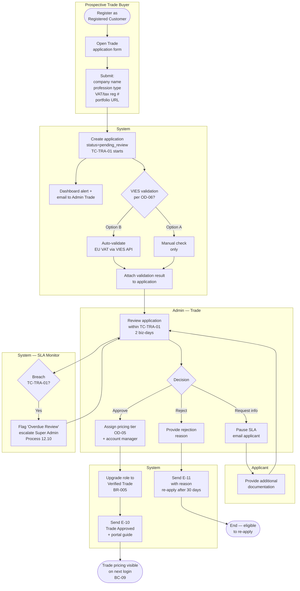

### 12.3 Returns & Exchange Process (with Timer Events)

- Customer navigates to 'My Orders'. 'Request Return' button visible only if within TC-19: 30-day window from delivery (server-side validated, not just UI-gated). Made-to-order items subject to OD-08 policy.
- Customer selects return reason and uploads photos. Eligibility re-validated server-side at submission.
- Admin receives dashboard alert. **TC-21:** Admin must review within 2 business days.
- If approved: admin sends return label or schedules white-glove pickup. **TC-20:** Customer must arrange return within 14 days of approval.
- Admin confirms receipt and inspects condition. **TC-22:** Admin must initiate Stripe refund within 1 business day of marking 'Item Received'.
- **TC-30:** If `refund.succeeded` webhook not received within 24 hours, admin alert triggered.
- **TC-23:** Total resolution target ≤12 business days from request to refund completed.

**BPMN — Returns & Exchange:**

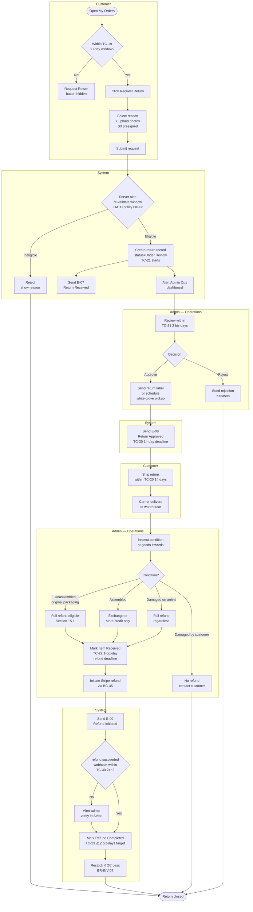

### 12.4 Order Fulfillment & Dispatch (Admin Process)

> **Actor:** Admin — Operations (Super Admin oversight). **Trigger:** Stripe `payment_intent.succeeded` webhook → order status `Paid`.

| # | Stage | Process Detail + Time Constraints |
|---|---|---|
| 1 | New Order Arrives | Order lands in admin queue with status `Paid`. **TC-17 starts** (4 biz-hr confirmation SLA). Dashboard counter increments. |
| 2 | Order Review & Confirmation | Admin Ops opens order, validates configuration, address, lead time. Clicks **Confirm**. System dispatches E-04 (Order Confirmed). |
| 3 | Routing Decision | If all items In Stock → Pick & Pack (step 4). If any item is Made-to-Order → Production queue (Process 12.5). |
| 4 | Pick, Pack & Quality Check | Warehouse picks items per packing slip; inspects condition; prepares packaging suitable for white-glove or parcel. |
| 5 | Carrier Booking | Admin generates shipping label via carrier API (EasyPost / ShipEngine). For large items: notify white-glove partner with delivery window. **TC-18 deadline**: 48 biz-hrs from confirmation. |
| 6 | Mark as Shipped | Admin updates status `Shipped`; tracking number recorded; E-05 (Shipping Confirmation with carrier link & white-glove window) dispatched immediately. |
| 7 | Delivery Confirmation | Carrier delivery webhook OR admin manual mark → status `Delivered`. Triggers BullMQ job for 7-day review prompt (TC-24, E-06). |
| 8 | Returns Window Opens | TC-19 30-day return window starts from delivery confirmation. Order eligible for Returns Portal (Process 12.3). |

**BPMN — Order Fulfillment & Dispatch:**

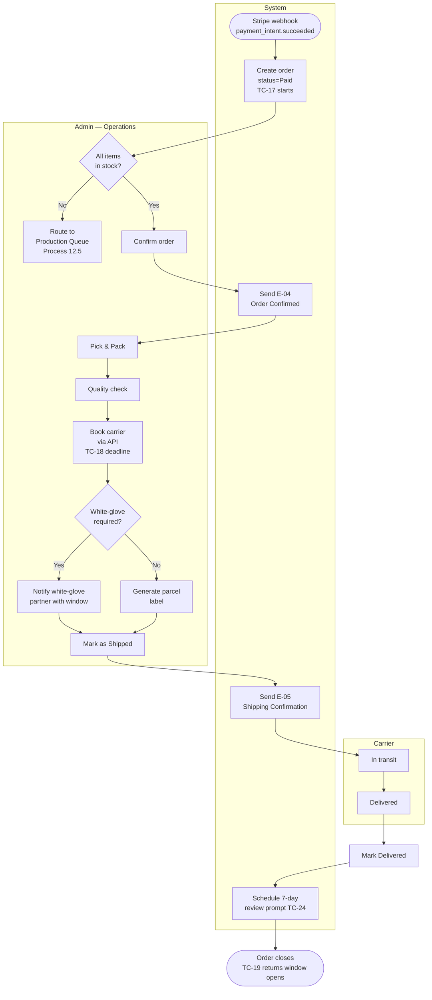

### 12.5 Made-to-Order Production Tracking (Admin Process)

> **Actor:** Admin — Operations + Supplier (external). **Trigger:** Order confirmed containing at least one made-to-order configuration. Per **OD-03** Option A.

| # | Stage | Process Detail + Time Constraints |
|---|---|---|
| 1 | Route to Production | After admin confirms order (Process 12.4 step 3), made-to-order line items routed to Production module. Lead time clock starts from order date. |
| 2 | Supplier PO Placement | Admin Ops generates supplier purchase order (manual export to supplier system or email). PO reference linked to HomeStyle order. |
| 3 | Production In Progress | Status `In Production` displayed in customer Order Tracking. Lead time visible per item (per OD-03 / OD-09). |
| 4 | Production Status Updates | Admin updates intermediate states: `Materials Ordered` → `In Build` → `Finishing` → `Quality Check`. Optional but improves customer trust. |
| 5 | Production Complete | Admin marks `Ready for Dispatch`. **TC-18 dispatch SLA begins** (48 biz-hrs) — not from order date. |
| 6 | Hand-off to Dispatch | Item enters standard fulfillment flow at Process 12.4 step 4 (Pick & Pack). |
| 7 | Lead Time Breach Path | If actual production exceeds confirmed lead time: system flags overdue; admin notifies customer; eligibility for OD-08 return policy revisited. |

**BPMN — Made-to-Order Production:**

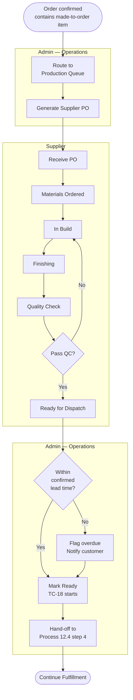

### 12.6 Product Catalogue & Configurator Management (Admin Process)

> **Actor:** Admin — Content (Super Admin gate optional). **Trigger:** New product launch, catalogue refresh, or supplier-driven configuration change.

| # | Stage | Process Detail |
|---|---|---|
| 1 | Draft Product Record | Admin creates product shell: name, designer credit, category, collection assignments. Status `Draft` — not searchable, not purchasable. |
| 2 | Media Upload | Multi-image upload to S3 (min. 8 images per CR-01). Material swatches per CR-02. Specification PDF per CR-03 (filename = SKU). |
| 3 | Configurator Build | Admin defines variant dimensions: materials, finishes, fabric grades, base, size. System auto-generates SKU variants. Out-of-production options flagged at configurator level (per Section 18.1). |
| 4 | Pricing & Lead Time | Admin sets per-currency price (USD/EUR/GBP) per SKU variant. Sets lead time per configuration (e.g. fabric A: 6–8 weeks; fabric B: 12–16 weeks). |
| 5 | Stock & Trade Pricing | Admin Ops sets initial stock_qty per SKU. Admin Trade sets trade pricing tier per OD-05. Trade prices never exposed to non-trade roles (BR-003). |
| 6 | Designer Credits & SEO | Admin Content adds designer biography, structured data (JSON-LD), meta description, OG image. |
| 7 | Publish | Admin moves status `Draft` → `Active`. Search index synced within 60 seconds (per BC-02). Product visible on storefront. |
| 8 | Archive / Discontinue | Admin sets `is_archived = true`. Product page returns 301 redirect to parent collection immediately. Not purchasable or searchable. |

**BPMN — Product Catalogue Management:**

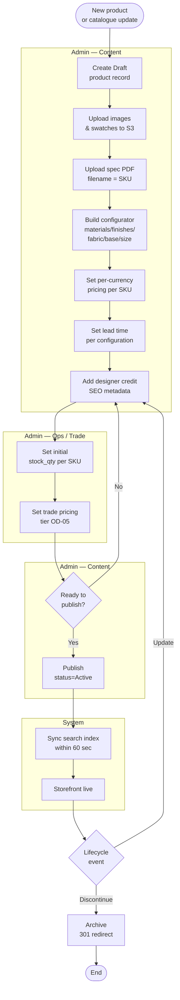

### 12.7 Inventory & Stock Replenishment (Admin Process)

> **Actor:** Admin — Operations + System (auto-alerts). **Trigger:** Stock adjustment, supplier delivery, scheduled audit, or low-stock threshold breach.

| # | Stage | Process Detail + Time Constraints |
|---|---|---|
| 1 | Continuous Monitoring | System monitors `stock_qty` vs `low_stock_threshold` per SKU configuration. |
| 2 | Low-Stock Alert | When `stock_qty ≤ threshold` → admin alert with **TC-27: 24-hr cooldown** per product (prevents alert flood). PDP shows 'Only X left'. |
| 3 | Stock Adjustment | Admin Ops adjusts `stock_qty`: supplier delivery received, returned item re-stocked, inventory audit correction. All adjustments audit-logged (BC-40). |
| 4 | Back-in-Stock Trigger | If `stock_qty` transitions `0 → positive` and `is_archived = false`: queue back-in-stock notification job. |
| 5 | Notify Customers | **TC-28: BullMQ hourly job** sends E-12 to all customers with this SKU on 'Notify Me' list. One notification per restock event. List cleared after send. |
| 6 | State Transition Sync | Product state (In Stock / Low Stock / OOS / Made-to-Order) synced to PDP, configurator, search index. |
| 7 | Discontinue Flow | Admin sets `is_archived = true`. Active wishlist holders notified once. Product 301-redirects to parent collection. |

**BPMN — Inventory & Stock Replenishment:**

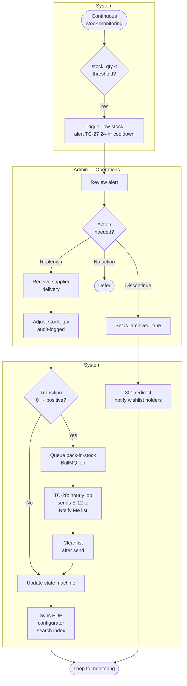

### 12.8 Review Moderation (Admin Process)

> **Actor:** Admin — Content (Super Admin escalation). **Trigger:** Customer submits review post-delivery via E-06 prompt link.

| # | Stage | Process Detail + Time Constraints |
|---|---|---|
| 1 | Customer Submits Review | Authenticated customer with completed order submits star rating + text + optional photo (verified one-per-product-per-customer post-delivery). Review enters queue with status `Pending`. |
| 2 | Queue Aging | **TC-26: 48-hr moderation SLA.** Reviews not actioned within 48h flagged red on Admin Content dashboard. |
| 3 | Moderation Decision | Admin Content reviews: **Approve** / **Reject** (with reason) / **Flag** / **Respond** (publishes official reply). |
| 4 | Auto-Approval Fallback | If no action within 72h: system auto-approves (per TC-26 default). Audit log records auto-approval. |
| 5 | Flagged Review Escalation | If flagged for IP/legal/abuse concerns: escalated to Super Admin queue. Hidden from storefront pending decision. |
| 6 | Publication | Approved reviews appear on PDP within 60 seconds. Average product rating recalculated. |
| 7 | Submission Window Closes | **TC-25: 180-day** window. 'Write a Review' option hidden after 180 days from delivery. |

**BPMN — Review Moderation:**

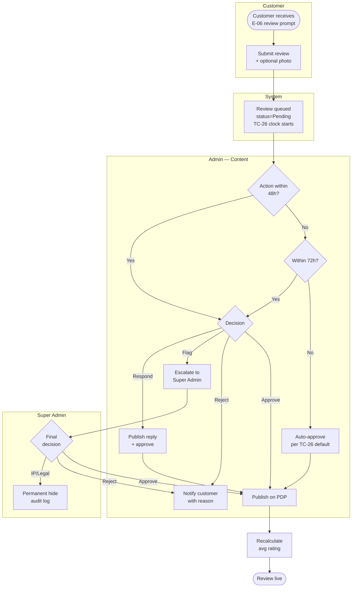

### 12.9 GDPR DSAR & Erasure Processing (Admin Process)

> **Actor:** Customer (initiator), Admin — Compliance / Super Admin, System. **Trigger:** Customer submits DSAR or erasure request via 'My Account → Privacy' or support email.

| # | Stage | Process Detail + Time Constraints |
|---|---|---|
| 1 | Request Submission | Customer submits via 'My Account → Privacy' or written support request. Request type: **Right of Access (DSAR)** or **Right to Erasure**. System creates request record with status `Pending Verification`. |
| 2 | Identity Verification | Admin verifies requestor identity (email confirmation link + last-order check). Prevents impersonation attacks. |
| 3 | DSAR — Data Export | If Right of Access: trigger export job → personal data + order history packaged as JSON/CSV. Fulfilled **within 30 days**. Encrypted download link sent (24-hr presigned). |
| 4 | Erasure — Eligibility Check | If Right to Erasure: confirm no open orders / unresolved returns. Financial records subject to TC-32 retention (7 years) — PII anonymised, not deleted. |
| 5 | Execute Erasure | **TC-34: within 30 days.** Erasure job anonymises PII fields (name, email, address, phone) in customer & order tables. Marketing consent / preferences purged. Account deactivated. |
| 6 | Backup Purge | **TC-35: within 90 days.** Scheduled job purges PII from all backups & log archives. |
| 7 | Confirmation | Customer receives confirmation email within 30 days listing what was exported / erased and what was retained (and why — TC-32 financial retention). |
| 8 | Audit Trail | All actions audit-logged (BC-40). Compliance can demonstrate 30-day adherence per regulator request. |

**BPMN — GDPR DSAR & Erasure:**

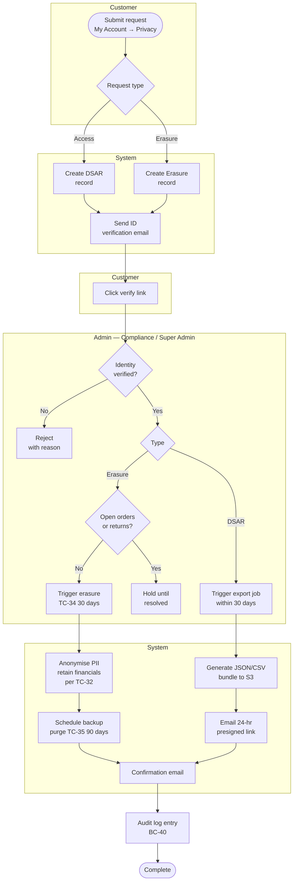

### 12.10 SLA Monitoring & Escalation (Cross-Cutting Process)

> **Actor:** System (continuous monitor), Super Admin (escalation receiver), assigned admin role (action owner). **Trigger:** Continuous evaluation of timed actions against TC thresholds.

| # | Stage | Process Detail + Time Constraints |
|---|---|---|
| 1 | Timer Initialisation | When a tracked event starts (order paid, return submitted, trade application submitted, review queued, refund triggered): system writes timer start timestamp. |
| 2 | Continuous Evaluation | Background BullMQ job evaluates open timers against thresholds (TC-17, TC-18, TC-21, TC-22, TC-26, TC-TRA-01, TC-30) every 5 minutes. |
| 3 | Approaching Threshold | At 75% of SLA window: dashboard badge turns amber for the responsible admin role. No customer-facing impact. |
| 4 | SLA Breach | At 100%: badge turns red. Status flagged 'Overdue'. Auto-email to Super Admin (and responsible admin) listing the breached item. |
| 5 | Escalation | If still unactioned after 1 additional business day: escalation tier 2 (e.g. Operations Manager email). Dashboard counter increments. |
| 6 | KPI Tracking | All breaches recorded for KPI reporting (Section 19): Order Confirmation SLA Compliance, Dispatch SLA Compliance, Trade Application Review SLA. |
| 7 | Stripe Webhook Watch | **TC-30 special case**: if `refund.succeeded` webhook not received within 24h of refund initiation, admin alert to verify in Stripe dashboard manually. |
| 8 | Audit & Reporting | All escalations logged for compliance & operational reviews. Monthly SLA compliance report exported (BC-42). |

**BPMN — SLA Monitoring & Escalation:**

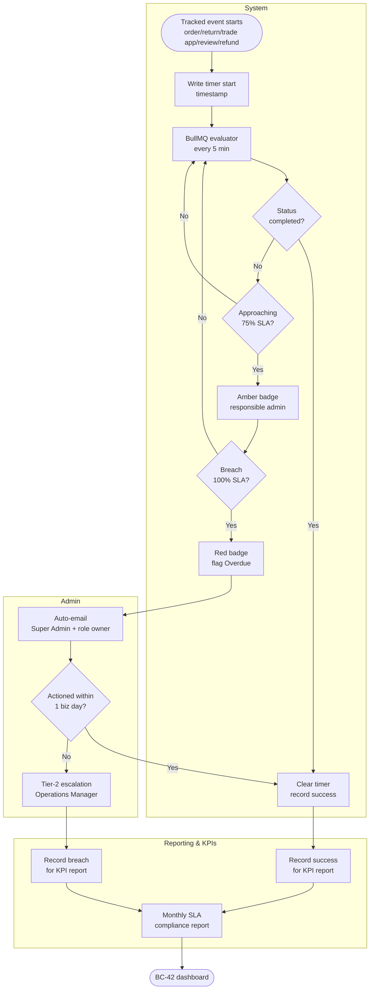

### 12.11 Order Routing & Allocation (System + Admin Process)

> **Actor:** System (routing engine), Admin — Operations (manual override). **Trigger:** Order confirmed (Process 12.4 step 2). Routes order line items to source warehouse(s) and creates allocation records (hard locks).

| # | Stage | Process Detail + Time Constraints |
|---|---|---|
| 1 | Routing Inputs | System reads: order line items, delivery postal code, customer service preference (ship-complete vs ship-when-ready, BR-FUL-06), each SKU's Physical & Reserved across warehouses. |
| 2 | Evaluate Whole-Order Completeness | Priority 1 (BR-FUL-01): identify any single warehouse that can fulfill **all lines**. If found → single-shipment allocation. **TC-FUL-01: routing decision within 30 seconds.** |
| 3 | Multi-Warehouse Decision | If no single warehouse can fulfill: optimise by (a) nearest-to-customer per line, (b) oldest-stock-first as tiebreaker, (c) load balancing as final tiebreaker. |
| 4 | Hard Lock Creation | For each allocation: create `order_allocation` row (BR-INV-04). Physical Stock unchanged at this stage; Reserved increased. Atomic DB transaction prevents concurrent over-allocation. |
| 5 | Shipment Records | Create one Shipment ID per origin warehouse + carrier service class. One Order ID owns N Shipment IDs (BR-FUL-02). |
| 6 | Made-to-Order Routing | Made-to-order lines bypass routing — they go directly to Process 12.5 (Production). Their hard lock is created on `Ready for Dispatch` (Process 12.5 step 5), at which point standard routing runs against the receiving warehouse. |
| 7 | Manual Override Path | Admin Ops can reroute an allocation **before pick** if priorities change (e.g. local warehouse damaged item). Override is audit-logged. After pick, routing is immutable (BR-FUL-10). |
| 8 | Customer Notification | If split shipment determined: E-04 (Order Confirmed) includes per-shipment ETA. Single combined shipping fee retained (BR-FUL-04). |

**BPMN — Order Routing & Allocation:**

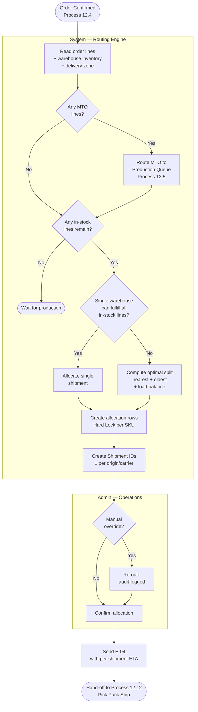

### 12.12 Warehouse Pick, Pack & Ship (Admin Process)

> **Actor:** Admin — Operations (planner), Warehouse Staff (pickers/packers). **Trigger:** Allocation confirmed (Process 12.11 step 8) or made-to-order item marked Ready for Dispatch (Process 12.5).

| # | Stage | Process Detail + Time Constraints |
|---|---|---|
| 1 | Wave Generation | **TC-WHS-01**: every 4 hours (configurable) the WMS aggregates all confirmed parcel allocations into a Wave. White-glove allocations bypass wave logic (BR-FUL-09). |
| 2 | Pick List | System generates a Pick List sorted by aisle/bin sequence — picker walks the shortest path collecting all items for the wave. |
| 3 | Pick & Scan | Picker scans each SKU at the bin. System validates SKU code, wave, and qty. Wrong scan → audible alert; cannot proceed until correct SKU scanned. |
| 4 | Pick Completion | Wave returned to pack zone with a tote per order. Physical Stock NOT yet decremented (still on the cart). |
| 5 | Pack-Verify | At pack station: Scan SKU → Scan Shipping Label → system **must match** (BR-WHS-05). Mismatch blocks the pack. On match: system prints carrier label + packing slip. **Physical Stock decremented atomically; Hard Lock released.** |
| 6 | Dispatch | Packed cartons staged at carrier dock. Carrier scan-out updates Shipment to `Shipped`; E-05 dispatched (Process 12.4 step 6). |
| 7 | Mispick Recovery | If pack-verify fails repeatedly on the same wave: wave paused, Super Admin notified for root-cause check (system data error vs. picker error vs. mis-bin). |
| 8 | Cycle Count Trigger | If a pick attempt fails because bin is empty (but system shows stock): emergency cycle count triggered for that SKU (BR-WHS-07 escalation). |

**BPMN — Warehouse Pick Pack Ship:**

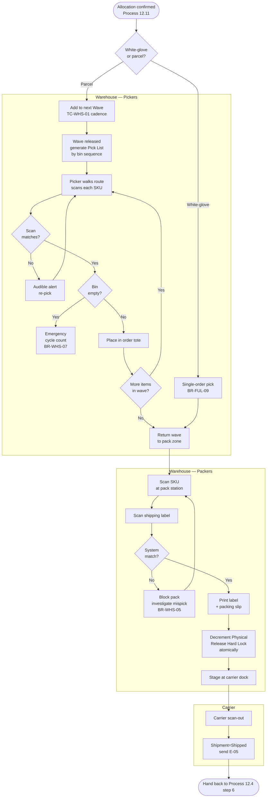

### 12.13 Goods Receipt & Putaway (Admin Process)

> **Actor:** Admin — Operations (Goods Receipt Note creator), Warehouse Staff (inbound team). **Trigger:** Supplier delivery against an open PO, or production batch ready from Process 12.5.

| # | Stage | Process Detail + Time Constraints |
|---|---|---|
| 1 | Pre-Receipt | Admin Ops creates a Goods Receipt Note (GRN) referencing the open Supplier PO or Production PO. **GRN without a referenced PO is blocked** (BR-WHS-01). |
| 2 | Carrier Arrival | Inbound team verifies seal, photographs carton condition. Damaged cartons recorded photographically before unsealing. |
| 3 | Scan-In | Each SKU label barcode-scanned. **TC-WHS-02**: receipt processing target 4 biz-hrs per pallet. System validates against PO line quantity; over/under-receipt flagged. |
| 4 | QC Inspection | Visual + dimensional check; photo upload for damaged units. Rejected units routed to `QC-Hold` virtual location (BR-WHS-03) — does NOT increment Physical Stock until resolved. |
| 5 | Putaway Suggestion | System suggests bin location using zone-routing (BR-WHS-09): heavy → lower racks; fast-mover → near pack station; white-glove → dedicated zone. |
| 6 | Putaway Confirmation | Warehouse staff scan bin barcode at the chosen location. System creates SKU↔bin mapping for future pick. |
| 7 | Stock Update | Physical Stock incremented atomically per SKU. ATP recomputed; if SKU transitioned OOS → InStock, TC-28 back-in-stock notification job queued. |
| 8 | Audit & Reconciliation | GRN closed; variance report generated for Finance (PO qty vs. received qty). All events logged per BR-WHS-08. |

**BPMN — Goods Receipt & Putaway:**

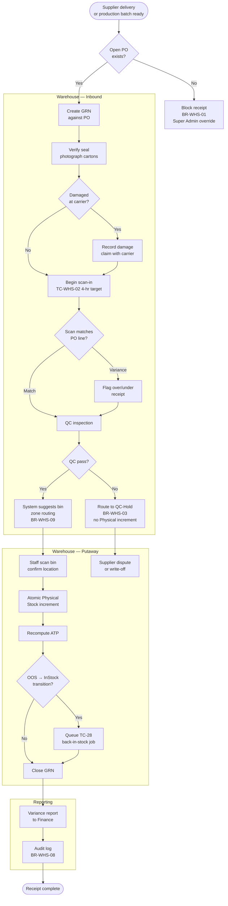

---

## 13. Business Capabilities (High-Level Requirements)

> **COVERAGE NOTE (v4.0):** Section 13 covers all Phase 1 modules: B2C storefront, Trade portal, Admin panel (7 modules), Compliance (GDPR/CCPA), Notifications, CMS, and Platform Integrations. Each capability is traceable to scope (Section 8), TC values (Section 17), and Open Decisions (Section 9).

### 13.1 Product Discovery & Browsing

| ID | Capability | Business Value + Time Constraints | Priority |
|---|---|---|---|
| BC-01 | Collection-based navigation (by room, designer, material, style) | Customers shop by design intent, not just category. Reduces drop-off for design-led buyers. | Critical |
| BC-02 | Full-text search with faceted filters including lead time and finish | Narrows complex catalogue instantly. Search index synced within 60 seconds of product update. | Critical |
| BC-03 | Rich product detail page with configurator | All purchase-decision info in one view. TC-09: Spec PDF via 15-min presigned URL. Lead time updates per configuration. | Critical |
| BC-04 | Delivery availability checker | Reduces checkout abandonment by confirming delivery feasibility (incl. white-glove zones) upfront. | High |
| BC-05 | Designer profile and collection pages | Communicates brand heritage and design provenance — critical for premium positioning. | High |

### 13.2 Purchase Experience

| ID | Capability | Business Value + Time Constraints | Priority |
|---|---|---|---|
| BC-06 | Frictionless checkout with lead time lock | TC-12/TC-13/TC-14/TC-15/TC-16. Lead time for each configured item confirmed and locked at checkout. | Critical |
| BC-07 | Multi-currency checkout (USD / EUR / GBP) | TC-16: 24-hour Stripe idempotency key prevents duplicate charges across currency contexts. | Critical |
| BC-08 | White-glove delivery as primary option | Differentiates HomeStyle at premium positioning; standard for large items, optional for accessories. | Critical |
| BC-09 | Trade portal — pricing, VAT exemption, project wishlists | Direct B2B revenue channel. Trade pricing visible post-authentication. VAT-exempt checkout for eligible accounts. | Critical |
| BC-10 | Discount code application | Server-side re-validation at checkout submission prevents race condition exploits. Trade-only codes supported. | High |

### 13.3 Order, Returns & Post-Purchase

| ID | Capability | Business Value + Time Constraints | Priority |
|---|---|---|---|
| BC-11 | Customer self-service order tracking with lead time status | Reduces support contacts. TC-29: email retry ensures delivery confirmation received. Lead time stage visible in order history. | Critical |
| BC-12 | Refund status visible in customer order view | Eliminates 'where is my refund?' tickets. TC-23: ≤12 business day total resolution target. | Critical |
| BC-13 | Returns & exchange request portal | TC-19: 30-day window enforced server-side. TC-20: 14-day ship-back deadline. TC-21: 2-day admin review SLA. Made-to-order policy per OD-08. | Critical |
| BC-14 | Verified post-purchase review system | TC-24: Prompt sent 7 days post-delivery. TC-25: 180-day submission window. TC-26: 48-hr moderation SLA. | High |

### 13.4 Account, Identity & Personalisation

| ID | Capability | Business Value + Time Constraints | Priority |
|---|---|---|---|
| BC-15 | Customer registration with email verification | Establishes verified customer base. TC-06: 24-hr verification link; max 3 resends/hr. TC-10: 5-fail lockout protects against credential stuffing. | Critical |
| BC-16 | Social OAuth login (Google, Facebook) | Removes signup friction; lifts conversion for first-time buyers. TC-08: 10-min CSRF state token. GDPR lawful-basis recorded at first login. | High |
| BC-17 | Password reset & account recovery | Self-service recovery reduces support tickets. TC-07: 1-hr single-use reset link; previous link invalidated on new request. | Critical |
| BC-18 | Customer wishlist with back-in-stock notifications | Captures intent on OOS items; recovers lost revenue. TC-28: hourly BullMQ job notifies on restock; one notification per restock event. | High |
| BC-19 | Profile, address book & saved payment methods management | Customers manage addresses, communication preferences, and Stripe-vaulted payment methods (token-only, no PAN stored). | High |
| BC-20 | Guest checkout & guest-to-registered cart merge | Per OD-01. Reduces friction for one-time buyers; BR-002: cart merge on login sums quantities up to stock limits without data loss. TC-12: 30-day guest session TTL. | Critical |

### 13.5 Trade Portal — Workflow & B2B Operations

| ID | Capability | Business Value + Time Constraints | Priority |
|---|---|---|---|
| BC-21 | Trade account application & approval workflow | Verified channel for designers/architects/corporates. TC-TRA-01: 2-business-day review SLA; auto-escalation to Super Admin on breach. Rejected applicants may re-apply after 30 days. | Critical |
| BC-22 | Trade-only project wishlists with client sharing | Trade buyers manage multiple concurrent projects; shareable view enables client sign-off without revealing trade pricing. | High |
| BC-23 | Formal invoicing with PO reference & VAT number | Required by corporate procurement & EU B2B accounting. Invoice includes company name, VAT number, PO reference; supports B2B reverse-charge per OD-06. | Critical |
| BC-24 | Made-to-order & pre-order handling | Per OD-03. Confirmed lead time displayed and locked at checkout; supplier order placed on payment; TC-18 dispatch SLA starts from production completion (not order date). | Critical |

### 13.6 Notifications & Communications

| ID | Capability | Business Value + Time Constraints | Priority |
|---|---|---|---|
| BC-25 | Transactional email delivery with retry policy | Drives trust at every order milestone. TC-29: 3 retries at 1 min + 1 at 15 min; admin alert if all fail. Covers E-01 to E-12 in Section 14. | Critical |
| BC-26 | SLA breach alerts & admin escalations | Protects operational KPIs. Auto-alerts on TC-17 (order confirmation), TC-18 (dispatch), TC-21 (return review), TC-22 (refund initiation), TC-TRA-01 (trade review) breaches. | High |

### 13.7 Admin — Catalogue, Inventory & Merchandising

| ID | Capability | Business Value + Time Constraints | Priority |
|---|---|---|---|
| BC-27 | Product & configurator catalogue management | Admin Content/Super CRUD: products, multi-image upload to S3, configurator options (materials, finishes, fabric grades, base, size), per-currency pricing, lead time per configuration, specification PDF upload. | Critical |
| BC-28 | Inventory management with stock state machine | Per Section 18.4 states (In Stock / Low Stock / OOS / Held / Made-to-Order / Discontinued). TC-27: 24-hr low-stock alert cooldown per product. | Critical |
| BC-29 | Trade pricing tier management | Per OD-05. Admin Trade/Super maintains pricing tiers (single or designer/architect/corporate); tier assignment at trade approval. Trade prices stored as a tier, never visible to non-trade roles (BR-003). | Critical |
| BC-30 | Promotions & discount code management | Admin Content/Super CRUD: percentage and fixed codes, trade-only codes, usage limits, expiry, stacking rules per OD-04. | High |
| BC-31 | Shipping zones, rates & white-glove partner management | Admin Ops/Super configures shipping zones, flat-rate and weight-based rates, white-glove service zones by ZIP/postal code, and carrier API credentials. | Critical |
| BC-32 | CMS-managed pages & email template management | Admin Content/Super manages About, Designer Profiles, FAQ, Delivery Info, Returns Policy, Privacy Policy, T&Cs, and all transactional email templates. | High |
| BC-33 | Review moderation workflow | Protects brand quality. TC-26: 48-hr review SLA; auto-approve at 72h by default. Admin Content can approve, reject, flag, or respond. | High |

### 13.8 Admin — Orders, Fulfillment & Returns Operations

| ID | Capability | Business Value + Time Constraints | Priority |
|---|---|---|---|
| BC-34 | Order management workflow with SLA tracking | Admin Ops/Super handles list/search/filter, status updates, lead time tracking, shipment creation, packing slip print, invoice download. TC-17: 4-biz-hr confirmation SLA; TC-18: 48-biz-hr dispatch SLA. | Critical |
| BC-35 | Returns & refund processing workflow | Admin Ops/Super reviews requests, approves/rejects, issues Stripe refund, tracks return status. TC-21: 2-biz-day review SLA; TC-22: 1-biz-day refund initiation; TC-30: 24-hr Stripe webhook monitoring. | Critical |
| BC-36 | Trade account application review queue | Admin Trade/Super reviews applications, approves with tier assignment and account manager, or rejects with reason. TC-TRA-01: 2-biz-day SLA enforced. | Critical |
| BC-37 | Customer management & account lifecycle | Admin Ops/Super views/searches customers, order history, activates/deactivates, manages trade account status. Read-only for Admin Content. | High |

### 13.9 Admin — Security, RBAC, System Settings & Reporting

| ID | Capability | Business Value + Time Constraints | Priority |
|---|---|---|---|
| BC-38 | Admin secure login with mandatory 2FA & inactivity timeout | TC-11: 3-fail / 30-min lockout with Super Admin email + manual unlock. TC-05: 30-min inactivity timeout with 5-min countdown warning. TOTP-based 2FA mandatory for all admin roles. | Critical |
| BC-39 | Role-based admin access control (Super / Ops / Content / Trade) | Enforces least privilege per Section 7. BR-009 to BR-011: only Super Admin manages roles & permissions; module-scoped access per Section 18 / domain-rules. | Critical |
| BC-40 | Admin audit logging of all sensitive actions | Compliance & forensic readiness. All admin actions logged (actor, action, timestamp, affected entity ID). Bulk operations require confirmation step. | Critical |
| BC-41 | System Settings module for configurable TC values | Per OD-10. Super Admin configures TC values marked "Yes — Admin" in Section 17 (e.g. TC-17, TC-18, TC-19, TC-21, TC-22, TC-24, TC-25, TC-26, TC-27, TC-TRA-01). | High |
| BC-42 | Real-time KPI dashboard & operational reporting with exports | Admin dashboard shows today's revenue, order count, new customers, low-stock alerts, pending trade applications, SLA compliance, sales trend. Reports exportable to PDF & Excel; trade vs B2C split; top-selling configurations. | Critical |

### 13.10 Compliance & Data Privacy

| ID | Capability | Business Value + Time Constraints | Priority |
|---|---|---|---|
| BC-43 | GDPR cookie consent with granular preference centre | Non-essential cookies blocked before consent. Granular categories (necessary / analytics / marketing). TC-36: 12-month consent validity; re-prompt on material policy change. | Critical |
| BC-44 | GDPR right of access & data portability (DSAR) | EU regulatory requirement. Customer-initiated export of personal data in machine-readable JSON/CSV; fulfilled within 30 days. | Critical |
| BC-45 | GDPR right to erasure within 30 days | TC-34: erasure within 30 days. TC-35: backup purge within 90 days. PII anonymised; financial records retained per TC-32 obligations. | Critical |
| BC-46 | CCPA "Do Not Sell My Personal Information" opt-out | TC-37: opt-out takes effect immediately (same page load); GA4 and marketing pixels disabled in-session. "Do Not Sell" link present in footer for California users. | Critical |
| BC-47 | Data retention policy enforcement | TC-31: customer PII 3 years from last activity (30-day warning email before deletion). TC-32: financial records 7 years (cannot be deleted on erasure, PII anonymised). TC-33: server logs 90-day rolling auto-purge. | Critical |
| BC-48 | Marketing unsubscribe with suppression list | TC-38: unsubscribe processed within 10 business days. Email address blocked from re-addition. One-click unsubscribe link in all marketing emails. | High |

### 13.11 Platform Integrations & Payments

| ID | Capability | Business Value + Time Constraints | Priority |
|---|---|---|---|
| BC-49 | Stripe multi-currency payments & B2B invoicing | PCI DSS offloaded to Stripe; cards, Apple Pay, Google Pay, iDEAL (NL), SEPA Direct Debit. TC-15: 30-sec API timeout; TC-16: 24-hr idempotency key. B2B invoicing via Stripe Invoices for trade accounts. | Critical |
| BC-50 | Tax engine integration — Stripe Tax / TaxJar | US sales tax by state/county; EU VAT by country; VAT exemption flag for verified trade accounts (per OD-06). Tax re-calculated server-side at checkout submission. | Critical |
| BC-51 | Shipping carrier API integration (EasyPost / ShipEngine) | Multi-carrier label generation, rate quotes, tracking links. Supports parcel carriers (FedEx/UPS/DHL/DPD), threshold carriers, and LTL freight + white-glove partners. | Critical |
| BC-52 | FX rate sync provider | Per OD-02. If Option A confirmed: scheduled BullMQ job syncs FX rates every 24 hours. If Option B: admin manually maintains per-currency prices via System Settings. | High |
| BC-53 | EU VIES VAT validation (optional per OD-06) | Automated validation of EU VAT numbers at trade account application; eliminates manual verification overhead. Conditional on OD-06 Option B approval. | Medium |

### 13.12 Catalogue Hierarchy & SKU Management

| ID | Capability | Business Value + Time Constraints | Priority |
|---|---|---|---|
| BC-66 | Five-level catalogue hierarchy (Family → Product → Option Types → SKU → Bundle) | Foundation for accurate pricing, inventory, and merchandising at scale. Per Section 18.1 / BR-PRD-01. Enables flash sales, combos, and Phase 2 lighting / accessories expansion without re-platform. | Critical |
| BC-67 | EAV (Entity-Attribute-Value) attribute model | Category-specific attributes (chairs need base/fabric grade; lamps need wattage/bulb type) without schema changes. BR-PRD-08. | Critical |
| BC-68 | SKU-level pricing, stock, weight, dimensions, lead time | Per-variant accuracy: Walnut base costs ≠ Lacquered Steel; Size XL ≠ Size M. Foundation for accurate ATP and shipping rate quotes. BR-PRD-01 / BR-PRD-04. | Critical |
| BC-69 | Bundle / Virtual SKU support | "Aria Lounge + Ottoman Set" sold as one item; inventory computed as `MIN(component_ATP)`; decrements each component on sale. BR-PRD-05 / BR-PRD-06. | High |
| BC-70 | Configurator combination validity enforcement | Customers cannot build configurations that aren't producible. Out-of-production options flagged at configurator level, not at cart (BR-PRD-03). Prevents support tickets. | Critical |
| BC-71 | Mandatory dimension & gross-weight validation at catalogue save | Catalogue save blocked on null/zero L/W/H/Weight. Without this, BC-51 shipping rate API fails at checkout — direct conversion killer. BR-PRD-04 / Process 12.6. | Critical |

### 13.13 Inventory, Allocation & Order Routing

| ID | Capability | Business Value + Time Constraints | Priority |
|---|---|---|---|
| BC-72 | Three-layer inventory model (Physical / Reserved / ATP) with safety-stock buffer | Customers see only ATP — never stale Physical. Eliminates "Add to Cart says yes but checkout says no" frustration. BR-INV-01 / BR-INV-02. | Critical |
| BC-73 | Soft Lock (Redis SETNX 15-min TTL) reservation at checkout initiation | Prevents two concurrent shoppers winning the same unit during checkout. TC-13. BR-INV-03 / BR-INV-05. | Critical |
| BC-74 | Hard Lock (durable DB row) on payment confirmation | Survives Redis flush, application restart, and webhook retry. Released only on pick, cancel, or admin override. BR-INV-04. | Critical |
| BC-75 | Multi-warehouse order routing engine | Per-line allocation across warehouses by priority: whole-order completeness → nearest-to-customer → oldest-stock → load balance. **TC-FUL-01: 30-sec routing decision**. BR-FUL-01 / BR-FUL-02. | Critical |
| BC-76 | Split shipment handling with derived order status | One Order ID, N Shipment IDs. Order status derived from shipment statuses (e.g. `Partially Delivered`). Single combined shipping fee charged to customer. BR-FUL-03 / BR-FUL-04. | Critical |
| BC-77 | Chargeable weight (DIM / volumetric) calculation for rate quotes | `MAX(gross_weight, (L×W×H)/DIM_divisor)`. Used by BC-51 for accurate carrier quotes. Trade pricing tier can override DIM divisor per carrier contract. BR-FUL-07. | Critical |
| BC-78 | Overselling prevention with auto-incident response | Defense-in-depth (5 control layers per Section 18.8); auto-detection at pick; auto-apology + voucher + Stripe refund without CSR intervention. KPI Oversell Rate ≤0.05%. BR-INV-09. | Critical |
| BC-79 | Channel buffer stock (Phase 3 marketplace prep) | Withholds N units from each external channel's ATP feed to absorb sync lag. Architecture in Phase 1; activated in Phase 3 when marketplaces are integrated. BR-WHS-10. | Medium |

### 13.14 Warehouse Operations (WMS)

| ID | Capability | Business Value + Time Constraints | Priority |
|---|---|---|---|
| BC-80 | Goods Receipt with PO-validated barcode scan-in | Every inbound item validated against open PO. Over/under receipt flagged at scan. BR-WHS-01 / BR-WHS-02. **TC-WHS-02: 4-hr per pallet** processing target. | Critical |
| BC-81 | QC-Hold inbound location | Damaged or failed-QC units routed to virtual `QC-Hold` location and excluded from Physical Stock until resolved. BR-INV-07 / BR-WHS-03. | Critical |
| BC-82 | Zone-routed putaway with bin barcode confirmation | Heavy → lower racks; fast-mover → near pack stations; white-glove → dedicated zone. Bin scan creates SKU↔bin mapping. BR-WHS-09. | High |
| BC-83 | Wave Picking with optimal pick-path generation | Aggregates 20–50 orders into one wave; picker walks shortest path. **TC-WHS-01: 4-hr wave cadence** (configurable). Productivity gain ~10× vs single-order picking. BR-WHS-04. | Critical |
| BC-84 | Pack-Verify barcode match (anti-mispick) | Scan SKU → Scan Shipping Label → must match before label print. Eliminates the single most expensive operational error (wrong item shipped). BR-WHS-05. | Critical |
| BC-85 | Cycle counting with ABC classification & variance escalation | A-class monthly / B-class quarterly / C-class biannually. Blind-count method. Variance >2% auto-escalated to Super Admin. BR-WHS-06 / BR-WHS-07. **TC-WHS-03**. | High |
| BC-86 | Emergency cycle count trigger on pick failure | If pick attempt fails because bin is empty but system shows stock: SKU auto-flagged for immediate count. Closes the ghost-stock root cause loop. | High |
| BC-87 | Warehouse audit log for all stock-affecting events | Receipt, pick, pack, putaway, cycle adjustment, write-off — all logged with actor, timestamp, SKU, bin, qty, before/after. Extends BC-40. BR-WHS-08. | Critical |

---

## 14. System Email & Notification Triggers

### 14.1 Customer-Facing Emails

| # | Trigger | Content Summary | TC Ref | Retry / Timing |
|---|---|---|---|---|
| E-01 | Registration — Email Verification | Welcome + verification link | TC-06 | Link expires 24h. Max 3 resend/hr. |
| E-02 | Password Reset | Secure reset link | TC-07 | Link expires 1h. Single use. |
| E-03 | Order Confirmation | Order #, items with configurations, totals, confirmed lead time | TC-29 | Sent immediately on payment. Retry 3× at 1 min, 1× at 15 min. |
| E-04 | Order Confirmed by Admin | Order confirmed; in production or being prepared | TC-17 | Sent when admin marks Confirmed. |
| E-05 | Shipping Confirmation | Carrier, tracking number, white-glove delivery window | TC-18, TC-29 | Sent immediately on Shipped status. |
| E-06 | Delivery Confirmed + Review Prompt | Delivered confirmation. Review prompt sent 7 days later. | TC-24 | Scheduled BullMQ job fires 7 days post-Delivered. |
| E-07 | Return Request Received | Return #XXXX received; under review | TC-21 | Sent within 5 min of submission. |
| E-08 | Return Approved + Instructions | Return authorised; label attached / white-glove pickup scheduled | TC-20 | Customer must return within TC-20: 14 days. |
| E-09 | Refund Initiated | Refund of $XX initiated; 5–10 business days | TC-22, TC-30 | Sent on admin Stripe refund trigger. |
| E-10 | Trade Account Approved | Trade account activated; trade pricing and portal access enabled | TC-TRA-01 | Sent on admin approval action. |
| E-11 | Trade Account Rejected | Application declined with reason; invitation to re-apply | — | Sent on admin rejection action. |
| E-12 | Wishlist Item Back in Stock | Item in wishlist now available | TC-28 | BullMQ hourly job. One notification per restock event. |

---

## 15. Returns & Exchange — Business Rules

> **PENDING DECISION:** Return window duration (default TC-19: 30 days) subject to client Legal confirmation per OD-07. Made-to-order return policy subject to OD-08. All values below use 30 days as the working default for standard items.

### 15.1 Eligibility Rules

- **TC-19:** Return window is 30 days from confirmed delivery date. 'Request Return' button hidden (not disabled) after window closes. Server-side validation re-checks window at submission to prevent race conditions.
- Standard in-stock items: eligible for full cash refund if unassembled and in original packaging.
- Assembled items: eligible for exchange or store credit only.
- Damaged on arrival: full refund or replacement regardless of assembly status. Photo upload required.
- Made-to-order / configured items: subject to OD-08 decision. Default working assumption: exchange or store credit only (no cash refund) unless item is faulty or does not match specification.
- Bespoke items (custom dimensions or custom fabric not in standard range): non-returnable unless faulty.

### 15.2 Return Reasons (Customer-Selectable)

- Damaged on arrival
- Wrong item or configuration received
- Item does not match product description or images
- Changed my mind
- Item arrived outside confirmed lead time window
- Other (free text field, required)

### 15.3 Return Status State Machine

| Status | Definition | Time Trigger |
|---|---|---|
| Return Requested | Customer submitted request. Pending admin review. | At submission (must be within TC-19: 30 days of delivery) |
| Under Review | Admin reviewing. SLA: TC-21: 2 business days. | At request creation |
| Return Approved | Admin approved. Return instructions or white-glove pickup scheduled. | On admin approval action |
| Return Rejected | Admin rejected with reason. | On admin rejection action |
| Item in Transit | Customer shipped item back or pickup scheduled. | Within TC-20: 14 days of approval |
| Item Received | Admin confirmed receipt at warehouse. | On admin confirmation action |
| Refund Initiated | Stripe refund triggered by admin. | Within TC-22: 1 business day of Item Received |
| Refund Completed | Stripe `refund.succeeded` webhook received. | TC-30: alert if webhook not received within 24h |

---

## 16. Non-Functional Requirements

| ID | Category | Requirement | Priority |
|---|---|---|---|
| NFR-01 | Performance | LCP < 2.5s on product and collection pages. Next.js SSR + CloudFront CDN. PageSpeed ≥80 on mobile. | Critical |
| NFR-02 | Scalability | 500 concurrent users at launch; scale to 5,000 within 12 months. Redis handles inventory holds (TC-13) atomically under load. | High |
| NFR-03 | Security | TLS 1.3 enforced. PCI DSS via Stripe. TC-01/TC-03: 15-min JWT. TC-10/TC-11: login lockout. Admin 2FA mandatory. | Critical |
| NFR-04 | Availability | 99.9% uptime SLA. TC-29 email retry on failure. TC-30 Stripe webhook monitoring with 24h alert. | High |
| NFR-05 | Accessibility | WCAG 2.1 Level AA. Validated via axe-core automated + manual audit pre-launch. | Critical |
| NFR-06 | SEO | Next.js SSR for all product/collection pages. Structured data (JSON-LD) for products and designer profiles. Auto-generated sitemap. | High |
| NFR-07 | GDPR Compliance | No non-essential cookies before consent (TC-36: 12-month validity). Right to erasure within TC-34: 30 days. TC-35: backup purge within 90 days. | Critical |
| NFR-08 | CCPA Compliance | TC-37: 'Do Not Sell' opt-out takes effect immediately (same page load). | Critical |
| NFR-09 | Mobile Responsiveness | Mobile-first CSS. All pages functional from 375px. Tested on iOS Safari 17+ and Android Chrome. | Critical |
| NFR-10 | API Design | REST API versioned from day one (`/api/v1/`). OpenAPI 3.0 spec required. Rate limiting on all public endpoints. | High |
| NFR-11 | Checkout Integrity | TC-13: Inventory hold uses Redis atomic SETNX. TC-16: Stripe idempotency key prevents duplicate charges. Lead time locked at checkout initiation. | Critical |
| NFR-12 | Data Retention | TC-31: customer PII retained 3 years. TC-32: financial records 7 years. TC-33: server logs 90 days rolling. | Critical |
| NFR-13 | Image Quality | Product images served via CloudFront CDN at original resolution on desktop, responsive breakpoints on mobile. Swatch images must render accurately at 100×100px minimum. | High |

---

## 17. Time Constraints & Validation Rules

> **CONFIGURABLE VALUES:** Values marked "Yes — Admin" must be exposed as configurable settings in the admin System Settings panel. The Development Lead must confirm which values are hard-coded vs. configurable per OD-10.

### 17.1 Authentication & Session

| TC Ref | Constraint | Value | Configurable? | Behaviour on Expiry / Breach |
|---|---|---|---|---|
| TC-01 | JWT access token — customer | 15 minutes | No (security) | Silent refresh via TC-02. If refresh also expired, redirect to login. Cart state preserved in session storage. |
| TC-02 | Refresh token — customer | 30 days | Yes — Admin | User must re-authenticate. Token rotated on every use — old token immediately invalidated. |
| TC-03 | JWT access token — admin | 15 minutes | No (security) | Silent refresh via TC-04. |
| TC-04 | Refresh token — admin | 8 hours | Yes — Super Admin | Admin must re-authenticate. Auto-save drafts every 60 seconds. |
| TC-05 | Admin inactivity timeout | 30 minutes | Yes — Super Admin | Session terminated on inactivity. Countdown warning at 5 minutes remaining. |
| TC-06 | Email verification link | 24 hours | No | Link shows 'Expired' page with 'Resend' button. Max 3 resend attempts per hour. |
| TC-07 | Password reset link | 1 hour | No | Link shows 'Expired or already used'. Previous link invalidated on new request. |
| TC-08 | OAuth state token (CSRF) | 10 minutes | No | OAuth callback after 10 min fails with generic error. User must restart social login flow. |
| TC-09 | S3 specification PDF presigned URL | 15 minutes | No | URL returns HTTP 403. Customer reloads product page to generate a fresh URL. |
| TC-10 | Customer login lockout | 5 failed → 15-min lockout | No | 'Too many attempts. Try again in X minutes.' Counter resets after successful login. |
| TC-11 | Admin login lockout | 3 failed → 30-min lockout | No | Super Admin receives email notification. Super Admin can manually unlock via admin panel. |

### 17.2 Cart & Checkout

| TC Ref | Constraint | Value | Configurable? | Behaviour on Expiry / Breach |
|---|---|---|---|---|
| TC-12 | Guest cart session lifetime | 30 days from last activity | No | Redis session and cart cookie expire silently. |
| TC-13 | Inventory hold (checkout initiated) | 15 minutes | No | Hold released. Countdown shown at ≤5 min. At 0:00: redirect to cart with 'Reservation expired.' |
| TC-14 | Checkout session hard expiry | 30 minutes total | No | Full checkout session expires. Prevents stale prices/tax/lead times. Customer returns to cart. |
| TC-15 | Stripe API confirmation timeout | 30 seconds | No | Show: 'Payment confirmation taking longer than expected. Check order history before retrying.' Prevents duplicate charges. |
| TC-16 | Stripe idempotency key window | 24 hours | No (Stripe default) | Same key within 24h returns original result — prevents duplicate charges on browser retry. |

### 17.3 Orders & Fulfillment

| TC Ref | Constraint | Value | Configurable? | Behaviour on Expiry / Breach |
|---|---|---|---|---|
| TC-17 | Order confirmation SLA | 4 business hours from order placement | Yes — Admin | Order escalated to Super Admin dashboard with 'Overdue' badge + email alert. |
| TC-18 | Order dispatch SLA (in-stock items) | 48 business hours from confirmation | Yes — Admin | Order flagged 'SLA Breached' with red badge. Super Admin receives email alert. |
| TC-TRA-01 | Trade account application review SLA | 2 business days from submission | Yes — Admin | Application flagged 'Overdue Review'. Super Admin receives email escalation. |

### 17.4 Returns & Refunds

| TC Ref | Constraint | Value | Configurable? | Behaviour on Expiry / Breach |
|---|---|---|---|---|
| TC-19 | Return eligibility window | 30 days from delivery | Yes — Admin (subject to Legal) | 'Request Return' button hidden. Server-side validation at submission. |
| TC-20 | Customer return shipping deadline | 14 days from approval | Yes — Admin | Admin alerted if no return update. Not auto-cancelled — admin decides. |
| TC-21 | Admin return review SLA | 2 business days from submission | Yes — Admin | Return flagged 'Overdue Review' with red badge. Super Admin receives email alert. |
| TC-22 | Admin refund initiation SLA | 1 business day from item receipt | Yes — Admin | 'Refund Due' alert shown in admin panel. Super Admin notified. |
| TC-23 | Total refund resolution target | ≤12 business days | Informational | Business benchmark only. Not a hard system enforced timer. |
| TC-30 | Stripe webhook expected receipt | Alert if not received within 24h | No | Admin alerted to verify refund status in Stripe dashboard. |

### 17.5 Reviews, Notifications & Compliance

| TC Ref | Constraint | Value | Configurable? | Behaviour on Expiry / Breach |
|---|---|---|---|---|
| TC-24 | Review prompt email delay | 7 days after delivery | Yes — Admin | BullMQ scheduled job. One email per order. |
| TC-25 | Review submission window | 180 days from delivery | Yes — Admin | 'Write a Review' option hidden after 180 days. |
| TC-26 | Review moderation SLA | 48h; auto-approve at 72h | Yes — Admin | Reviews not actioned within 48h flagged. Auto-approve fires at 72h by default. |
| TC-27 | Low-stock alert cooldown | 24 hours per product | Yes — Admin | Prevents alert flood if stock fluctuates around threshold. |
| TC-28 | Back-in-stock notification | Within 1 hour (hourly BullMQ job) | No | Customers on 'Notify Me' list emailed. List cleared after notification. |
| TC-29 | Transactional email retry | 3× at 1 min; 1× at 15 min | No | If all retries fail: admin alert. Customer can re-request confirmation from 'My Orders'. |
| TC-31 | Customer PII data retention | 3 years from last activity | Legal — confirm | Monthly BullMQ job identifies inactive accounts. 30-day warning email sent before deletion. |
| TC-32 | Order / financial records retention | 7 years from order date | Legal — confirm | Cannot be deleted on customer erasure request during window. PII fields anonymised. |
| TC-33 | Server / application log retention | 90 days rolling | DevOps config | Auto-purged after 90 days. |
| TC-34 | GDPR erasure processing deadline | Within 30 days of erasure request | No (legal maximum) | Automated erasure job: anonymises PII, retains financial records. Confirmation email within 30 days. |
| TC-36 | Cookie consent validity | 12 months from consent date | No (GDPR best practice) | Consent re-displayed after 12 months. Immediately invalidated on material policy change. |
| TC-37 | CCPA opt-out effect | Immediate (same page load) | No (legal requirement) | Tracking pixels (GA4) disabled within same page load on opt-out. |
| TC-38 | Marketing unsubscribe processing | Within 10 business days | No (legal maximum) | Suppression list maintained. Email address blocked from re-addition. |

### 17.6 Inventory, Fulfillment & Warehouse Operations

| TC Ref | Constraint | Value | Configurable? | Behaviour on Expiry / Breach |
|---|---|---|---|---|
| TC-INV-01 | Soft-lock TTL at checkout initiation | 15 minutes (alias of TC-13) | No | Hold released on TTL expiry. Other shoppers' ATP recovers. See Section 18.4.3. |
| TC-INV-02 | Hard-lock auto-release on order cancellation before pick | Immediate | No | Reserved decremented; ATP recomputed; if SKU was OOS due to lock: TC-28 back-in-stock job queued. |
| TC-INV-03 | Safety Stock review cadence | Quarterly (per SKU) | Yes — Admin | Admin Ops reviews safety-stock values quarterly using oversell incidents + carrier delay data. Adjustments audit-logged. |
| TC-FUL-01 | Order routing decision time | 30 seconds | No | If routing engine cannot decide within 30 sec: order queued for Super Admin manual allocation. Alerts dashboard. |
| TC-FUL-02 | Split shipment customer notification | Within 5 minutes of allocation | No | If split allocated: E-04 enriched with per-shipment ETA. If failed to send: TC-29 retry. |
| TC-WHS-01 | Wave generation cadence | Every 4 hours | Yes — Admin | Configurable per warehouse. Smaller windows for high-volume periods (e.g. hourly during peak season). |
| TC-WHS-02 | Goods receipt processing target | 4 business hours per pallet | Yes — Admin | Receipt overdue triggers Super Admin alert. Pallets waiting beyond target affect inbound KPI. |
| TC-WHS-03 | Cycle count cadence by ABC class | A: monthly / B: quarterly / C: biannually | Yes — Admin | Per BR-WHS-06. Missed cycle counts flagged amber on warehouse dashboard. Persistent miss escalates to Super Admin. |
| TC-WHS-04 | Cycle count variance escalation threshold | >2% per SKU | Yes — Admin | Variance >2% auto-escalated. BR-WHS-07. Investigation must close within 5 business days. |
| TC-WHS-05 | Pack-Verify mismatch retry limit | 3 attempts | Yes — Admin | After 3 consecutive mismatches on same order: pack station locked, Super Admin notified for root-cause review (BR-WHS-05). |

---

## 18. Domain-Specific Considerations

### 18.1 Product Hierarchy & Catalogue Model

> Premium design furniture has complex multi-dimensional variants. Designing the data model correctly at the catalogue level is foundational — flat product tables break the moment we introduce bundles, flash sales, or trade-only SKUs.

**Five-level catalogue hierarchy (mandatory for all catalogue work):**

| Level | Entity | Purpose | HomeStyle Example |
|---|---|---|---|
| 1 | **Product Family / Collection** | Marketing & merchandising grouping. Drives navigation (BC-01) and designer/collection pages (BC-05). | "Lounge Seating", "Aria by Marco Vitti Collection" |
| 2 | **Product (Parent)** | Shared metadata: brand/designer, description, category, dimensions schema, materials list, base specification PDF. **No price or stock here.** | "Aria Lounge Chair" |
| 3 | **Option Types (Attributes — EAV model)** | Variant dimensions: material, finish, fabric grade, base type, size. Stored using **Entity–Attribute–Value (EAV)** to support category-specific attributes without altering schema. | Material = {Walnut, Oak, Lacquered Steel}; Fabric Grade = {A, B, C}; Base = {4-star, sled, solid wood} |
| 4 | **Variant / SKU** | Smallest orderable unit. **All price and inventory are stored here, not on the parent.** Unique SKU code embeds option codes (per Section 11.1 assumption). | `HS-CHAIR-001-WAL-BLK-FABA` for Aria Lounge in Walnut base, Black Fabric Grade A |
| 5 | **Bundle / Virtual SKU** | Composite product sold as one item, composed of multiple child SKUs. Stock decremented on each component when bundle sells. | "Aria Lounge + Ottoman Set" = 1× `HS-CHAIR-001-WAL-BLK-FABA` + 1× `HS-OTTO-001-WAL-BLK-FABA` |

**Key data-model rules (referenced by BR-PRD-XX below):**

- Price, stock quantity, weight, dimensions (length × width × height), and lead time live on **SKU**, never on the parent. A Walnut base sofa costs less than the same sofa in Lacquered Steel; Size XL may carry a 15-week lead time vs. 8 weeks for Size M.
- Out-of-production option values must be flagged at the **configurator level** (not just hidden at cart) — customers must not be allowed to build configurations they cannot order.
- The EAV model means new product categories (e.g. a future lighting collection) can introduce category-specific attributes (Wattage, Bulb Type) without schema changes.
- Bundles are first-class catalogue entities with their own SKU code, marketing copy, and discounted bundle price, but **inventory is computed from their components** at cart-add time: `bundle_available = MIN(component_available_qty)` across all bundle components.
- Specification PDFs are associated to parent product model via a `product_assets` table; served via TC-09: 15-minute S3 presigned URLs. Full-resolution versions available to verified trade accounts only.

### 18.2 Shipping & White-Glove Complexity

- **Small accessories** (<15 lbs): standard parcel carriers (FedEx/UPS for US; DHL/DPD for EU). 3–7 business day delivery.
- **Medium furniture** (15–80 lbs, e.g. chairs, side tables): threshold carriers with 2-person delivery. 5–10 business day delivery.
- **Large furniture** (>80 lbs, e.g. sofas, beds, wardrobes): LTL freight + specialist white-glove partner. 7–21 business day delivery window. Room-of-choice delivery and packaging removal included as standard.
- White-glove service zone eligibility checked by ZIP/postal code at product page and at checkout address step. Customers outside zone offered 'threshold delivery' or 'contact us' for bespoke logistics.
- Made-to-order items have a production lead time before dispatch SLA (TC-18) begins. Lead time and estimated delivery date displayed and locked at checkout.

### 18.3 Tax Handling

- **United States:** Sales tax calculated at checkout by state/county via Stripe Tax or TaxJar. Nexus states confirmed per CR-10. Design services and trade purchases may have different tax treatment — legal confirmation required.
- **European Union:** VAT included in displayed price. Per-country VAT rates in DB. Trade accounts with valid VAT registration numbers: VAT-exempt invoice generated at checkout (B2B reverse charge mechanism applies in some EU jurisdictions — legal confirmation required).
- **United Kingdom:** Standard UK VAT (20%). Separate market with GBP pricing and UK shipping zones. Post-Brexit import duty considerations for EU→UK shipments to be confirmed by legal.

### 18.4 Inventory State Machine, Layers & Locks

> Stock ≠ "Inbound minus Outbound". Inventory is a multi-layered state machine. Treating it as a single counter is the single biggest cause of overselling on flash sales and high-traffic launches.

**18.4.1 Inventory Layers (the three numbers every senior BA tracks)**

| Layer | Definition | When it Changes |
|---|---|---|
| **On-Hand / Physical Stock** | Goods physically present on warehouse shelves right now. The "ground truth" number. | Only changes on warehouse goods-receipt (inbound) or pick-confirmation (outbound). Returns add back after QC. |
| **Reserved / Allocated Stock** | Units already promised to active orders but not yet shipped out. Reservations exist in two flavours (see 18.4.3). | Increments on order creation / checkout initiation; decrements on order cancel, hold expiry, or pick confirmation. |
| **ATP — Available to Promise** | The number actually shown to customers on PDPs and used for "Add to Cart" eligibility. | **`ATP = Physical − Reserved − Safety Stock`**. Recomputed on every reservation event. |

> **Safety Stock** is a configurable buffer per SKU (admin System Settings, BC-41) protecting against carrier delays, returns processing lag, and channel-sync race conditions. Default: 2 units for parcel-shipped accessories; 0 for made-to-order items (lead time handles uncertainty); 1 for white-glove large items.

**18.4.2 Inventory State Machine (SKU-level)**

| State | Definition | Time / Timer Behaviour |
|---|---|---|
| In Stock | `ATP > low_stock_threshold` for this SKU | Normal display. TC-27: 24-hr low-stock alert cooldown when ATP falls to threshold. |
| Low Stock | `ATP ≤ threshold` (admin-configurable per SKU) | 'Only X left in this configuration' badge on PDP. Add to Cart still enabled. |
| Out of Stock | `ATP = 0`, no active hold, no pre-order | 'Notify Me' button. TC-28: back-in-stock email within 1 hour of restock. |
| Soft Locked (Checkout) | `Physical > 0` but `Reserved` increased by an active checkout hold (TC-13). | See 18.4.3 below. Hold expires after 15 min. Other checkout attempts see reduced ATP. |
| Hard Locked (Paid) | Stock attached to a confirmed paid order awaiting pick. | Locked until pick-confirmation or order cancellation. Cannot be reallocated to another order. |
| Made to Order | `Physical = 0` for the SKU but configuration is producible to order (per OD-03) | Lead time displayed per configuration. Supplier PO placed on payment confirmation. TC-18 dispatch SLA starts from production completion (Process 12.5). |
| Discontinued | `is_archived = true` in DB | Product page 301-redirects to parent collection immediately on archive. Not purchasable or searchable. Active wishlist holders notified once. |

**18.4.3 Soft Lock vs Hard Lock (critical distinction)**

| Aspect | Soft Lock | Hard Lock |
|---|---|---|
| Trigger | Customer initiates checkout (Process 12.1 step 5) | Stripe `payment_intent.succeeded` webhook (Process 12.4 step 1) |
| TTL | TC-13: 15 minutes (Redis SETNX with TTL); TC-14: 30-min hard expiry on whole checkout session | None — held until pick-confirmation, cancellation, or admin manual release |
| Released by | Timer expiry, customer abandoning checkout, payment failure | Successful pick (decrements Physical), order cancellation (auto-refund + release), admin manual override (audit-logged BC-40) |
| Visible to other shoppers | Reduces ATP shown on PDP | Reduces ATP and removes from "Available" reports |
| Storage | Redis (volatile, atomic SETNX) | Database row in `order_allocations` (durable) |

**18.4.4 Inventory Event Flow (high level)**

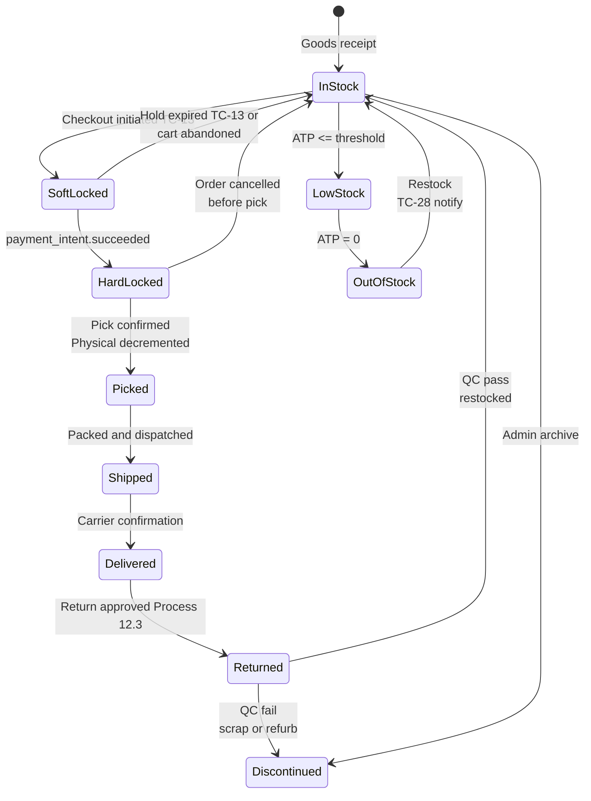

> **TC values referenced:** TC-13 (soft lock 15 min), TC-14 (checkout hard expiry 30 min), TC-27 (low-stock cooldown 24h), TC-28 (back-in-stock hourly job), TC-INV-01 to TC-INV-03 (Section 17.6 new).

### 18.5 Order Routing & Allocation

> When HomeStyle expands to multi-warehouse (Phase 2 EU expansion), order routing logic becomes critical. Even in Phase 1 single-warehouse operations, allocation rules govern split-shipment behaviour when a multi-line order combines in-stock and made-to-order items.

**Routing priority (configurable in System Settings, BC-41):**

| Priority | Rule | Rationale |
|---|---|---|
| 1 | **Whole-order completeness** — pick the warehouse that can fulfill all lines from one location | Minimises split shipments → fewer customer notifications, lower freight cost, better CSAT |
| 2 | **Nearest to customer** — geographic distance from delivery postal code | Reduces transit time and freight cost; critical for white-glove zones |
| 3 | **Oldest-stock-first (FEFO/FIFO)** — prefer warehouse with older receipt dates | Inventory turnover; reduces aging stock; important for upholstery (fabric ages) |
| 4 | **Load balancing** — avoid overloading any single warehouse's pick queue | Smoother operations; prevents SLA breaches on TC-18 |

**Split Shipment Handling (BR-FUL-04, see Section 18.9):**

- One **Order ID** (customer-facing — used for support, tracking, returns eligibility).
- Multiple **Shipment / Package IDs** (operations-facing — one per warehouse origin or one per carrier service class).
- Order Status is **derived** from child shipment statuses: e.g. one parcel Delivered + one in production → `Partially Delivered`.
- **Cost allocation rule (BR-FUL-05):** Customer pays a single combined shipping fee at checkout. Internal accounting splits cost across shipments for P&L purposes — this is not visible to the customer.

### 18.6 Warehouse Operations (WMS)

> Phase 1 ships from a single warehouse; the WMS module exists from day one because the operations principles still apply at small scale and adding warehouses later should be a configuration change, not a re-build.

**18.6.1 Inbound — Goods Receipt & Putaway**

| Step | Detail |
|---|---|
| Pre-receipt | Admin Ops creates Goods Receipt Note (GRN) against an open supplier PO (or made-to-order PO from Process 12.5). |
| Scan-in | Warehouse staff scan barcode (or generated SKU label) on each carton. System validates against PO line quantity. Discrepancies flagged immediately. |
| QC inspection | Visual + dimensional check. Photo upload for damaged items. Rejected units routed to `QC-Hold` location (does not increment Physical Stock until resolved). |
| Putaway | System suggests bin location (zone routing — heavy items lower racks, fast-movers near pack stations). Staff scan bin barcode to confirm. |
| Stock update | Physical Stock incremented atomically. ATP recomputed. If transitioning OOS → InStock: triggers TC-28 back-in-stock notification job. |

**18.6.2 Outbound — Wave Picking & Pack-Verify**

Single-order picking ("one customer at a time") is the most common Junior mistake — staff walk the same aisles repeatedly. HomeStyle's WMS uses **Wave Picking** for parcels (Pick Pack Ship optimisation):

| Concept | Detail |
|---|---|
| **Wave / Batch** | System groups all confirmed orders due to pick within a configurable window (e.g. next 4 hours per TC-WHS-01). Generates one consolidated **Pick List** sorted by warehouse aisle/bin sequence. |
| **Pick-by-Light or Mobile Scanner** | Staff scan each SKU as they pick it from the bin. System validates SKU → wave → expected qty. Wrong SKU triggers an audible alert. |
| **Pack-Verify (anti-mispick)** | At pack station: scan SKU → scan shipping label → system must **match** ("beep"). Mismatch blocks pack until resolved. This single check eliminates the most expensive operational error (wrong item shipped). |
| **White-glove items** | Bypass wave picking — handled as single-order picks because of size, fragility, and dedicated dispatch slot booking. Still benefit from pack-verify barcode match. |

**18.6.3 Cycle Counting**

| Aspect | Rule |
|---|---|
| Frequency | Per TC-WHS-03 (Section 17.6). Default: A-class SKUs (top 20% revenue) counted monthly; B-class quarterly; C-class biannually. |
| Method | Blind count — picker enters count without seeing system quantity. System computes variance and routes >2% variance to Super Admin for investigation. |
| Adjustment | All cycle-count adjustments audit-logged (BC-40). Persistent variance investigated as potential shrinkage. |

### 18.7 Shipping Cost & DIM (Volumetric) Weight

> Carriers do not charge by physical weight alone for low-density, bulky items. Premium furniture — particularly upholstered pieces — is almost always priced on volumetric weight.

| Concept | Formula |
|---|---|
| **Gross Weight** | Actual measured weight from packed scale. |
| **Volumetric / DIM Weight** | `(Length × Width × Height) / DIM_Divisor` — cm³/kg basis. **Divisor 5000 (international air/IATA), 6000 (legacy domestic/ground)** — configurable per carrier contract. |
| **Chargeable Weight** | **`MAX(Gross Weight, Volumetric Weight)`** — this is what the carrier bills. |

**BA-action consequences (BR-PRD-04):**

- Length, Width, Height, and Gross Weight are **mandatory non-zero** fields on the product/SKU record. Catalogue management (Process 12.6) must validate and block save on zero or null values. Without these, the rate-quote API call to BC-51 fails and the customer sees a generic "shipping unavailable" error — a guaranteed conversion killer.
- Shipping rate quotes at checkout (BC-08, BC-51) must use chargeable weight, not just gross.
- Trade bulk orders may negotiate carrier-specific divisors; trade pricing tier (OD-05) can carry a custom DIM divisor override.

### 18.8 Overselling Prevention & Incident Response

> Oversell happens when concurrency exceeds the atomicity of the reservation. Flash Sale: 100 units, 1000 simultaneous Add-to-Cart presses. Without server-side atomic reservation, 150 orders confirm — 50 customers receive an apology email instead of furniture.

**Prevention controls (defense in depth):**

| Layer | Control |
|---|---|
| 1 — Display | ATP recomputed and pushed to PDP on every reservation event. Customers never see stale "10 left" when ATP is actually 0. |
| 2 — Cart | Add-to-Cart re-validates ATP against the configured cart line quantity. Returns error if insufficient. |
| 3 — Checkout (Soft Lock) | TC-13: Redis `SETNX` with TTL atomically reserves the unit. Two concurrent checkouts cannot both succeed; the loser sees "Item no longer available — please return to cart". |
| 4 — Payment (Hard Lock) | On `payment_intent.succeeded`, soft lock promoted to hard lock in a single DB transaction. Stripe idempotency key (TC-16) prevents duplicate charges if customer retries. |
| 5 — Channel buffer | If selling on third-party marketplaces in Phase 3: buffer stock per channel (push ATP−2 to marketplace) prevents cross-channel oversell while sync events propagate. |

**Incident Response (if oversell still happens — never zero risk):**

| Step | Detail |
|---|---|
| 1 | System detects oversell at pick-confirmation step (Physical < total Hard Locked). |
| 2 | Last-in orders (newest payment timestamp) auto-transitioned to `On-Hold — Oversell`. |
| 3 | E-OVERSELL email auto-dispatched: apology, two options (a) accept goodwill voucher + cancel, (b) wait for restock with revised lead time. |
| 4 | If customer accepts cancel: auto Stripe refund + auto voucher issuance. No CSR phone call required. |
| 5 | All oversell incidents logged to a dedicated dashboard for root-cause analysis (race condition? safety stock too low? supplier shortage?). |
| 6 | KPI tracked: **Oversell Rate** = oversold units / total units sold. Target ≤0.05%. Any month >0.2% triggers a postmortem.

### 18.9 Business Rules — Product, Inventory, Fulfillment & Warehouse

> Consolidated business rules referenced by Capabilities (BC-66+), Processes (12.4–12.13), and the Domain sections above. Rules are codified for traceability in SRS and acceptance tests.

**Product Hierarchy & Catalogue Rules (BR-PRD)**

| ID | Rule |
|---|---|
| BR-PRD-01 | Price, stock quantity, weight, dimensions, and lead time are stored at the **SKU (variant) level** — never at the parent product. Aggregation up to parent is for display only. |
| BR-PRD-02 | Every SKU must have a unique system-generated SKU code that incorporates option-value codes (per Section 11.1). |
| BR-PRD-03 | The product configurator must enforce **valid combinations only**. Out-of-production option values must be flagged at configurator level — customers cannot build configurations that are unavailable. |
| BR-PRD-04 | Length, Width, Height (cm or inches with stored unit), and Gross Weight (kg) are **mandatory non-zero** fields on every sellable SKU. Catalogue save is blocked on zero / null (BC-27 validation). |
| BR-PRD-05 | Bundle (Virtual SKU) availability is computed as `MIN(component_ATP)` across all bundle components at every reservation event. A bundle becomes Out-of-Stock the moment any single component is OOS. |
| BR-PRD-06 | Selling a bundle decrements **each component's** Physical Stock individually — not the bundle as a unit. |
| BR-PRD-07 | Product Family / Collection assignment drives navigation; a product can belong to multiple collections (e.g. "Lounge Seating" + "Aria by Marco Vitti"). |
| BR-PRD-08 | EAV attribute schema is extensible per category — new attributes can be introduced without altering core schema (required for Phase 2 lighting / lifestyle accessories expansion). |
| BR-PRD-09 | Specification PDFs are stored at parent product level. Configuration-specific spec sheets (where applicable) override at SKU level. |
| BR-PRD-10 | Discontinued products (`is_archived = true`) are immediately removed from search index, configurator output, and PDPs. 301-redirected to parent collection. |

**Inventory & Allocation Rules (BR-INV)**

| ID | Rule |
|---|---|
| BR-INV-01 | `ATP = Physical − Reserved − Safety Stock`. ATP is the **only number shown to customers** and used for Add-to-Cart eligibility. Physical and Reserved are admin-only. |
| BR-INV-02 | Safety Stock is configured per SKU in admin (BC-41). Defaults: 2 units (parcel accessories), 1 unit (white-glove items), 0 (made-to-order). |
| BR-INV-03 | **Soft Lock** is created at checkout initiation (TC-13: Redis SETNX, 15-min TTL). Soft locks release automatically on TTL expiry, cart abandonment, or payment failure. |
| BR-INV-04 | **Hard Lock** is created on `payment_intent.succeeded` webhook (durable row in `order_allocations` table). Hard locks release **only** on pick confirmation, order cancellation, or admin manual override (audit-logged). |
| BR-INV-05 | Reservation must be **atomic**. Redis SETNX (soft) and DB transaction (hard) prevent concurrent reservation of the same physical unit. |
| BR-INV-06 | Made-to-Order SKUs have `Physical = 0` but remain orderable. Their "reservation" is a supplier-production commitment, not a physical-stock lock. |
| BR-INV-07 | Returned items enter `QC-Hold` location and do **not** increment Physical Stock until QC pass. QC fail routes to scrap or refurb (Phase 3 outlet channel). |
| BR-INV-08 | Stock adjustments outside of order flow (cycle count, supplier delivery, manual write-off) are all audit-logged with actor, before/after values, and reason code (BC-40). |
| BR-INV-09 | Oversell Rate KPI: ≤0.05% target. >0.2% in any rolling month triggers mandatory postmortem and safety-stock review. |
| BR-INV-10 | Low-stock threshold per SKU is admin-configurable (BC-41). Default: 5 units for parcel; 2 units for white-glove. Customer PDP shows 'Only X left' below threshold. |

**Fulfillment & Order Routing Rules (BR-FUL)**

| ID | Rule |
|---|---|
| BR-FUL-01 | Order routing priority (multi-warehouse): (1) whole-order completeness, (2) nearest to customer, (3) oldest-stock-first, (4) load balancing. Configurable per System Settings (BC-41). |
| BR-FUL-02 | A single Order ID can spawn multiple Shipment / Package IDs when items ship from different warehouses or carrier services. Customer sees one Order in 'My Orders' with child shipments tracked individually. |
| BR-FUL-03 | Order Status is **derived** from child shipment statuses: all delivered → `Delivered`; some delivered, some in transit → `Partially Delivered`; etc. |
| BR-FUL-04 | Split shipments cannot result in additional customer-visible shipping charges. Customer pays a single combined shipping fee at checkout. |
| BR-FUL-05 | Internal accounting allocates freight cost across child shipments by weight × distance for P&L (admin reporting only, not customer-visible). |
| BR-FUL-06 | Made-to-order items in a multi-line order ship **separately** from in-stock items by default (faster delivery for the in-stock portion). Customer may opt for "ship complete" at checkout to consolidate. |
| BR-FUL-07 | Customer-paid shipping fee is calculated using **chargeable weight** = `MAX(gross_weight, volumetric_weight)`, where `volumetric_weight = (L×W×H) / DIM_divisor`. DIM_divisor is configurable per carrier contract. |
| BR-FUL-08 | TC-18 dispatch SLA (48 biz-hrs) starts at order confirmation for in-stock items and at production completion for made-to-order items. |
| BR-FUL-09 | White-glove items are picked individually and not wave-picked — their dispatch requires partner appointment booking and dedicated handling. |
| BR-FUL-10 | An order may not be cancelled by a customer after status `Picked` (already off the shelf). Cancellations after pick require Operations Admin override. |

**Warehouse Operations Rules (BR-WHS)**

| ID | Rule |
|---|---|
| BR-WHS-01 | Goods Receipt requires an open Supplier PO or production PO reference. Receipts without a referenced PO are blocked and require Super Admin to record as an "unscheduled receipt" (rare, audit-flagged). |
| BR-WHS-02 | Every inbound item is barcode-scanned and validated against PO line qty. Mismatches stop receipt for that line until reconciled. |
| BR-WHS-03 | Damaged inbound goods are routed to `QC-Hold` and do not increment Physical Stock until resolution (return-to-supplier or write-off). |
| BR-WHS-04 | Wave Picking is the default for parcel orders. Wave size is configurable (default 20–50 orders) and waves are generated per TC-WHS-01 cadence. |
| BR-WHS-05 | Pack stations must perform Scan-SKU → Scan-Shipping-Label barcode match before label print. Mismatch blocks the pack action — this is the primary mispick safeguard. |
| BR-WHS-06 | Cycle counting cadence per ABC classification: A-class monthly, B-class quarterly, C-class biannually (configurable per BC-41). |
| BR-WHS-07 | Cycle count variance >2% per SKU is automatically escalated to Super Admin for investigation. |
| BR-WHS-08 | All stock-affecting warehouse events (receipt, pick, pack, putaway, cycle adjustment, write-off) are audit-logged with actor, timestamp, SKU, bin, qty, before/after (BC-40). |
| BR-WHS-09 | Bin location assignment uses zone routing logic: heavy items → lower racks; fast-movers → near pack stations; fragile/white-glove → dedicated zone with restricted access. |
| BR-WHS-10 | Buffer Stock (channel sync) ≠ Safety Stock (overall). Buffer Stock applies only if Phase 3 marketplace integrations are enabled; it withholds N units from each external channel's ATP feed to absorb sync lag. |

---

## 19. Key Performance Indicators (KPIs)

### 19.1 Business KPIs

| KPI | Definition | Target (6 Months) | Source |
|---|---|---|---|
| Online Revenue Contribution | % of total revenue from online channel (B2C + B2B) | ≥ 35% | Admin Reports |
| Average Order Value (AOV) | Average revenue per completed order | ≥ $1,800 / €1,600 | Admin Reports |
| Trade Revenue Share | % of online orders from verified trade accounts | ≥ 20% of online channel by Month 12 | Admin Reports |
| Trade Account Growth | Number of active verified trade accounts | ≥ 500 by Month 6 | Admin Reports |
| New vs. Returning Customer Ratio | % of orders from new vs. returning buyers | Track baseline Month 2 | Admin / GA4 |

### 19.2 Product & Operational KPIs

| KPI | Definition | Target (6 Months) | Source |
|---|---|---|---|
| Conversion Rate | % of sessions resulting in a completed order | ≥ 1.8% (premium AOV) | GA4 + Admin |
| Cart Abandonment Rate | % of carts not completed at checkout | ≤ 60% | Custom Analytics |
| Order Confirmation SLA Compliance | % of orders confirmed within TC-17: 4 biz hrs | ≥ 95% | Admin Reports |
| Order Dispatch SLA Compliance | % of in-stock orders shipped within TC-18: 48 biz hrs | ≥ 95% | Admin Reports |
| Trade Application Review SLA | % of trade applications reviewed within 2 business days | ≥ 95% | Admin Reports |
| Return Rate | % of delivered orders returned | ≤ 5% (premium lower expectation) | Returns Reports |
| Avg. Product Rating | Mean star rating across all reviewed products | ≥ 4.5 / 5.0 | Review Module |
| Page Load Time (LCP) | Largest Contentful Paint on product pages | < 2.5 seconds | Core Web Vitals |

---

## 20. Stakeholder Register & RACI

### 20.1 Stakeholder Register

| Stakeholder | Role | Key Responsibilities | Influence | Interest |
|---|---|---|---|---|
| Business Owner | Project Sponsor | Approves scope, budget, all Open Business Decisions (OD-05 through OD-10). Signs off trade portal scope. | High | High |
| Product Owner / BA | Requirements Lead | Owns BRD, SRS, backlog, and all TC definitions. Bridge between business intent and technical execution. | High | High |
| Development Lead | Technical Architect | Architecture decisions, tech stack, API design, DB schema for product configuration and trade portal, feasibility review of all TC values. | High | High |
| UX/UI Designer | Design Lead | Wireframes, design system, product configurator UX, checkout countdown timer UI, trade portal flows. | Medium | High |
| QA Lead | Quality Assurance | Test strategy, test cases for all TC values and trade portal flows, regression testing, pre-launch UAT sign-off. | Medium | High |
| Trade & Sales Manager | Trade Channel Lead | Validates trade portal requirements, trade pricing tiers (OD-05), VAT exemption flow (OD-06), account manager assignment. | High | High |
| Warehouse / Ops Team | Fulfillment Operations | Validate order management, SLA thresholds (TC-17, TC-18), lead time data accuracy (CR-07), returns process. | Low | High |
| Legal / Compliance | Compliance Advisory | GDPR, CCPA, returns policy (OD-07, OD-08), VAT exemption legal basis (OD-06), data retention values TC-31 to TC-38. | Medium | High |
| Finance | Financial Oversight | Currency model (OD-02), trade pricing tiers, tax nexus, 7-year financial record retention (TC-32). | Medium | Medium |

### 20.2 RACI Matrix — Key Project Activities

| Activity | Biz Owner | PO/BA | Dev Lead | UX/UI | QA | Trade Mgr | Legal | Finance |
|---|---|---|---|---|---|---|---|---|
| BRD v4.0 Approval | A | R | C | C | I | C | C | I |
| Trade Portal Scope & OD-05 / OD-06 | A/R | R | C | I | I | R | C | C |
| Open Business Decisions (OD-07 to OD-10) | A/R | R | C | I | I | C | C | C |
| TC values Legal review (TC-31 to TC-38) | A | C | I | I | I | I | R | C |
| SRS Sign-Off | A | R | C | C | C | C | I | I |
| Product Configurator UX & Design | I | C | C | R/A | C | I | I | I |
| Backend / API Development | I | C | R/A | I | C | I | I | I |
| GDPR / Legal Review | A | C | I | I | I | I | R | I |
| UAT Sign-Off | A | C | C | C | R | C | I | I |
| Go-Live Approval | A/R | C | C | C | C | C | C | I |

*R = Responsible &nbsp; A = Accountable &nbsp; C = Consulted &nbsp; I = Informed*

---

## 21. Warranty & Aftercare Specification (Phase 2)

> **PHASE:** Months 7–12 (Phase 2 — Growth). **STATUS:** Specification draft. Full SRS to follow on Phase 2 kickoff. This section establishes the BA-level scope and rules so the Phase 2 backlog can be estimated and prioritised at MVP go-live.

### 21.1 Overview & Business Value

Premium design furniture is a multi-year purchase. Buyers expect manufacturer-backed warranty as a hallmark of quality, and trade clients (hospitality, contract, corporate) typically require commercial warranty terms in their procurement contracts. HomeStyle's current offline business handles warranty via account managers and email — the goal of Phase 2 is to bring this in-house with a self-service portal, defined SLAs, and a service partner network.

| Driver | Business Outcome |
|---|---|
| Reduce reactive support workload | Replace 80% of warranty email back-and-forth with portal-based claims. |
| Win trade & contract tenders | Published 5-year structural warranty becomes a competitive proof point in B2B RFPs. |
| Aftercare revenue | Paid Extended Warranty Plans create new recurring revenue (target: ≥8% attach rate). |
| Brand trust | Visible warranty status + transparent resolution timelines reinforce premium positioning (NFR target: post-claim CSAT ≥4.5). |
| Inventory recovery | Returned-for-warranty items refurbished and re-routed to outlet channel (Phase 3 enabler). |

### 21.2 Warranty Types & Coverage Periods

> Warranty period **starts on confirmed delivery date** (BR-W01). Made-to-order items inherit standard warranty unless flagged "bespoke" (BR-W02 / BR-W04).

| Component Class | B2C — Standard Warranty | Trade — Commercial Warranty | Notes |
|---|---|---|---|
| Structural / Frame (timber, metal) | 5 years | 10 years | Manufacturing & material defects only |
| Mechanism (reclining, lift, swivel) | 2 years | 3 years | Hardware & motor (where applicable) |
| Upholstery — Leather Grade A/B | 2 years | 2 years (commercial-grade only) | Excludes natural variation & wear |
| Upholstery — Fabric Grade A | 2 years | 1 year | Heavy commercial use shortens cover |
| Cushion fill / resilience | 1 year | 6 months | Excludes normal compression |
| Finish (wood lacquer, paint, plating) | 1 year | 1 year | Excludes UV fade & cleaning damage |
| Electrical components | 1 year | 1 year | Where applicable (LED, USB, motors) |
| Hardware & fixings | 2 years | 2 years | Replacement parts dispatched free |

> **B2C → Trade Crossover (BR-W04):** Furniture installed in commercial premises (hotels, offices, restaurants, hospitality) under a B2C order is **not** covered under the B2C warranty. Customer must purchase via Trade account for commercial use.

### 21.3 Coverage — Inclusions & Exclusions

| Covered (eligible for claim) | Excluded (claim will be rejected) |
|---|---|
| Manufacturing defects (frame, joints, welding) | Customer-caused damage (drops, spills, pets, sharp objects) |
| Material defects (fabric weave failure, leather splitting) | Normal wear & tear (fabric pilling, leather patina, cushion softening) |
| Mechanism / hardware failure | Modifications / DIY repairs by unauthorised parties |
| Finish defects (peeling, cracking, blistering from manufacturing) | UV fading, environmental damage (humidity, dryness) |
| Inconsistencies vs. confirmed specification | Use beyond intended (e.g. outdoor use of indoor furniture) |
| Failed components within stated warranty period | Items installed in commercial premises under B2C warranty (BR-W04) |
| Defects discovered within first 30 days (DOA — full replacement) | Cosmetic variation natural to material (wood grain, leather marks) |
| | Damage from improper assembly by customer (when self-assembly is optional) |
| | Bespoke / custom items unless faulty per spec |

### 21.4 Warranty Registration & Activation

Standard warranty is **auto-activated on delivery confirmation** for registered customers — no manual action required. Guest-checkout customers must register within **TC-W01** to retain warranty.

| # | Stage | Detail |
|---|---|---|
| 1 | Auto-Activation (Registered) | On `Delivered` status, system creates warranty record linked to order item. Warranty period calculated per component class (Section 21.2). Customer receives E-13 with digital warranty certificate (PDF). |
| 2 | Manual Registration (Guest) | Guest customer receives E-13 with registration link. Must register within **TC-W01: 30 days** of delivery. Order ID + email + last 4 of delivery postcode verify the link. |
| 3 | Trade Customers | Auto-activated with extended terms. Trade pricing tier (OD-05) determines commercial warranty scope. |
| 4 | Extended Warranty Purchase | Optional paid add-on. Available at checkout AND for **TC-W08: 90 days** post-delivery via account dashboard. Extends component-class periods by 1–3 additional years (tier-priced). |
| 5 | Warranty Card | PDF certificate generated with warranty ID, order ID, items covered, period per component, terms. Downloadable from order history; accessible to trade buyers' clients via project share link (BC-22). |

### 21.5 Customer Warranty Claim Process

> **Actor:** Registered Customer or Verified Trade Account. **Trigger:** Customer files claim via 'My Orders → Warranty' or trade portal.

| # | Stage | Process Detail + Time Constraints |
|---|---|---|
| 1 | Initiate Claim | Customer opens warranty record from order history → 'File a Claim'. Selects affected item, component class, issue type. |
| 2 | Evidence Upload | **TC-W09: 14 days** to upload required photos (min. 3) and optional video. S3 presigned upload (TC-09 pattern, 15-min URL). Claim cannot be submitted without evidence. |
| 3 | Describe Issue | Free-text description, date issue noticed, usage context (residential / commercial — affects BR-W04 eligibility). |
| 4 | Eligibility Pre-Check | System validates: (a) within warranty period for component, (b) order belongs to customer, (c) usage context permitted for plan type, (d) evidence uploaded. |
| 5 | Submit | Claim record created with status `Submitted`. **TC-W02 server-side check**: claim must be submitted within active warranty period. E-14 confirmation dispatched. |
| 6 | Tracking | Customer sees claim status in 'My Warranty' dashboard. Status updates trigger emails (E-15 / E-16 / E-17 / E-18 / E-19). |

**BPMN — Customer Warranty Claim Submission:**

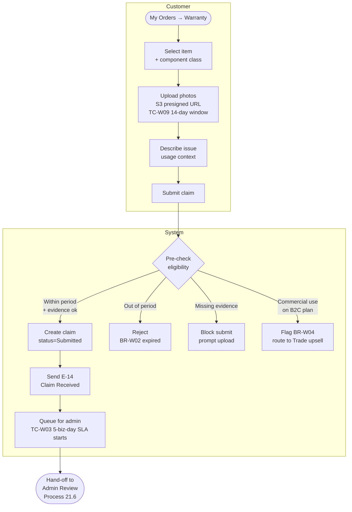

### 21.6 Admin Claim Review & Resolution Process

> **Actor:** Admin — Operations (Warranty role extension), Service Partner (external), Super Admin (escalation). **Trigger:** Claim submitted by customer enters admin queue.

| # | Stage | Process Detail + Time Constraints |
|---|---|---|
| 1 | Triage | Admin opens claim, reviews evidence, validates eligibility against business rules. **TC-W03: 5 biz-day review SLA.** |
| 2 | Decision | Admin chooses: **Approve**, **Reject** (with reason), or **Request More Info** (pauses TC-W03, restarts on customer response). |
| 3 | Approved → Resolution Selection | Admin selects resolution path: **Repair**, **Replace** (component or full item), **Partial Refund**, **Store Credit**. Defined by Section 21.7 matrix. |
| 4a | Repair Path | Admin dispatches service partner request via partner portal. **TC-W04: 10 biz-day** scheduling SLA. Customer receives E-17 with appointment slot. **TC-W07: 3 biz-day** partner response. |
| 4b | Replace Path | Admin generates replacement order linked to original. Replacement dispatched within **TC-W05: 21 biz-days** (incl. made-to-order lead time). E-18 with tracking. |
| 4c | Partial Refund Path | Admin selects refund tier (Section 21.7) → Stripe refund via existing returns engine (BC-35). E-19 dispatched. |
| 4d | Store Credit Path | Admin issues credit to customer account (Phase 2 dependency on loyalty/credit module). E-19 with credit amount. |
| 5 | Closure | Admin marks claim `Resolved`. Customer survey (post-claim CSAT) auto-sent 3 days later. **TC-W06: 30 biz-day** total resolution target. |
| 6 | Escalation | If TC-W03 / W04 / W05 breached → Super Admin alerted (per SLA Monitoring Process 12.10 extended). |
| 7 | Fraud Watch | If customer has >3 claims in 12 months OR claim count > order count: flag for Super Admin manual review (risk BR-W11). |

**BPMN — Admin Claim Review & Resolution:**

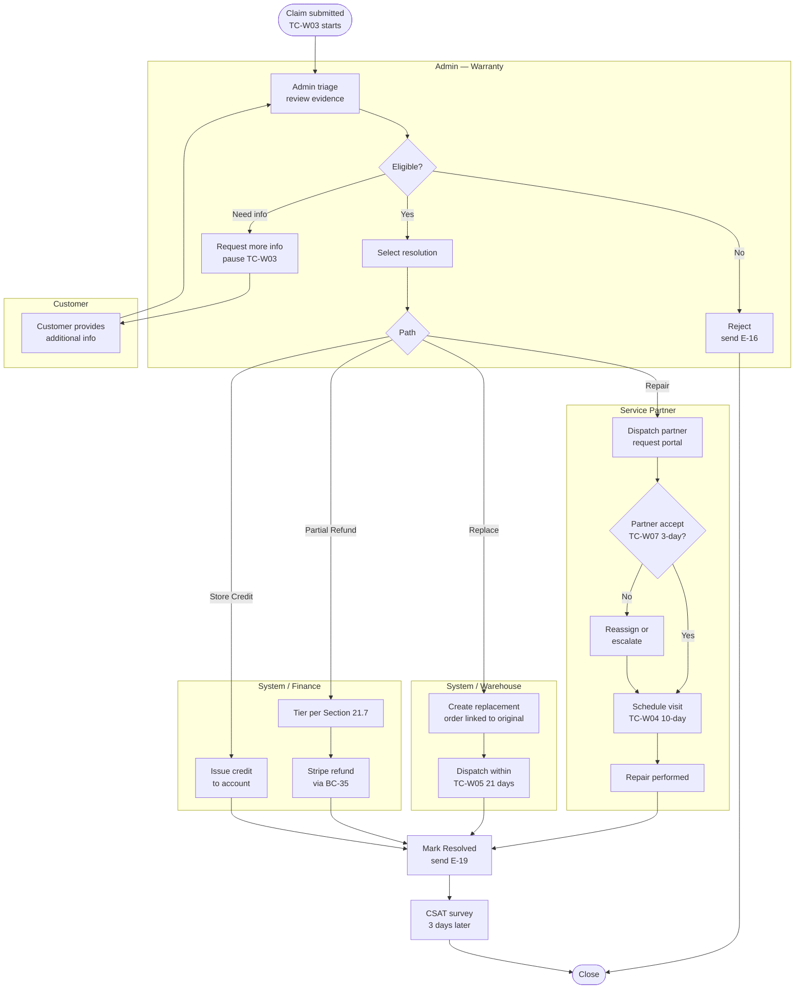

### 21.7 Resolution Options Matrix

| Resolution | When Used | Customer Cost | Operational Cost | SLA |
|---|---|---|---|---|
| Free Repair | Mechanism, hardware, fixings; cosmetic finish on display surfaces; first claim on component | $0 | Parts + Service partner fee | TC-W04: 10 biz-days |
| Component Replacement | Cushion, fabric panel, mechanism module — when repair impractical | $0 | Component cost + dispatch | TC-W05: 21 biz-days |
| Full Item Replacement | Structural failure (frame); third valid claim on same item (BR-W08); DOA within 30 days | $0 | Full item cost + dispatch | TC-W05: 21 biz-days (or made-to-order lead time) |
| Partial Refund — 75% | Out-of-stock component, customer accepts pre-discount | 25% retained | Refund cost | TC-W06: 30 biz-days |
| Partial Refund — 50% | Item out of catalogue, no equivalent available, no replacement possible | 50% retained | Refund cost | TC-W06: 30 biz-days |
| Store Credit (110%) | Customer prefers credit over refund; bonus 10% to retain | Credit issued | Future order discount | Immediate |
| Out-of-Warranty Repair | Component class period expired but customer wants paid repair | Quoted | Quote + partner fee | TC-W07 + scheduling |

### 21.8 Trade-Specific Warranty Terms

| Aspect | Trade Provision |
|---|---|
| Period extension | Structural: 10 years (vs B2C 5). Mechanism: 3 years. |
| Commercial-grade upholstery | Trade catalogue specifies which fabrics are rated for commercial use. Non-rated fabrics void on commercial install (BR-W04). |
| Service level | Priority queue (TC-W03 reduced to 3 biz-days for verified trade). Dedicated trade warranty manager. |
| Bulk claims | Trade can submit multiple-item claims for the same project under one ticket (one evidence pack, batched resolution). |
| On-site repair | Available for projects ≥$25,000. Standard for hospitality / contract orders. |
| Replacement parts inventory | Trade contracts may include guaranteed parts availability for warranty period (annexed to project quote). |

### 21.9 Extended Warranty (Paid Add-on)

> **Phase 2 add-on revenue stream.** Customer-purchased extension to standard warranty.

| Plan | Adds to Standard | Price Model | Target Attach Rate |
|---|---|---|---|
| Extended 2-Year | +2 years on Structural & Mechanism only | 4% of item price | ≥8% B2C |
| Extended 5-Year — Premium | +5 years on Structural, +2 on Mechanism, +1 on Upholstery | 9% of item price | ≥3% B2C |
| Trade Service Plan | Annual maintenance visits + priority parts access | Annual fee per project | Trade contract negotiated |

**Purchase windows:**
- At checkout (BC-49 integration): single-click add-on.
- Post-delivery within **TC-W08: 90 days** via account dashboard.
- Non-refundable once activated. Transferable on item resale only with admin approval (BR-W06).

### 21.10 Service Partner Network

| Capability | Detail |
|---|---|
| Partner onboarding | Admin Trade/Super onboards repair partners with geographic service zones, certification, insurance verification, response capacity. |
| Partner portal | Vendor-facing web app: receive claim assignments, accept/decline within TC-W07, upload repair completion evidence, invoice HomeStyle. |
| Coverage zones | ZIP/postal-code mapped per partner. Auto-routing on approval based on customer delivery address. Fallback escalation if no partner in zone. |
| SLA contracts | Partner contracts include response time, repair quality standards, customer rating threshold (≥4.0 to remain active). |
| Payment | Net-30 from completion-of-repair confirmation. Disputes via admin portal. |

### 21.11 Business Rules — Warranty Module

| ID | Rule |
|---|---|
| BR-W01 | Warranty period begins on confirmed delivery date (not order date). Same rule for replacements: replacement carries the remainder of the original item's warranty, not a fresh period. |
| BR-W02 | Claim must be submitted within active warranty period for the affected component class. Submission after expiry is rejected at server-side validation. |
| BR-W03 | Customer-caused damage is excluded. Photo/video evidence reviewed by admin determines causation. Disputes escalated to Super Admin. |
| BR-W04 | B2C warranty does NOT cover items installed in commercial premises. Trade account upgrade or claim rejection. |
| BR-W05 | Proof of purchase is the linked order ID (registered customers auto-linked; guest must register within TC-W01). |
| BR-W06 | Warranty is **non-transferable** to second-hand buyers in Phase 2. Phase 3 may introduce transfer-with-fee (Open Decision OD-W04 below). |
| BR-W07 | A customer may submit multiple claims within the warranty period for different defects on the same item or different items. |
| BR-W08 | After **3 valid claims** on the same item, the next resolution defaults to full item replacement or partial refund — not repair. |
| BR-W09 | Trade warranty (extended terms) requires the order to have been placed via a Verified Trade Account. Standard B2C orders by trade buyers receive B2C terms. |
| BR-W10 | Extended warranty must be purchased within TC-W08: 90 days post-delivery. After 90 days, only out-of-warranty repair quotes available. |
| BR-W11 | Fraud watch: if a customer's lifetime claim count exceeds order count, OR more than 3 claims in rolling 12 months, claims flagged for Super Admin manual review before approval. |
| BR-W12 | Made-to-order items have the same warranty period as standard catalogue. Bespoke items (custom dimensions or custom fabric outside standard range) are warranted only for material/manufacturing defect — not for fit-for-purpose. |
| BR-W13 | DOA (Damaged on Arrival, reported within 30 days of delivery) bypasses standard repair-first logic and proceeds directly to full replacement. Tracked separately from warranty claims for KPI purposes. |

### 21.12 Time Constraints — Warranty (TC-W01 to TC-W10)

| TC Ref | Constraint | Value | Configurable? | Behaviour on Expiry / Breach |
|---|---|---|---|---|
| TC-W01 | Guest warranty registration window | 30 days from delivery | Yes — Admin | Warranty marked 'Unregistered'. Customer can still register up to component-class warranty expiry but loses claim eligibility for issues arising before registration. |
| TC-W02 | Claim submission within warranty period | Per component class (Section 21.2) | No (legal/contractual) | 'File a Claim' button hidden in UI after expiry. Server-side re-validates at submission. |
| TC-W03 | Admin claim review SLA — B2C / Trade | 5 biz-days B2C / 3 biz-days Trade | Yes — Admin | Claim flagged 'Overdue Review'. Super Admin alert. KPI: % within SLA tracked. |
| TC-W04 | Repair scheduling SLA | 10 biz-days from approval | Yes — Admin | Customer offered partial refund / replacement as alternative if scheduling slips. |
| TC-W05 | Replacement dispatch SLA | 21 biz-days from approval (or production lead time for made-to-order) | Yes — Admin | Customer notified of revised ETA; partial refund offered if breach >50%. |
| TC-W06 | Total claim resolution target | 30 biz-days from submission | Informational | Business benchmark, not hard-enforced. Quarterly KPI report. |
| TC-W07 | Service partner response window | 3 biz-days from assignment | Yes — Admin | Auto-reassign to next partner in zone. After 2 reassigns: Super Admin escalation. |
| TC-W08 | Extended warranty purchase window | 90 days post-delivery | Yes — Admin | 'Purchase Extended Warranty' option removed from dashboard after 90 days. |
| TC-W09 | Customer evidence upload deadline | 14 days from claim filing | Yes — Admin | Incomplete claims auto-closed. Customer can re-file within remaining warranty period. |
| TC-W10 | Warranty certificate PDF availability | Validity period = longest covered component | No | Certificate downloadable until last covered component's period expires. |

### 21.13 Business Capabilities — Warranty (BC-54 to BC-65)

| ID | Capability | Business Value + Time Constraints | Priority |
|---|---|---|---|
| BC-54 | Warranty auto-registration & certificate generation | Reduces friction; certificate downloadable from order history. PDF generated on `Delivered`. | Critical |
| BC-55 | Customer warranty claim submission portal | Self-service replaces email/phone claims. TC-W09 evidence window enforced. | Critical |
| BC-56 | Evidence photo/video upload via S3 presigned URLs | Secure direct-to-S3 uploads (TC-09 pattern); min. 3 photos required. | Critical |
| BC-57 | Admin claim review queue with SLA tracking | TC-W03 B2C 5-day / Trade 3-day. Auto-escalation on breach via Process 12.10. | Critical |
| BC-58 | Service partner network & vendor portal | Geographic routing, TC-W07 3-day partner response, partner SLA contracts, rating ≥4.0 retention threshold. | High |
| BC-59 | Repair / Replace / Partial Refund / Store Credit resolution engine | Resolution matrix (Section 21.7) drives Stripe refund (via BC-35) or replacement order (via BC-34). | Critical |
| BC-60 | Customer warranty dashboard | Lists all covered items, periods per component, active claims, downloadable certificates. | High |
| BC-61 | Trade warranty extended terms with commercial-grade flagging | Per Section 21.8. Trade catalogue flags commercial-grade fabrics; auto-applied at order. | Critical |
| BC-62 | Extended warranty (paid add-on) purchase | At checkout & TC-W08 90-day post-delivery window. Non-refundable (BR-W10). | High |
| BC-63 | DOA (Damaged on Arrival) fast-track | 30-day post-delivery window. Skips repair-first logic; routes to immediate replacement (BR-W13). | Critical |
| BC-64 | Warranty fraud detection & escalation | BR-W11 triggers Super Admin review when claim count or frequency exceeds thresholds. | High |
| BC-65 | Warranty KPI dashboard & reporting | Claim rate, resolution time, repair-vs-replace ratio, post-claim CSAT, extended warranty attach rate, cost per claim. | High |

### 21.14 New Email Triggers — Warranty (E-13 to E-21)

| # | Trigger | Content Summary | TC Ref | Retry / Timing |
|---|---|---|---|---|
| E-13 | Warranty Registration Confirmation | Warranty ID, items covered, component periods, certificate PDF link | TC-W01 | Sent on `Delivered` (auto) or on manual guest registration |
| E-14 | Claim Received | Claim #, items affected, expected review timeframe | TC-W03 | Sent within 5 min of submission |
| E-15 | Claim Approved + Resolution Path | Approved; resolution path; next steps; ETA | TC-W03 | Sent on admin approval |
| E-16 | Claim Rejected | Reason; appeal instructions; out-of-warranty repair quote option | — | Sent on admin rejection |
| E-17 | Repair Scheduled | Service partner name; appointment slot; what to prepare | TC-W04 | Sent on partner schedule confirmation |
| E-18 | Replacement Dispatched | Replacement order #; tracking; ETA | TC-W05 | Sent on shipment of replacement |
| E-19 | Refund / Credit Initiated | Amount; method; ETA to receipt | TC-W06 | Sent on refund or credit issuance |
| E-20 | Extended Warranty Purchase Confirmation | Plan; coverage; new expiry dates per component | TC-W08 | Sent on payment confirmation |
| E-21 | Warranty Expiry Reminder | 30 days before earliest component expiry; offer extended plan if eligible | TC-W08 | BullMQ scheduled job |

### 21.15 Admin Module Additions (Warranty Module)

| Module Area | Capability |
|---|---|
| Warranty Dashboard | Real-time KPI cards: open claims, claims by SLA status, claim rate this month, partner SLA compliance, fraud-watch flags. |
| Claim Queue | Filterable list of claims by status, age, customer type (B2C/Trade), component class, geographic zone. Bulk approve/reassign actions. |
| Service Partner Management | CRUD partners with service zones (ZIP/postal range), certifications, insurance docs, SLA contract upload, performance rating dashboard. |
| Resolution Configuration | Manage resolution matrix tiers (Section 21.7), partial refund percentages, store credit bonus rates, replacement-vs-repair business rules. |
| Warranty Catalogue | Per-product warranty configuration: component periods per class, exceptions for bespoke, extended warranty plan eligibility & pricing. |
| Claims Reporting | Exportable reports: claim rate by product/collection/designer, repair-vs-replace ratio, partner cost, CSAT post-claim, fraud-flag investigations. |
| Audit Trail | All claim status changes, admin decisions, partner assignments logged (extends BC-40). |

### 21.16 Integration with Existing Modules

| Existing Module | Integration Point |
|---|---|
| Orders (BC-11, BC-34) | Warranty record auto-linked to order item on `Delivered`. Replacement orders generated via BC-34 with parent-claim reference. |
| Returns (BC-13, BC-35) | Warranty claims share evidence-upload, review-SLA, and Stripe-refund patterns. Returns dashboard surfaces both. |
| Inventory (BC-28) | Replacement dispatch decrements stock; component replacements decrement component-level inventory (new sub-SKU table required). |
| Trade Portal (BC-09, BC-21–24) | Trade buyers see extended-warranty terms inline on PDPs. Trade dashboard adds Warranty queue & priority badge. |
| Notifications (BC-25) | E-13 to E-21 integrate with existing email engine + retry policy (TC-29). |
| Admin RBAC (BC-39) | New 'Admin — Warranty' role (or extension to Ops). Service partner is a new external auth class (limited-scope JWT). |
| Stripe (BC-49) | Partial refunds use existing Stripe refund flow. Extended warranty purchase uses Stripe one-off payment with metadata linkage. |
| Reporting (BC-42) | Warranty KPIs join the executive dashboard. Filterable in admin reports. |

### 21.17 Warranty KPIs

| KPI | Definition | Target (12 Months Post-Phase-2-Launch) | Source |
|---|---|---|---|
| Warranty Claim Rate | % of delivered items with at least one claim | ≤4% B2C; ≤7% Trade | Warranty Module |
| Avg. Claim Resolution Time | Days from submission to `Resolved` | ≤20 biz-days (target TC-W06 = 30) | Warranty Module |
| Repair-vs-Replace Ratio | Resolved-by-Repair / Resolved-by-Replace | ≥2:1 (repair preferred operationally) | Warranty Module |
| Partner SLA Compliance | % of partner assignments responded to within TC-W07 | ≥90% | Partner Portal |
| Post-Claim CSAT | Customer satisfaction survey post-resolution | ≥4.5 / 5.0 | Survey Module |
| Extended Warranty Attach Rate | % of qualifying orders that purchase an extended plan | ≥8% B2C | Checkout Reports |
| Cost per Claim | Operational cost (parts + partner + admin time) / total claims | Trend down quarter-over-quarter | Finance + Warranty Module |
| Fraud-Flag Rate | Claims escalated under BR-W11 / total claims | ≤2% (trend) | Warranty Module |

### 21.18 Open Decisions — Phase 2 Warranty

| # | Decision | Options | Owner |
|---|---|---|---|
| OD-W01 | Warranty period for Structural — B2C | A) 5 years (recommended) / B) 10 years (matching trade — more competitive but higher liability) | Biz Owner + Legal |
| OD-W02 | Extended Warranty pricing model | A) % of item price (recommended) / B) Flat fee per item / C) Tiered by item value bracket | Biz Owner + Finance |
| OD-W03 | Service partner model | A) Build network of contractors / B) Single national partner per market / C) Hybrid | Biz Owner + Ops |
| OD-W04 | Warranty transferability | A) Non-transferable (default, BR-W06) / B) Transferable with admin approval + fee / C) Transferable freely with new owner registration | Biz Owner + Legal |
| OD-W05 | DOA fast-track threshold | A) 30 days (recommended, BR-W13) / B) 14 days / C) 60 days | Biz Owner + Ops |
| OD-W06 | Out-of-warranty paid repair | A) Offer via service partner network / B) Refer to third party / C) Not offered | Biz Owner + Ops |

### 21.19 Assumptions & Constraints — Warranty

**Assumptions:**
- Phase 1 systems (orders, returns, Stripe refund, S3 upload, BullMQ, admin RBAC) are stable in production before Phase 2 build begins.
- Component-level SKU tracking required — a new sub-SKU table (or component metadata on parent SKU) will be designed during Phase 2 SRS.
- Service partner agreements drafted and signed in parallel with build (CR-W01 below).
- Insurance providers cover replacement-cost exposure for warranty obligations (Finance to confirm).

**Constraints:**
- Legal must finalise warranty terms per market (US state-specific, UK Consumer Rights Act 2015, EU Sale of Goods Directive 2019/771 — minimum 2 years statutory). Section 21.2 values are *commitments above* statutory minimums.
- Trade contract warranties may exceed Section 21.2 if individually negotiated; Phase 2 admin tooling must support per-contract overrides.
- Phase 2 launch contingent on minimum 5 service partners onboarded across primary US states and EU launch countries.

### 21.20 Phase 2 Client Responsibilities (Warranty)

| # | Deliverable | Specification | Required By |
|---|---|---|---|
| CR-W01 | Service Partner Network | Min. 5 onboarded partners (3 US, 2 EU) with signed SLA contracts, insurance verification, and service-zone definitions. | Phase 2 Month 3 |
| CR-W02 | Warranty Terms (per market) | Final legal-approved warranty terms per US state nexus, UK, and EU country. PDF version + structured data for system display. | Phase 2 Month 2 |
| CR-W03 | Component-Level Spec Data | Updated product spec sheets identifying component class per part (frame, mechanism, upholstery type, finish) for accurate per-component warranty calculation. | Phase 2 Month 2 |
| CR-W04 | Insurance Confirmation | Finance confirmation that warranty obligations are covered under existing product liability + a contingency reserve for replacement exposure. | Phase 2 Month 1 |
| CR-W05 | Commercial-Grade Fabric Flagging | Trade catalogue updated to flag which fabrics carry commercial-use ratings (per Section 21.8 / BR-W04). | Phase 2 Month 2 |

### 21.21 Out of Scope — Phase 2 Warranty (Future / Phase 3)

- Self-serve warranty transfer on resale (OD-W04 dependent).
- White-label warranty programme for trade clients (resold to their end customers).
- IoT-enabled warranty (smart furniture with sensors auto-reporting issues).
- Multi-language warranty portal beyond Phase 2 language scope (DE/FR/IT — depends on Phase 2 i18n).
- Mobile-app native warranty claim flow (Phase 3 alongside native mobile app).
- Refurbished/outlet channel for warranty-returned items (Phase 3).

---

## 22. Approvals

By signing below, the named stakeholder confirms they have reviewed BRD v4.0 — including all time constraints and validation rules in Section 17 and the trade portal scope in Section 8.3 — and approve it as the basis for proceeding to the Software Requirements Specification (SRS) phase.

> **NOTE:** Before signing: Legal must confirm data retention values TC-31 to TC-38 and returns policy OD-07/OD-08. The Development Lead must confirm technical feasibility of all TC values. Business Owner must resolve Open Decisions OD-05 through OD-10. Trade Manager must confirm trade pricing tiers and VAT exemption approach.

| Role | Name | Title | Signature | Date |
|---|---|---|---|---|
| Project Sponsor / Business Owner | | | | |
| Product Owner / BA | | | | |
| Development Lead | | | | |
| UX/UI Lead | | | | |
| QA Lead | | | | |
| Trade & Sales Manager | | | | |
| Legal / Compliance | | | | |
| Finance | | | | |

---

*— End of Document — HomeStyle BRD v4.0 | Premium Design Furniture | Custom Web Application | Confidential*
