# HomeStyle — Sequence Diagrams (Mermaid Code Only)

Copy any block below and paste into https://mermaid.live, draw.io, Notion, GitHub markdown, or any tool that supports Mermaid 10.x.

Total: 37 diagrams.

---

## M01 — Authentication

### SD-01.1 Customer Registration with Email Verification

*`F-01.1` · **Triggers:** TC-06 (verification link), TC-29 (email retry)*

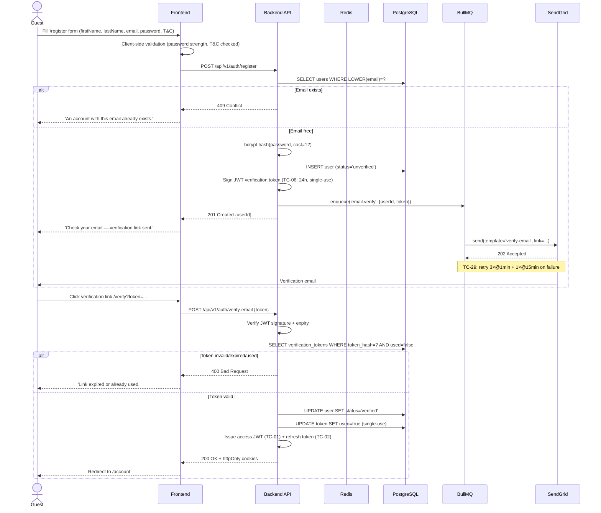
```mermaid
sequenceDiagram
    actor G as Guest
    participant FE as Frontend
    participant API as Backend API
    participant R as Redis
    participant DB as PostgreSQL
    participant BMQ as BullMQ
    participant SG as SendGrid

    G->>FE: Fill /register form (firstName, lastName, email, password, T&C)
    FE->>FE: Client-side validation (password strength, T&C checked)
    FE->>API: POST /api/v1/auth/register
    API->>DB: SELECT users WHERE LOWER(email)=?

    alt Email exists
        API-->>FE: 409 Conflict
        FE-->>G: 'An account with this email already exists.'
    else Email free
        API->>API: bcrypt.hash(password, cost=12)
        API->>DB: INSERT user (status='unverified')
        API->>API: Sign JWT verification token (TC-06: 24h, single-use)
        API->>BMQ: enqueue('email.verify', {userId, token})
        API-->>FE: 201 Created {userId}
        FE-->>G: 'Check your email — verification link sent.'

        BMQ->>SG: send(template='verify-email', link=...)
        SG-->>BMQ: 202 Accepted
        Note over BMQ,SG: TC-29: retry 3×@1min + 1×@15min on failure

        SG->>G: Verification email
    end

    G->>FE: Click verification link /verify?token=...
    FE->>API: POST /api/v1/auth/verify-email {token}
    API->>API: Verify JWT signature + expiry
    API->>DB: SELECT verification_tokens WHERE token_hash=? AND used=false

    alt Token invalid/expired/used
        API-->>FE: 400 Bad Request
        FE-->>G: 'Link expired or already used.'
    else Token valid
        API->>DB: UPDATE user SET status='verified'
        API->>DB: UPDATE token SET used=true (single-use)
        API->>API: Issue access JWT (TC-01) + refresh token (TC-02)
        API-->>FE: 200 OK + httpOnly cookies
        FE-->>G: Redirect to /account
    end
```

### SD-01.2 Customer Login — Email/Password and Google OAuth

*`F-01.2` · **Triggers:** TC-01, TC-02, TC-08, TC-10*

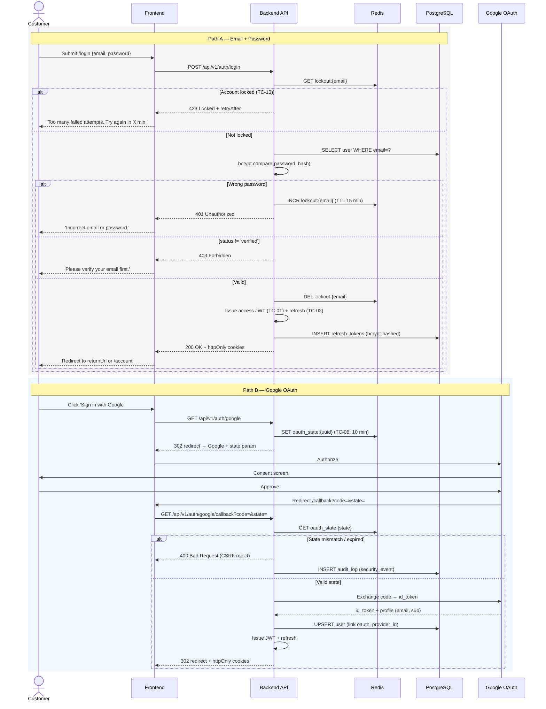
```mermaid
sequenceDiagram
    actor C as Customer
    participant FE as Frontend
    participant API as Backend API
    participant R as Redis
    participant DB as PostgreSQL
    participant OAuth as Google OAuth

    rect rgb(245,245,245)
    Note over C,DB: Path A — Email + Password
    C->>FE: Submit /login {email, password}
    FE->>API: POST /api/v1/auth/login
    API->>R: GET lockout:{email}

    alt Account locked (TC-10)
        API-->>FE: 423 Locked + retryAfter
        FE-->>C: 'Too many failed attempts. Try again in X min.'
    else Not locked
        API->>DB: SELECT user WHERE email=?
        API->>API: bcrypt.compare(password, hash)

        alt Wrong password
            API->>R: INCR lockout:{email} (TTL 15 min)
            API-->>FE: 401 Unauthorized
            FE-->>C: 'Incorrect email or password.'
        else status != 'verified'
            API-->>FE: 403 Forbidden
            FE-->>C: 'Please verify your email first.'
        else Valid
            API->>R: DEL lockout:{email}
            API->>API: Issue access JWT (TC-01) + refresh (TC-02)
            API->>DB: INSERT refresh_tokens (bcrypt-hashed)
            API-->>FE: 200 OK + httpOnly cookies
            FE-->>C: Redirect to returnUrl or /account
        end
    end
    end

    rect rgb(240,248,255)
    Note over C,OAuth: Path B — Google OAuth
    C->>FE: Click 'Sign in with Google'
    FE->>API: GET /api/v1/auth/google
    API->>R: SET oauth_state:{uuid} (TC-08: 10 min)
    API-->>FE: 302 redirect → Google + state param
    FE->>OAuth: Authorize
    OAuth->>C: Consent screen
    C->>OAuth: Approve
    OAuth->>FE: Redirect /callback?code=&state=
    FE->>API: GET /api/v1/auth/google/callback?code=&state=
    API->>R: GET oauth_state:{state}

    alt State mismatch / expired
        API-->>FE: 400 Bad Request (CSRF reject)
        API->>DB: INSERT audit_log (security_event)
    else Valid state
        API->>OAuth: Exchange code → id_token
        OAuth-->>API: id_token + profile (email, sub)
        API->>DB: UPSERT user (link oauth_provider_id)
        API->>API: Issue JWT + refresh
        API-->>FE: 302 redirect + httpOnly cookies
    end
    end
```

### SD-01.3 Password Reset

*`F-01.3` · **Triggers:** TC-07 (1-hr reset link), revokes all TC-02 refresh tokens*

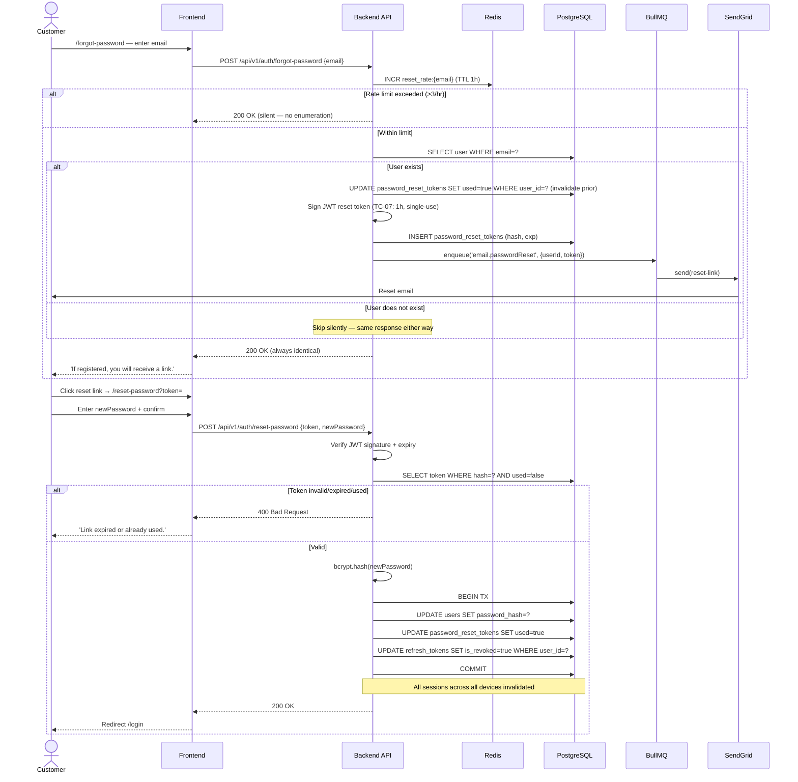
```mermaid
sequenceDiagram
    actor C as Customer
    participant FE as Frontend
    participant API as Backend API
    participant R as Redis
    participant DB as PostgreSQL
    participant BMQ as BullMQ
    participant SG as SendGrid

    C->>FE: /forgot-password — enter email
    FE->>API: POST /api/v1/auth/forgot-password {email}
    API->>R: INCR reset_rate:{email} (TTL 1h)

    alt Rate limit exceeded (>3/hr)
        API-->>FE: 200 OK (silent — no enumeration)
    else Within limit
        API->>DB: SELECT user WHERE email=?
        alt User exists
            API->>DB: UPDATE password_reset_tokens SET used=true WHERE user_id=? (invalidate prior)
            API->>API: Sign JWT reset token (TC-07: 1h, single-use)
            API->>DB: INSERT password_reset_tokens (hash, exp)
            API->>BMQ: enqueue('email.passwordReset', {userId, token})
            BMQ->>SG: send(reset-link)
            SG->>C: Reset email
        else User does not exist
            Note over API: Skip silently — same response either way
        end
        API-->>FE: 200 OK (always identical)
        FE-->>C: 'If registered, you will receive a link.'
    end

    C->>FE: Click reset link → /reset-password?token=
    C->>FE: Enter newPassword + confirm
    FE->>API: POST /api/v1/auth/reset-password {token, newPassword}
    API->>API: Verify JWT signature + expiry
    API->>DB: SELECT token WHERE hash=? AND used=false

    alt Token invalid/expired/used
        API-->>FE: 400 Bad Request
        FE-->>C: 'Link expired or already used.'
    else Valid
        API->>API: bcrypt.hash(newPassword)
        API->>DB: BEGIN TX
        API->>DB: UPDATE users SET password_hash=?
        API->>DB: UPDATE password_reset_tokens SET used=true
        API->>DB: UPDATE refresh_tokens SET is_revoked=true WHERE user_id=?
        API->>DB: COMMIT
        Note over API,DB: All sessions across all devices invalidated
        API-->>FE: 200 OK
        FE-->>C: Redirect /login
    end
```

### SD-01.4 Admin Login with Mandatory 2FA

*`F-01.4` · **Triggers:** TC-03, TC-04, TC-05, TC-11*

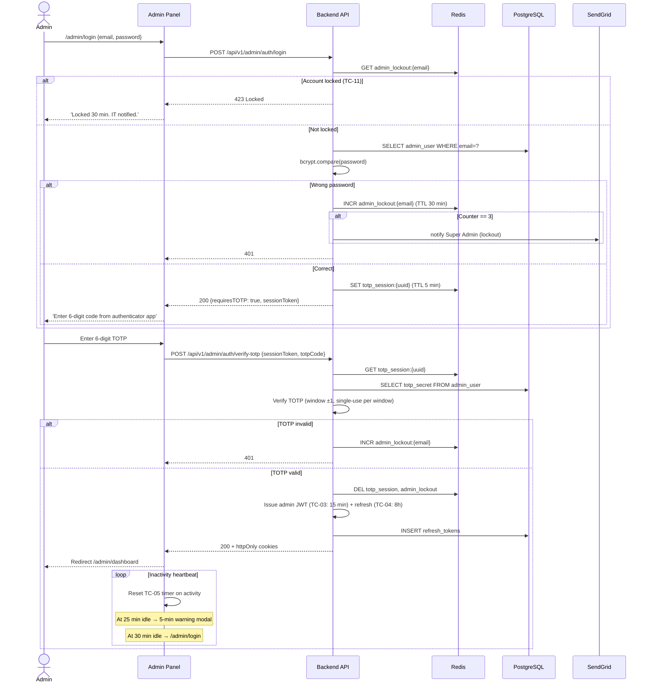
```mermaid
sequenceDiagram
    actor A as Admin
    participant FE as Admin Panel
    participant API as Backend API
    participant R as Redis
    participant DB as PostgreSQL
    participant SG as SendGrid

    A->>FE: /admin/login {email, password}
    FE->>API: POST /api/v1/admin/auth/login
    API->>R: GET admin_lockout:{email}

    alt Account locked (TC-11)
        API-->>FE: 423 Locked
        FE-->>A: 'Locked 30 min. IT notified.'
    else Not locked
        API->>DB: SELECT admin_user WHERE email=?
        API->>API: bcrypt.compare(password)

        alt Wrong password
            API->>R: INCR admin_lockout:{email} (TTL 30 min)

            alt Counter == 3
                API->>SG: notify Super Admin (lockout)
            end

            API-->>FE: 401
        else Correct
            API->>R: SET totp_session:{uuid} (TTL 5 min)
            API-->>FE: 200 {requiresTOTP: true, sessionToken}
            FE-->>A: 'Enter 6-digit code from authenticator app'
        end
    end

    A->>FE: Enter 6-digit TOTP
    FE->>API: POST /api/v1/admin/auth/verify-totp {sessionToken, totpCode}
    API->>R: GET totp_session:{uuid}
    API->>DB: SELECT totp_secret FROM admin_user
    API->>API: Verify TOTP (window ±1, single-use per window)

    alt TOTP invalid
        API->>R: INCR admin_lockout:{email}
        API-->>FE: 401
    else TOTP valid
        API->>R: DEL totp_session, admin_lockout
        API->>API: Issue admin JWT (TC-03: 15 min) + refresh (TC-04: 8h)
        API->>DB: INSERT refresh_tokens
        API-->>FE: 200 + httpOnly cookies
        FE-->>A: Redirect /admin/dashboard

        loop Inactivity heartbeat
            FE->>FE: Reset TC-05 timer on activity
            Note over FE: At 25 min idle → 5-min warning modal
            Note over FE: At 30 min idle → /admin/login
        end
    end
```

### SD-01.5 Token Refresh & Reuse Detection

*`F-01.5` · **Triggers:** TC-01/03 access token rotation, family revocation on reuse*

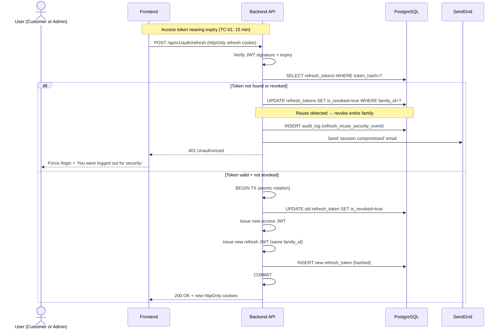
```mermaid
sequenceDiagram
    actor U as User (Customer or Admin)
    participant FE as Frontend
    participant API as Backend API
    participant DB as PostgreSQL
    participant SG as SendGrid

    Note over FE,API: Access token nearing expiry (TC-01: 15 min)
    FE->>API: POST /api/v1/auth/refresh (httpOnly refresh cookie)
    API->>API: Verify JWT signature + expiry
    API->>DB: SELECT refresh_tokens WHERE token_hash=?

    alt Token not found or revoked
        API->>DB: UPDATE refresh_tokens SET is_revoked=true WHERE family_id=?
        Note over API,DB: Reuse detected → revoke entire family
        API->>DB: INSERT audit_log (refresh_reuse_security_event)
        API->>SG: Send 'session compromised' email
        API-->>FE: 401 Unauthorized
        FE-->>U: Force /login + 'You were logged out for security.'
    else Token valid + not revoked
        API->>API: BEGIN TX (atomic rotation)
        API->>DB: UPDATE old refresh_token SET is_revoked=true
        API->>API: Issue new access JWT
        API->>API: Issue new refresh JWT (same family_id)
        API->>DB: INSERT new refresh_token (hashed)
        API->>API: COMMIT
        API-->>FE: 200 OK + new httpOnly cookies
    end
```

### SD-01.6 Email Change with Re-verification

*`F-01.6` · **Triggers:** TC-06 (24-hr verification link)*

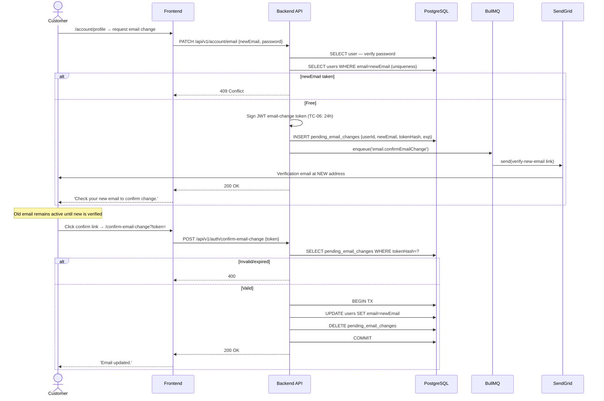
```mermaid
sequenceDiagram
    actor C as Customer
    participant FE as Frontend
    participant API as Backend API
    participant DB as PostgreSQL
    participant BMQ as BullMQ
    participant SG as SendGrid

    C->>FE: /account/profile → request email change
    FE->>API: PATCH /api/v1/account/email {newEmail, password}
    API->>DB: SELECT user — verify password
    API->>DB: SELECT users WHERE email=newEmail (uniqueness)

    alt newEmail taken
        API-->>FE: 409 Conflict
    else Free
        API->>API: Sign JWT email-change token (TC-06: 24h)
        API->>DB: INSERT pending_email_changes {userId, newEmail, tokenHash, exp}
        API->>BMQ: enqueue('email.confirmEmailChange')
        BMQ->>SG: send(verify-new-email link)
        SG->>C: Verification email at NEW address
        API-->>FE: 200 OK
        FE-->>C: 'Check your new email to confirm change.'
    end

    Note over C: Old email remains active until new is verified

    C->>FE: Click confirm link → /confirm-email-change?token=
    FE->>API: POST /api/v1/auth/confirm-email-change {token}
    API->>DB: SELECT pending_email_changes WHERE tokenHash=?

    alt Invalid/expired
        API-->>FE: 400
    else Valid
        API->>DB: BEGIN TX
        API->>DB: UPDATE users SET email=newEmail
        API->>DB: DELETE pending_email_changes
        API->>DB: COMMIT
        API-->>FE: 200 OK
        FE-->>C: 'Email updated.'
    end
```

## M02 — Product Catalogue

### SD-02.1 Product Search with Auto-Suggest

*`F-02.2` · **Index sync:** ≤60 seconds after product publish*

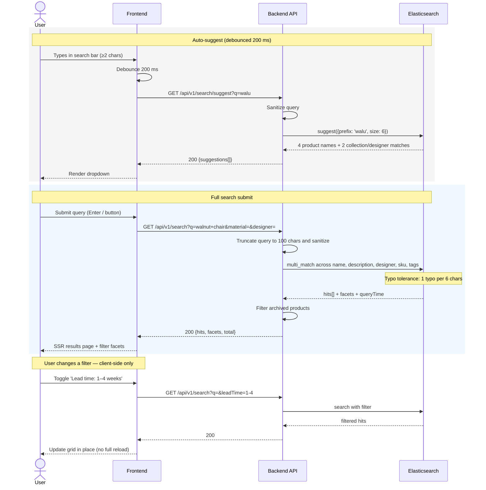
```mermaid
sequenceDiagram
    actor U as User
    participant FE as Frontend
    participant API as Backend API
    participant ES as Elasticsearch

    rect rgb(245,245,245)
    Note over U,ES: Auto-suggest (debounced 200 ms)
    U->>FE: Types in search bar (≥2 chars)
    FE->>FE: Debounce 200 ms
    FE->>API: GET /api/v1/search/suggest?q=walu
    API->>API: Sanitize query
    API->>ES: suggest({prefix: 'walu', size: 6})
    ES-->>API: 4 product names + 2 collection/designer matches
    API-->>FE: 200 {suggestions[]}
    FE-->>U: Render dropdown
    end

    rect rgb(240,248,255)
    Note over U,ES: Full search submit
    U->>FE: Submit query (Enter / button)
    FE->>API: GET /api/v1/search?q=walnut+chair&material=&designer=
    API->>API: Truncate query to 100 chars and sanitize
    API->>ES: multi_match across name, description, designer, sku, tags
    Note over ES: Typo tolerance: 1 typo per 6 chars
    ES-->>API: hits[] + facets + queryTime
    API->>API: Filter archived products
    API-->>FE: 200 {hits, facets, total}
    FE-->>U: SSR results page + filter facets
    end

    Note over U,FE: User changes a filter — client-side only
    U->>FE: Toggle 'Lead time: 1–4 weeks'
    FE->>API: GET /api/v1/search?q=&leadTime=1-4
    API->>ES: search with filter
    ES-->>API: filtered hits
    API-->>FE: 200
    FE-->>U: Update grid in place (no full reload)
```

### SD-02.2 Product Detail — Configurator + Spec PDF Download

*`F-02.3` · **Triggers:** TC-09 (15-min S3 presigned URL)*

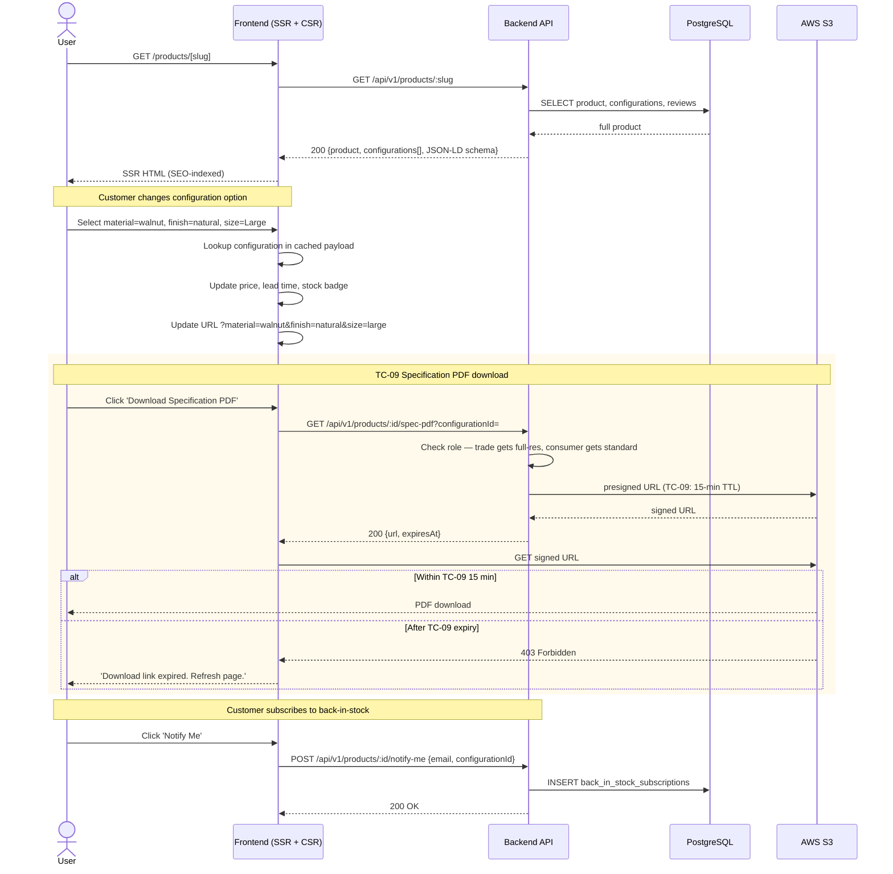
```mermaid
sequenceDiagram
    actor U as User
    participant FE as Frontend (SSR + CSR)
    participant API as Backend API
    participant DB as PostgreSQL
    participant S3 as AWS S3

    U->>FE: GET /products/[slug]
    FE->>API: GET /api/v1/products/:slug
    API->>DB: SELECT product, configurations, reviews
    DB-->>API: full product
    API-->>FE: 200 {product, configurations[], JSON-LD schema}
    FE-->>U: SSR HTML (SEO-indexed)

    Note over U,FE: Customer changes configuration option
    U->>FE: Select material=walnut, finish=natural, size=Large
    FE->>FE: Lookup configuration in cached payload
    FE->>FE: Update price, lead time, stock badge
    FE->>FE: Update URL ?material=walnut&finish=natural&size=large

    rect rgb(255,250,235)
    Note over U,S3: TC-09 Specification PDF download
    U->>FE: Click 'Download Specification PDF'
    FE->>API: GET /api/v1/products/:id/spec-pdf?configurationId=
    API->>API: Check role — trade gets full-res, consumer gets standard
    API->>S3: presigned URL (TC-09: 15-min TTL)
    S3-->>API: signed URL
    API-->>FE: 200 {url, expiresAt}
    FE->>S3: GET signed URL

    alt Within TC-09 15 min
        S3-->>U: PDF download
    else After TC-09 expiry
        S3-->>FE: 403 Forbidden
        FE-->>U: 'Download link expired. Refresh page.'
    end
    end

    Note over U,API: Customer subscribes to back-in-stock
    U->>FE: Click 'Notify Me'
    FE->>API: POST /api/v1/products/:id/notify-me {email, configurationId}
    API->>DB: INSERT back_in_stock_subscriptions
    API-->>FE: 200 OK
```

### SD-02.3 Delivery Availability Check

*`F-02.4` · **Cache:** browser sessionStorage 1h per (zip, productId)*

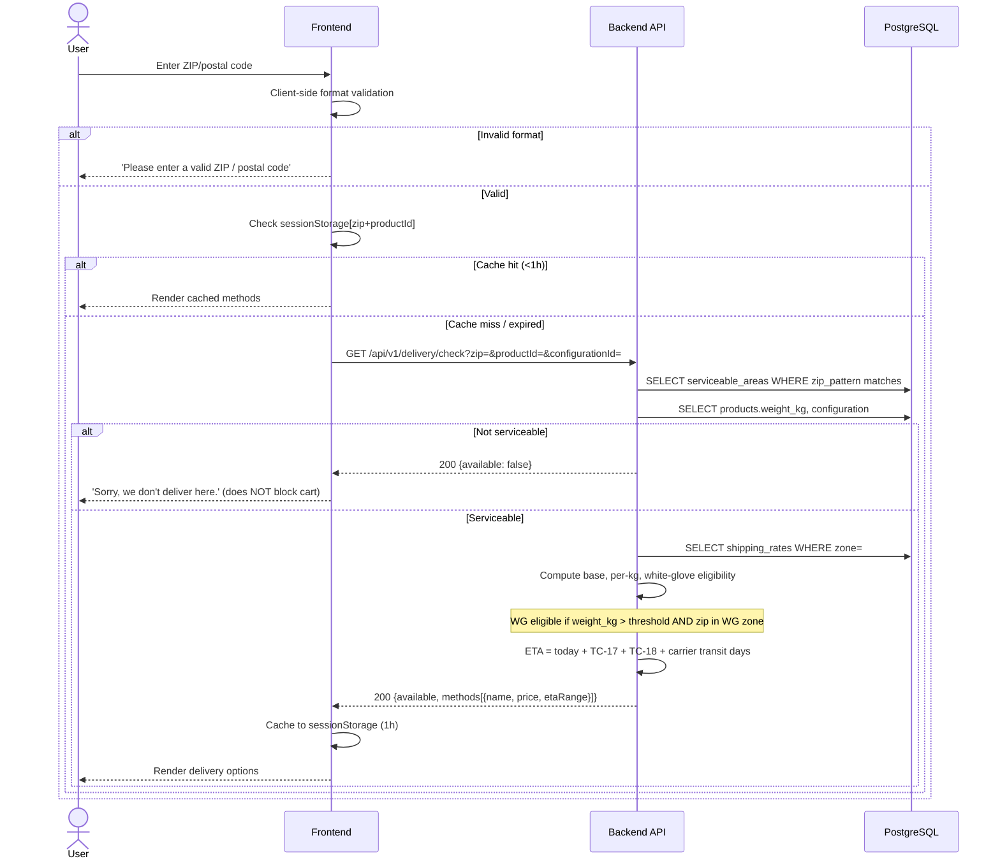
```mermaid
sequenceDiagram
    actor U as User
    participant FE as Frontend
    participant API as Backend API
    participant DB as PostgreSQL

    U->>FE: Enter ZIP/postal code
    FE->>FE: Client-side format validation

    alt Invalid format
        FE-->>U: 'Please enter a valid ZIP / postal code'
    else Valid
        FE->>FE: Check sessionStorage[zip+productId]

        alt Cache hit (<1h)
            FE-->>U: Render cached methods
        else Cache miss / expired
            FE->>API: GET /api/v1/delivery/check?zip=&productId=&configurationId=
            API->>DB: SELECT serviceable_areas WHERE zip_pattern matches
            API->>DB: SELECT products.weight_kg, configuration

            alt Not serviceable
                API-->>FE: 200 {available: false}
                FE-->>U: 'Sorry, we don't deliver here.' (does NOT block cart)
            else Serviceable
                API->>DB: SELECT shipping_rates WHERE zone=
                API->>API: Compute base, per-kg, white-glove eligibility
                Note over API: WG eligible if weight_kg > threshold AND zip in WG zone
                API->>API: ETA = today + TC-17 + TC-18 + carrier transit days
                API-->>FE: 200 {available, methods[{name, price, etaRange}]}
                FE->>FE: Cache to sessionStorage (1h)
                FE-->>U: Render delivery options
            end
        end
    end
```

### SD-02.4 Admin Product Publish

*`F-02.5` · **Search index sync within 60 s***

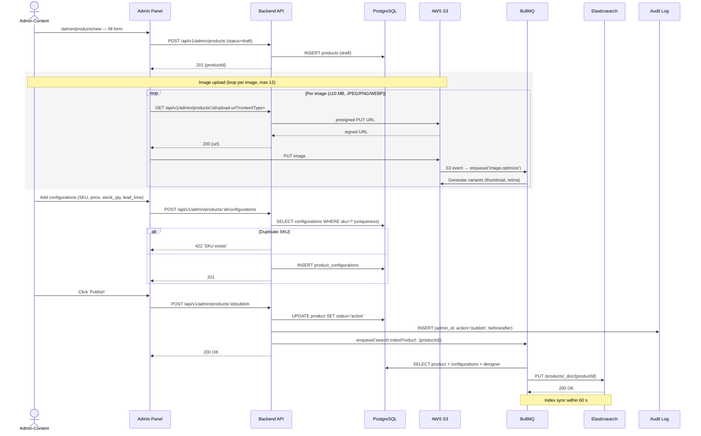
```mermaid
sequenceDiagram
    actor AC as Admin-Content
    participant FE as Admin Panel
    participant API as Backend API
    participant DB as PostgreSQL
    participant S3 as AWS S3
    participant BMQ as BullMQ
    participant ES as Elasticsearch
    participant Audit as Audit Log

    AC->>FE: /admin/products/new — fill form
    FE->>API: POST /api/v1/admin/products (status=draft)
    API->>DB: INSERT products (draft)
    API-->>FE: 201 {productId}

    rect rgb(245,245,245)
    Note over AC,S3: Image upload (loop per image, max 12)
    loop Per image (≤10 MB, JPEG/PNG/WEBP)
        FE->>API: GET /api/v1/admin/products/:id/upload-url?contentType=
        API->>S3: presigned PUT URL
        S3-->>API: signed URL
        API-->>FE: 200 {url}
        FE->>S3: PUT image
        S3->>BMQ: S3 event → enqueue('image.optimize')
        BMQ->>S3: Generate variants (thumbnail, retina)
    end
    end

    AC->>FE: Add configurations (SKU, price, stock_qty, lead_time)
    FE->>API: POST /api/v1/admin/products/:id/configurations
    API->>DB: SELECT configurations WHERE sku=? (uniqueness)
    alt Duplicate SKU
        API-->>FE: 422 'SKU exists'
    else
        API->>DB: INSERT product_configurations
        API-->>FE: 201
    end

    AC->>FE: Click 'Publish'
    FE->>API: POST /api/v1/admin/products/:id/publish
    API->>DB: UPDATE product SET status='active'
    API->>Audit: INSERT (admin_id, action='publish', before/after)
    API->>BMQ: enqueue('search.indexProduct', {productId})
    API-->>FE: 200 OK

    BMQ->>DB: SELECT product + configurations + designer
    BMQ->>ES: PUT /products/_doc/{productId}
    ES-->>BMQ: 200 OK
    Note over BMQ,ES: Index sync within 60 s
```

## M03 — Cart & Wishlist

### SD-03.1 Add to Cart — Guest and Authenticated

*`F-03.1` · **Triggers:** TC-12 (30-day Redis TTL for guest cart)*

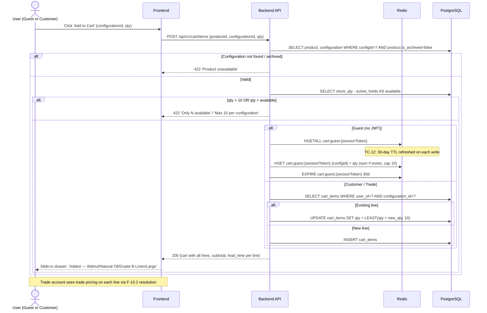
```mermaid
sequenceDiagram
    actor U as User (Guest or Customer)
    participant FE as Frontend
    participant API as Backend API
    participant R as Redis
    participant DB as PostgreSQL

    U->>FE: Click 'Add to Cart' (configurationId, qty)
    FE->>API: POST /api/v1/cart/items {productId, configurationId, qty}

    API->>DB: SELECT product, configuration WHERE configId=? AND product.is_archived=false
    alt Configuration not found / archived
        API-->>FE: 422 'Product unavailable'
    else Valid
        API->>DB: SELECT stock_qty - active_holds AS available

        alt qty > 10 OR qty > available
            API-->>FE: 422 'Only N available' / 'Max 10 per configuration'
        else
            alt Guest (no JWT)
                API->>R: HGETALL cart:guest:{sessionToken}
                Note over R: TC-12: 30-day TTL refreshed on each write
                API->>R: HSET cart:guest:{sessionToken} {configId} = qty (sum if exists, cap 10)
                API->>R: EXPIRE cart:guest:{sessionToken} 30d
            else Customer / Trade
                API->>DB: SELECT cart_items WHERE user_id=? AND configuration_id=?
                alt Existing line
                    API->>DB: UPDATE cart_items SET qty = LEAST(qty + new_qty, 10)
                else New line
                    API->>DB: INSERT cart_items
                end
            end

            API-->>FE: 200 {cart with all lines, subtotal, lead_time per line}
            FE-->>U: Slide-in drawer: 'Added — Walnut/Natural Oil/Grade B Linen/Large'
        end
    end

    Note over U,FE: Trade account sees trade pricing on each line via F-10.2 resolution
```

### SD-03.2 Guest → Account Cart Merge on Login

*`F-03.2` · **Atomic merge — all-or-nothing***

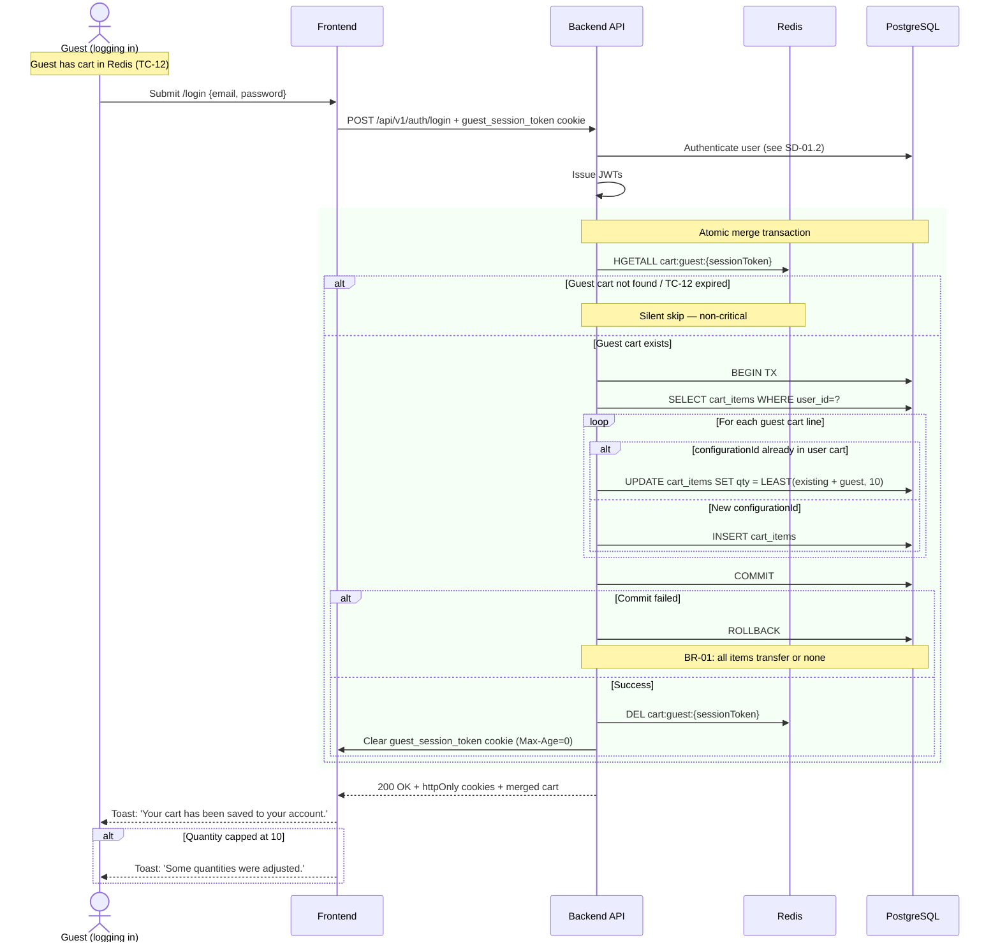
```mermaid
sequenceDiagram
    actor G as Guest (logging in)
    participant FE as Frontend
    participant API as Backend API
    participant R as Redis
    participant DB as PostgreSQL

    Note over G: Guest has cart in Redis (TC-12)
    G->>FE: Submit /login {email, password}
    FE->>API: POST /api/v1/auth/login + guest_session_token cookie

    API->>DB: Authenticate user (see SD-01.2)
    API->>API: Issue JWTs

    rect rgb(245,255,245)
    Note over API,DB: Atomic merge transaction
    API->>R: HGETALL cart:guest:{sessionToken}

    alt Guest cart not found / TC-12 expired
        Note over API,R: Silent skip — non-critical
    else Guest cart exists
        API->>DB: BEGIN TX
        API->>DB: SELECT cart_items WHERE user_id=?

        loop For each guest cart line
            alt configurationId already in user cart
                API->>DB: UPDATE cart_items SET qty = LEAST(existing + guest, 10)
            else New configurationId
                API->>DB: INSERT cart_items
            end
        end

        API->>DB: COMMIT
        alt Commit failed
            API->>DB: ROLLBACK
            Note over API,DB: BR-01: all items transfer or none
        else Success
            API->>R: DEL cart:guest:{sessionToken}
            API->>FE: Clear guest_session_token cookie (Max-Age=0)
        end
    end
    end

    API-->>FE: 200 OK + httpOnly cookies + merged cart
    FE-->>G: Toast: 'Your cart has been saved to your account.'

    alt Quantity capped at 10
        FE-->>G: Toast: 'Some quantities were adjusted.'
    end
```

### SD-03.3 Wishlist Add + Back-in-Stock Notification

*`F-03.3` · **Triggers:** TC-28 (1-hr back-in-stock email via BullMQ hourly job)*

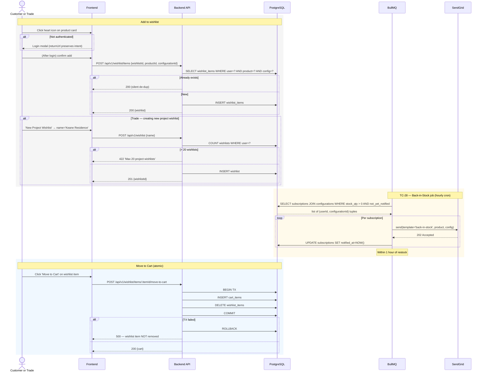
```mermaid
sequenceDiagram
    actor U as Customer or Trade
    participant FE as Frontend
    participant API as Backend API
    participant DB as PostgreSQL
    participant BMQ as BullMQ
    participant SG as SendGrid

    rect rgb(245,245,245)
    Note over U,DB: Add to wishlist
    U->>FE: Click heart icon on product card

    alt Not authenticated
        FE-->>U: Login modal (returnUrl preserves intent)
    end

    U->>FE: (After login) confirm add
    FE->>API: POST /api/v1/wishlist/items {wishlistId, productId, configurationId}
    API->>DB: SELECT wishlist_items WHERE user=? AND product=? AND config=?

    alt Already exists
        API-->>FE: 200 (silent de-dup)
    else New
        API->>DB: INSERT wishlist_items
        API-->>FE: 200 {wishlist}
    end

    alt Trade — creating new project wishlist
        U->>FE: 'New Project Wishlist' → name='Keane Residence'
        FE->>API: POST /api/v1/wishlist {name}
        API->>DB: COUNT wishlists WHERE user=?
        alt > 20 wishlists
            API-->>FE: 422 'Max 20 project wishlists'
        else
            API->>DB: INSERT wishlist
            API-->>FE: 201 {wishlistId}
        end
    end
    end

    rect rgb(255,250,235)
    Note over BMQ,SG: TC-28 — Back-in-Stock job (hourly cron)
    BMQ->>DB: SELECT subscriptions JOIN configurations WHERE stock_qty > 0 AND not_yet_notified
    DB-->>BMQ: list of (userId, configurationId) tuples

    loop Per subscription
        BMQ->>SG: send(template='back-in-stock', product, config)
        SG-->>BMQ: 202 Accepted
        BMQ->>DB: UPDATE subscriptions SET notified_at=NOW()
    end

    Note over BMQ: Within 1 hour of restock
    end

    rect rgb(240,248,255)
    Note over U,DB: Move to Cart (atomic)
    U->>FE: Click 'Move to Cart' on wishlist item
    FE->>API: POST /api/v1/wishlist/items/:itemId/move-to-cart
    API->>DB: BEGIN TX
    API->>DB: INSERT cart_items
    API->>DB: DELETE wishlist_items
    API->>DB: COMMIT
    alt TX failed
        API->>DB: ROLLBACK
        API-->>FE: 500 — wishlist item NOT removed
    else
        API-->>FE: 200 {cart}
    end
    end
```

## M04 — Checkout & Payment

### SD-04.1 Checkout Flow — TC-13 Inventory Hold + TC-14 Session Timer

*`F-04.1` · **Highest revenue-risk diagram in the system***

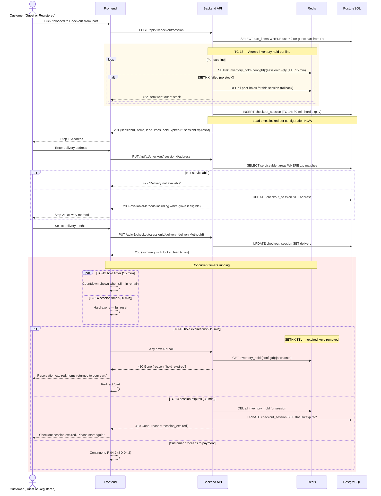
```mermaid
sequenceDiagram
    actor C as Customer (Guest or Registered)
    participant FE as Frontend
    participant API as Backend API
    participant R as Redis
    participant DB as PostgreSQL

    C->>FE: Click 'Proceed to Checkout' from /cart
    FE->>API: POST /api/v1/checkout/session
    API->>DB: SELECT cart_items WHERE user=? (or guest cart from R)

    rect rgb(255,250,235)
    Note over API,R: TC-13 — Atomic inventory hold per line
    loop Per cart line
        API->>R: SETNX inventory_hold:{configId}:{sessionId} qty (TTL 15 min)
        alt SETNX failed (no stock)
            API->>R: DEL all prior holds for this session (rollback)
            API-->>FE: 422 'Item went out of stock'
        end
    end
    end

    API->>DB: INSERT checkout_session (TC-14: 30-min hard expiry)
    Note over API,DB: Lead times locked per configuration NOW
    API-->>FE: 201 {sessionId, items, leadTimes, holdExpiresAt, sessionExpiresAt}
    FE-->>C: Step 1: Address

    C->>FE: Enter delivery address
    FE->>API: PUT /api/v1/checkout/:sessionId/address
    API->>DB: SELECT serviceable_areas WHERE zip matches
    alt Not serviceable
        API-->>FE: 422 'Delivery not available'
    else
        API->>DB: UPDATE checkout_session SET address
        API-->>FE: 200 {availableMethods including white-glove if eligible}
        FE-->>C: Step 2: Delivery method
    end

    C->>FE: Select delivery method
    FE->>API: PUT /api/v1/checkout/:sessionId/delivery {deliveryMethodId}
    API->>DB: UPDATE checkout_session SET delivery
    API-->>FE: 200 {summary with locked lead times}

    rect rgb(255,235,235)
    Note over FE,R: Concurrent timers running
    par TC-13 hold timer (15 min)
        FE->>FE: Countdown shown when ≤5 min remain
    and TC-14 session timer (30 min)
        FE->>FE: Hard expiry — full reset
    end

    alt TC-13 hold expires first (15 min)
        Note over R: SETNX TTL → expired keys removed
        FE->>API: Any next API call
        API->>R: GET inventory_hold:{configId}:{sessionId}
        API-->>FE: 410 Gone {reason: 'hold_expired'}
        FE-->>C: 'Reservation expired. Items returned to your cart.'
        FE->>FE: Redirect /cart
    else TC-14 session expires (30 min)
        API->>R: DEL all inventory_hold for session
        API->>DB: UPDATE checkout_session SET status='expired'
        API-->>FE: 410 Gone {reason: 'session_expired'}
        FE-->>C: 'Checkout session expired. Please start again.'
    else Customer proceeds to payment
        FE->>FE: Continue to F-04.2 (SD-04.2)
    end
    end
```

### SD-04.2 Stripe Payment Processing with Webhook Confirmation

*`F-04.2` · **Triggers:** TC-15 (30-sec timeout), TC-16 (24-hr idempotency)*

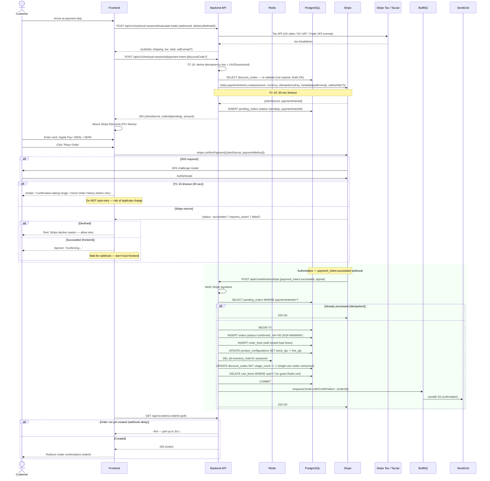
```mermaid
sequenceDiagram
    actor C as Customer
    participant FE as Frontend
    participant API as Backend API
    participant R as Redis
    participant DB as PostgreSQL
    participant Stripe as Stripe
    participant Tax as Stripe Tax / TaxJar
    participant BMQ as BullMQ
    participant SG as SendGrid

    C->>FE: Arrive at payment step
    FE->>API: POST /api/v1/checkout/:sessionId/calculate-totals {addressId, deliveryMethodId}
    API->>Tax: Tax API (US sales / EU VAT / Trade VAT-exempt)
    Tax-->>API: tax breakdown
    API-->>FE: {subtotal, shipping, tax, total, vatExempt?}

    FE->>API: POST /api/v1/checkout/:sessionId/payment-intent {discountCode?}
    API->>API: TC-16: derive idempotency key = UUID(sessionId)
    API->>DB: SELECT discount_codes — re-validate (not expired, limits OK)
    API->>Stripe: stripe.paymentIntents.create(amount, currency, idempotencyKey, metadata{vatExempt, vatNumber?})
    Note over API,Stripe: TC-15: 30-sec timeout
    Stripe-->>API: {clientSecret, paymentIntentId}
    API->>DB: INSERT pending_orders (status='pending', paymentIntentId)
    API-->>FE: 200 {clientSecret, orderId(pending), amount}

    FE->>FE: Mount Stripe Elements (PCI iframe)
    C->>FE: Enter card / Apple Pay / iDEAL / SEPA
    C->>FE: Click 'Place Order'
    FE->>Stripe: stripe.confirmPayment({clientSecret, paymentMethod})

    alt 3DS required
        Stripe->>C: 3DS challenge modal
        C->>Stripe: Authenticate
    end

    alt TC-15 timeout (30 sec)
        FE-->>C: Amber: 'Confirmation taking longer. Check Order History before retry.'
        Note over FE: Do NOT auto-retry — risk of duplicate charge
    else Stripe returns
        Stripe-->>FE: {status: 'succeeded' | 'requires_action' | 'failed'}
        alt Declined
            FE-->>C: Red: Stripe decline reason — allow retry
        else Succeeded (frontend)
            FE-->>C: Spinner: 'Confirming…'
            Note over FE: Wait for webhook — don't trust frontend
        end
    end

    rect rgb(245,255,245)
    Note over Stripe,DB: Authoritative — payment_intent.succeeded webhook
    Stripe->>API: POST /api/v1/webhooks/stripe {payment_intent.succeeded, signed}
    API->>API: Verify Stripe signature
    API->>DB: SELECT pending_orders WHERE paymentIntentId=?

    alt Already processed (idempotent)
        API-->>Stripe: 200 OK
    else
        API->>DB: BEGIN TX
        API->>DB: INSERT orders (status='confirmed', ref='HS-2026-NNNNNN')
        API->>DB: INSERT order_lines (with locked lead times)
        API->>DB: UPDATE product_configurations SET stock_qty -= line_qty
        API->>R: DEL all inventory_hold for sessionId
        API->>DB: UPDATE discount_codes SET usage_count += 1 (single-use codes consumed)
        API->>DB: DELETE cart_items WHERE user=? (or guest Redis cart)
        API->>DB: COMMIT
        API->>BMQ: enqueue('email.orderConfirmation', {orderId})
        BMQ->>SG: send(E-03 confirmation)
        API-->>Stripe: 200 OK
    end
    end

    FE->>API: GET /api/v1/orders/:orderId (poll)
    alt Order not yet created (webhook delay)
        API-->>FE: 404 — poll up to 30 s
    else Created
        API-->>FE: 200 {order}
        FE-->>C: Redirect /order-confirmation/:orderId
    end
```

### SD-04.3 Discount Code Apply with Re-Validation at Payment

*`F-04.3` · **Double validation pattern***

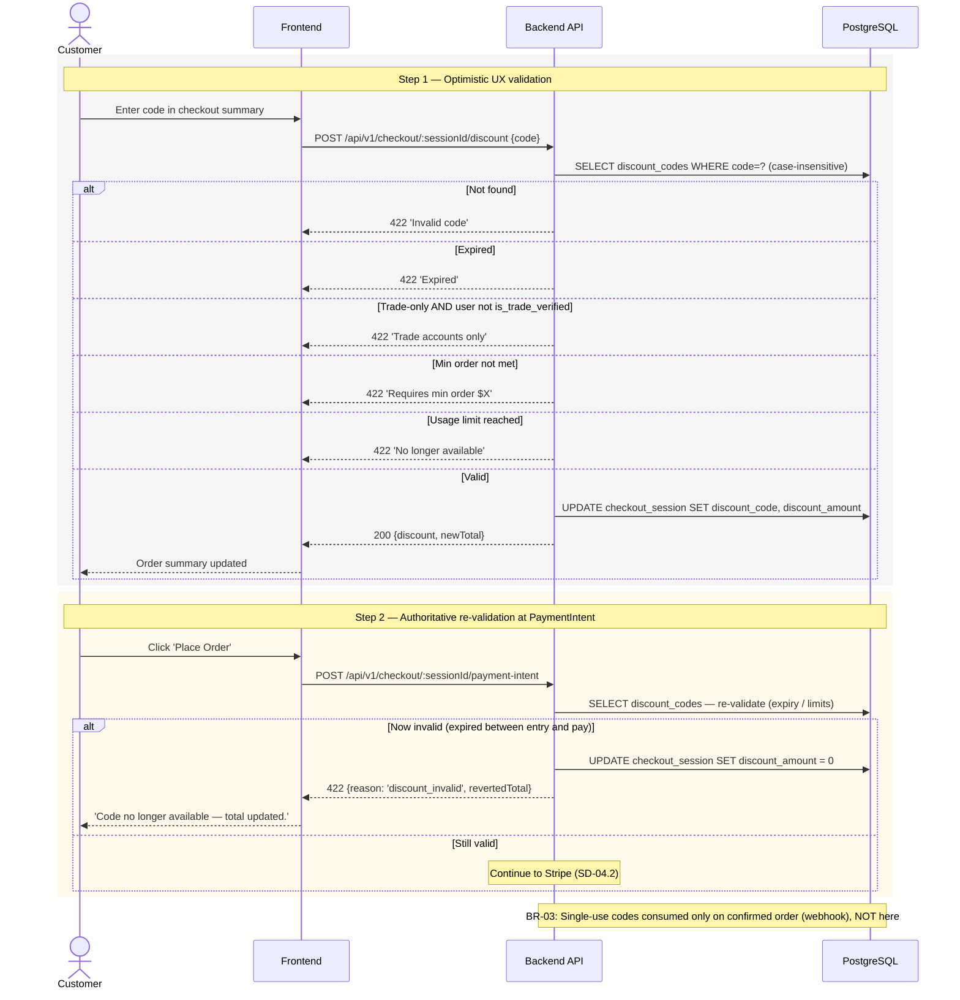
```mermaid
sequenceDiagram
    actor C as Customer
    participant FE as Frontend
    participant API as Backend API
    participant DB as PostgreSQL

    rect rgb(245,245,245)
    Note over C,DB: Step 1 — Optimistic UX validation
    C->>FE: Enter code in checkout summary
    FE->>API: POST /api/v1/checkout/:sessionId/discount {code}
    API->>DB: SELECT discount_codes WHERE code=? (case-insensitive)

    alt Not found
        API-->>FE: 422 'Invalid code'
    else Expired
        API-->>FE: 422 'Expired'
    else Trade-only AND user not is_trade_verified
        API-->>FE: 422 'Trade accounts only'
    else Min order not met
        API-->>FE: 422 'Requires min order $X'
    else Usage limit reached
        API-->>FE: 422 'No longer available'
    else Valid
        API->>DB: UPDATE checkout_session SET discount_code, discount_amount
        API-->>FE: 200 {discount, newTotal}
        FE-->>C: Order summary updated
    end
    end

    rect rgb(255,250,235)
    Note over C,DB: Step 2 — Authoritative re-validation at PaymentIntent
    C->>FE: Click 'Place Order'
    FE->>API: POST /api/v1/checkout/:sessionId/payment-intent
    API->>DB: SELECT discount_codes — re-validate (expiry / limits)

    alt Now invalid (expired between entry and pay)
        API->>DB: UPDATE checkout_session SET discount_amount = 0
        API-->>FE: 422 {reason: 'discount_invalid', revertedTotal}
        FE-->>C: 'Code no longer available — total updated.'
    else Still valid
        Note over API: Continue to Stripe (SD-04.2)
    end
    end

    Note over API,DB: BR-03: Single-use codes consumed only on confirmed order (webhook), NOT here
```

### SD-04.4 Tax & Shipping Calculation (US, EU, Trade VAT-Exempt)

*`F-04.4` · **Stripe Tax authoritative; flat-rate fallback on timeout***

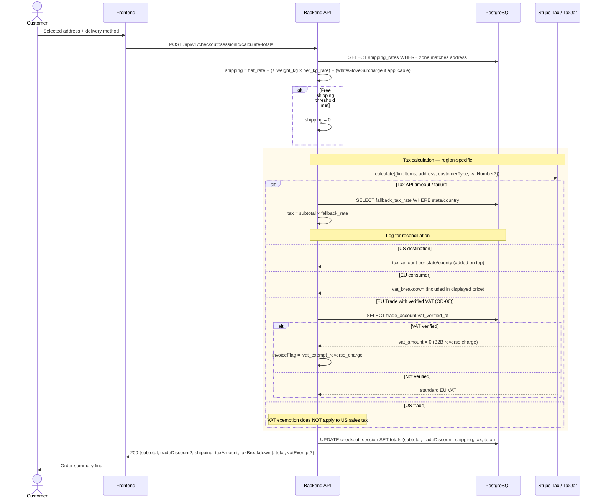
```mermaid
sequenceDiagram
    actor C as Customer
    participant FE as Frontend
    participant API as Backend API
    participant DB as PostgreSQL
    participant Tax as Stripe Tax / TaxJar

    C->>FE: Selected address + delivery method
    FE->>API: POST /api/v1/checkout/:sessionId/calculate-totals

    API->>DB: SELECT shipping_rates WHERE zone matches address
    API->>API: shipping = flat_rate + (Σ weight_kg × per_kg_rate) + (whiteGloveSurcharge if applicable)

    alt Free shipping threshold met
        API->>API: shipping = 0
    end

    rect rgb(255,250,235)
    Note over API,Tax: Tax calculation — region-specific
    API->>Tax: calculate({lineItems, address, customerType, vatNumber?})

    alt Tax API timeout / failure
        API->>DB: SELECT fallback_tax_rate WHERE state/country
        API->>API: tax = subtotal × fallback_rate
        Note over API,DB: Log for reconciliation
    else US destination
        Tax-->>API: tax_amount per state/county (added on top)
    else EU consumer
        Tax-->>API: vat_breakdown (included in displayed price)
    else EU Trade with verified VAT (OD-06)
        API->>DB: SELECT trade_account.vat_verified_at
        alt VAT verified
            Tax-->>API: vat_amount = 0 (B2B reverse charge)
            API->>API: invoiceFlag = 'vat_exempt_reverse_charge'
        else Not verified
            Tax-->>API: standard EU VAT
        end
    else US trade
        Note over API: VAT exemption does NOT apply to US sales tax
    end
    end

    API->>DB: UPDATE checkout_session SET totals (subtotal, tradeDiscount, shipping, tax, total)
    API-->>FE: 200 {subtotal, tradeDiscount?, shipping, taxAmount, taxBreakdown[], total, vatExempt?}
    FE-->>C: Order summary final
```

## M05 — Order Management

### SD-05.1 Order Confirmation, History, Receipt

*`F-05.1` · **Triggers:** TC-17 (4-hr SLA), TC-29 (email retry)*

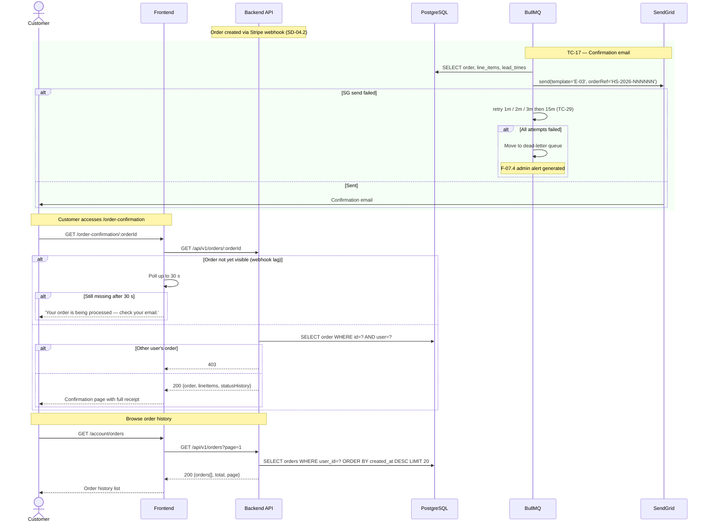
```mermaid
sequenceDiagram
    actor C as Customer
    participant FE as Frontend
    participant API as Backend API
    participant DB as PostgreSQL
    participant BMQ as BullMQ
    participant SG as SendGrid

    Note over API: Order created via Stripe webhook (SD-04.2)

    rect rgb(245,255,245)
    Note over BMQ,SG: TC-17 — Confirmation email
    BMQ->>DB: SELECT order, line_items, lead_times
    BMQ->>SG: send(template='E-03', orderRef='HS-2026-NNNNNN')
    alt SG send failed
        BMQ->>BMQ: retry 1m / 2m / 3m then 15m (TC-29)
        alt All attempts failed
            BMQ->>BMQ: Move to dead-letter queue
            Note over BMQ: F-07.4 admin alert generated
        end
    else Sent
        SG->>C: Confirmation email
    end
    end

    Note over C,FE: Customer accesses /order-confirmation
    C->>FE: GET /order-confirmation/:orderId
    FE->>API: GET /api/v1/orders/:orderId

    alt Order not yet visible (webhook lag)
        FE->>FE: Poll up to 30 s
        alt Still missing after 30 s
            FE-->>C: 'Your order is being processed — check your email.'
        end
    else
        API->>DB: SELECT order WHERE id=? AND user=?
        alt Other user's order
            API-->>FE: 403
        else
            API-->>FE: 200 {order, lineItems, statusHistory}
            FE-->>C: Confirmation page with full receipt
        end
    end

    Note over C,API: Browse order history
    C->>FE: GET /account/orders
    FE->>API: GET /api/v1/orders?page=1
    API->>DB: SELECT orders WHERE user_id=? ORDER BY created_at DESC LIMIT 20
    API-->>FE: 200 {orders[], total, page}
    FE-->>C: Order history list
```

### SD-05.2 Order Tracking with Carrier API

*`F-05.2` · **Tracking refresh every 2h via BullMQ***

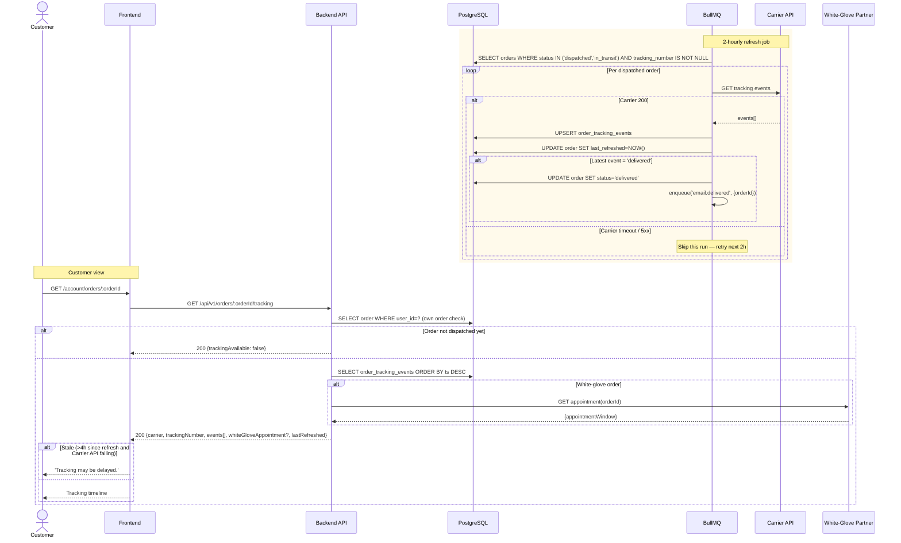
```mermaid
sequenceDiagram
    actor C as Customer
    participant FE as Frontend
    participant API as Backend API
    participant DB as PostgreSQL
    participant BMQ as BullMQ
    participant Carrier as Carrier API
    participant WG as White-Glove Partner

    rect rgb(255,250,235)
    Note over BMQ,Carrier: 2-hourly refresh job
    BMQ->>DB: SELECT orders WHERE status IN ('dispatched','in_transit') AND tracking_number IS NOT NULL

    loop Per dispatched order
        BMQ->>Carrier: GET tracking events
        alt Carrier 200
            Carrier-->>BMQ: events[]
            BMQ->>DB: UPSERT order_tracking_events
            BMQ->>DB: UPDATE order SET last_refreshed=NOW()
            alt Latest event = 'delivered'
                BMQ->>DB: UPDATE order SET status='delivered'
                BMQ->>BMQ: enqueue('email.delivered', {orderId})
            end
        else Carrier timeout / 5xx
            Note over BMQ: Skip this run — retry next 2h
        end
    end
    end

    Note over C,FE: Customer view
    C->>FE: GET /account/orders/:orderId
    FE->>API: GET /api/v1/orders/:orderId/tracking
    API->>DB: SELECT order WHERE user_id=? (own order check)
    alt Order not dispatched yet
        API-->>FE: 200 {trackingAvailable: false}
    else
        API->>DB: SELECT order_tracking_events ORDER BY ts DESC

        alt White-glove order
            API->>WG: GET appointment(orderId)
            WG-->>API: {appointmentWindow}
        end

        API-->>FE: 200 {carrier, trackingNumber, events[], whiteGloveAppointment?, lastRefreshed}
        alt Stale (>4h since refresh and Carrier API failing)
            FE-->>C: 'Tracking may be delayed.'
        else
            FE-->>C: Tracking timeline
        end
    end
```

### SD-05.3 Admin Order Fulfilment + Status Transition

*`F-05.3`, `F-05.4` · **Triggers:** TC-17, TC-18, TC-29*

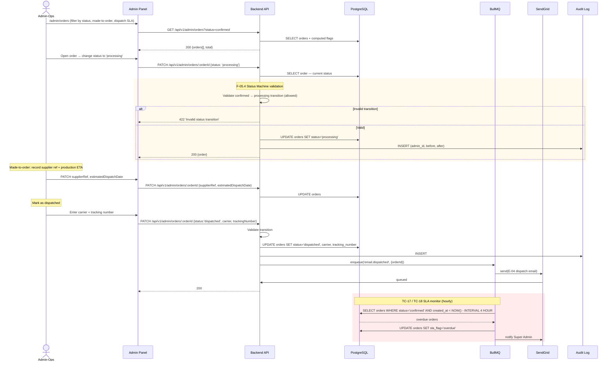
```mermaid
sequenceDiagram
    actor AOps as Admin-Ops
    participant FE as Admin Panel
    participant API as Backend API
    participant DB as PostgreSQL
    participant BMQ as BullMQ
    participant SG as SendGrid
    participant Audit as Audit Log

    AOps->>FE: /admin/orders (filter by status, made-to-order, dispatch SLA)
    FE->>API: GET /api/v1/admin/orders?status=confirmed
    API->>DB: SELECT orders + computed flags
    API-->>FE: 200 {orders[], total}

    AOps->>FE: Open order → change status to 'processing'
    FE->>API: PATCH /api/v1/admin/orders/:orderId {status: 'processing'}
    API->>DB: SELECT order — current status

    rect rgb(255,250,235)
    Note over API: F-05.4 Status Machine validation
    API->>API: Validate confirmed → processing transition (allowed)

    alt Invalid transition
        API-->>FE: 422 'Invalid status transition'
    else Valid
        API->>DB: UPDATE orders SET status='processing'
        API->>Audit: INSERT (admin_id, before, after)
        API-->>FE: 200 {order}
    end
    end

    Note over AOps: Made-to-order: record supplier ref + production ETA
    AOps->>FE: PATCH supplierRef, estimatedDispatchDate
    FE->>API: PATCH /api/v1/admin/orders/:orderId {supplierRef, estimatedDispatchDate}
    API->>DB: UPDATE orders

    Note over AOps: Mark as dispatched
    AOps->>FE: Enter carrier + tracking number
    FE->>API: PATCH /api/v1/admin/orders/:orderId {status:'dispatched', carrier, trackingNumber}
    API->>API: Validate transition
    API->>DB: UPDATE orders SET status='dispatched', carrier, tracking_number
    API->>Audit: INSERT
    API->>BMQ: enqueue('email.dispatched', {orderId})
    BMQ->>SG: send(E-04 dispatch email)
    SG->>API: queued
    API-->>FE: 200

    rect rgb(255,235,235)
    Note over BMQ,DB: TC-17 / TC-18 SLA monitor (hourly)
    BMQ->>DB: SELECT orders WHERE status='confirmed' AND created_at < NOW() - INTERVAL 4 HOUR
    DB-->>BMQ: overdue orders
    BMQ->>DB: UPDATE orders SET sla_flag='overdue'
    BMQ->>SG: notify Super Admin
    end
```

## M06 — Returns & Refunds

### SD-06.1 Customer Return Request

*`F-06.1` · **Triggers:** TC-19 (return window), TC-21 (admin SLA)*

```mermaid
sequenceDiagram
    actor C as Customer
    participant FE as Frontend
    participant API as Backend API
    participant S3 as AWS S3
    participant DB as PostgreSQL
    participant BMQ as BullMQ
    participant SG as SendGrid

    C->>FE: /account/orders/:orderId
    FE->>API: GET /api/v1/orders/:orderId
    API->>DB: SELECT order, line_items, delivered_at

    alt status != 'delivered'
        API-->>FE: 200 {returnable: false, reason: 'not_delivered'}
    else delivered_at + TC-19 window expired
        API-->>FE: 200 {returnable: false, reason: 'window_expired'}
    else
        API-->>FE: 200 {returnable: true, eligibleLineItems[]}
    end

    FE-->>C: Show 'Return Item' button (where eligible per OD-08)

    C->>FE: Select items, reason, optional photos
    rect rgb(245,245,245)
    Note over FE,S3: Photo upload (max 3, ≤5 MB, JPEG/PNG/WEBP)
    loop Per photo
        FE->>API: GET /api/v1/returns/upload-url
        API->>S3: presigned PUT
        S3-->>API: signed URL
        API-->>FE: {url}
        FE->>S3: PUT image
    end
    end

    FE->>API: POST /api/v1/orders/:orderId/returns {lineItemIds, reason, notes, photoKeys[]}
    API->>DB: SELECT order — re-check window AND eligibility
    alt Window expired (race)
        API-->>FE: 422 'Return window expired'
    else Already returned
        API-->>FE: 422 'Return already exists'
    else Made-to-order — OD-08 limits
        Note over API: BR-02: exchange / store credit only unless faulty
        API->>DB: INSERT return_request (eligibleForCashRefund=false)
    else Standard
        API->>DB: INSERT return_request (status='return_requested', eligibleForCashRefund=true)
        API->>DB: UPDATE order SET status='return_requested' (F-05.4)
    end

    API->>BMQ: enqueue('email.returnConfirm') and ('alert.adminReturn')
    BMQ->>SG: send E-07 to customer + admin notification
    API-->>FE: 201 {returnId, status}
    FE-->>C: 'Return request submitted. Admin review within 2 business days.'
```

### SD-06.2 Admin Return Review and Decision

*`F-06.2` · **TC-21: 2-business-day review SLA***

```mermaid
sequenceDiagram
    actor AOps as Admin-Ops
    participant FE as Admin Panel
    participant API as Backend API
    participant DB as PostgreSQL
    participant BMQ as BullMQ
    participant SG as SendGrid
    participant WG as White-Glove Partner

    AOps->>FE: /admin/returns?status=return_requested
    FE->>API: GET /api/v1/admin/returns
    API->>DB: SELECT returns + flag SLA breach
    API-->>FE: list + breach badges

    AOps->>FE: Open return — review photos, reason, item state
    FE->>API: GET /api/v1/admin/returns/:returnId
    API->>DB: SELECT return + S3 photo URLs (presigned)
    API-->>FE: 200 {return}

    rect rgb(245,245,245)
    Note over AOps,API: Decision — approve or reject
    alt Approve — cash refund
        AOps->>FE: PATCH decision='approved', refundType='cash_refund', refundAmount
        FE->>API: PATCH /api/v1/admin/returns/:returnId
        API->>DB: UPDATE return SET status='return_approved', refund_amount
        API->>DB: UPDATE order SET status='return_approved'

        alt White-glove pickup
            API->>WG: schedule pickup({address, slots})
            WG-->>API: appointmentId
            API->>DB: UPDATE return SET pickup_appointment
        end

        API->>BMQ: enqueue('email.returnApproved')
        BMQ->>SG: send return label / pickup confirmation
    else Approve — exchange / credit (made-to-order per OD-08)
        AOps->>FE: PATCH decision='approved', refundType='exchange_or_credit'
        FE->>API: PATCH ...
        API->>DB: UPDATE return SET refund_type='store_credit'
        API->>BMQ: enqueue('email.exchangeOption')
    else Reject
        AOps->>FE: PATCH decision='rejected', adminNotes
        FE->>API: PATCH ...
        API->>DB: UPDATE return SET status='return_rejected'
        API->>DB: UPDATE order SET status='return_rejected'
        API->>BMQ: enqueue('email.returnRejected')
        BMQ->>SG: send rejection with reason (customer-facing only)
    end
    end

    Note over API: TC-21 SLA monitor flags overdue returns to Super Admin
```

### SD-06.3 Refund Processing via Stripe + TC-30 Webhook Watchdog

*`F-06.3` · **Triggers:** TC-22, TC-23, TC-30*

```mermaid
sequenceDiagram
    actor AOps as Admin-Ops
    participant FE as Admin Panel
    participant API as Backend API
    participant DB as PostgreSQL
    participant Stripe as Stripe
    participant BMQ as BullMQ
    participant SG as SendGrid

    Note over AOps: Item received and inspected
    AOps->>FE: Click 'Initiate Refund'
    FE->>API: POST /api/v1/admin/returns/:returnId/refund {refundAmount}
    API->>DB: SELECT return + order WHERE id=?
    API->>API: Validate refundAmount ≤ original total

    API->>Stripe: stripe.refunds.create({paymentIntent, amount, idempotencyKey})
    Stripe-->>API: {refundId, status: 'pending'}
    API->>DB: UPDATE return SET status='refund_processing', stripe_refund_id
    API->>DB: UPDATE order SET status='refund_processing'
    API-->>FE: 200 {refundId, status}

    rect rgb(255,250,235)
    Note over Stripe,DB: Stripe refund.succeeded webhook (async, hours-days)
    Stripe->>API: POST /api/v1/webhooks/stripe {refund.succeeded}
    API->>API: Verify Stripe signature
    API->>DB: BEGIN TX
    API->>DB: UPDATE return SET status='refunded'
    API->>DB: UPDATE order SET status='refunded'
    API->>DB: COMMIT
    API->>BMQ: enqueue('email.refundCompleted')
    BMQ->>SG: send refund confirmation
    API-->>Stripe: 200 OK
    end

    rect rgb(255,235,235)
    Note over BMQ,DB: TC-30 watchdog — webhook silence ≥24h
    BMQ->>DB: SELECT returns WHERE status='refund_processing' AND refund_initiated_at < NOW() - 24h
    alt Found stale refunds
        BMQ->>SG: alert Ops + Super Admin
        BMQ->>DB: UPDATE return SET sla_alert='webhook_silent_24h'
    end
    end

    Note over C,API: Customer view (F-06.4)
    C->>FE: /account/orders/:orderId/refund
    FE->>API: GET /api/v1/orders/:orderId/refund
    API->>DB: SELECT return
    API->>API: Compute estimatedCreditDate per TC-23 (≤12 business days)
    API-->>FE: {refundId, amount, status, estimatedCreditDate}
    FE-->>C: Refund status timeline
```

## M07 — Reviews & Notifications

### SD-07.1 Verified-Purchase Review Submission

*`F-07.1` · **Triggers:** TC-24 (7-day prompt), TC-25 (180-day window)*

```mermaid
sequenceDiagram
    actor C as Customer
    participant FE as Frontend
    participant API as Backend API
    participant DB as PostgreSQL
    participant BMQ as BullMQ
    participant SG as SendGrid

    rect rgb(255,250,235)
    Note over BMQ,SG: TC-24 — Review prompt 7 days post-delivery
    BMQ->>DB: SELECT orders WHERE status='delivered' AND delivered_at = NOW() - 7d
    loop Per qualifying order
        BMQ->>DB: SELECT line_items + product
        BMQ->>SG: send(template='E-06 review prompt')
        SG->>C: 'Tell us what you think' email
    end
    end

    Note over C,API: Customer submits review
    C->>FE: /products/:slug → 'Write a Review'
    FE->>API: POST /api/v1/reviews {productId, rating, title, body}
    API->>DB: SELECT orders WHERE user_id=? AND status='delivered' AND product_id=?

    alt No matching delivered order — purchase not verified
        API-->>FE: 403 'You can only review products you have purchased.'
    else delivered_at + TC-25 window expired (>180d)
        API-->>FE: 422 'Review window closed.'
    else
        API->>DB: SELECT reviews WHERE user=? AND product=?

        alt Existing review
            API-->>FE: 422 + link to edit existing
        else New
            API->>DB: INSERT reviews (status='pending', verified_purchase=true)
            API->>BMQ: enqueue('alert.reviewPendingModeration')
            API-->>FE: 201 {reviewId, status: 'pending'}
            FE-->>C: 'Thanks! Your review will appear once approved.'
        end
    end
```

### SD-07.2 Admin Review Moderation

*`F-07.2` · **TC-26: 48-hr SLA, auto-approve at 72h***

```mermaid
sequenceDiagram
    actor ACont as Admin-Content
    participant FE as Admin Panel
    participant API as Backend API
    participant DB as PostgreSQL
    participant BMQ as BullMQ
    participant SG as SendGrid

    ACont->>FE: /admin/reviews?status=pending
    FE->>API: GET /api/v1/admin/reviews
    API->>DB: SELECT reviews + flag TC-26 breach
    API-->>FE: list

    ACont->>FE: Open review → Approve / Reject

    alt Approve
        FE->>API: PATCH /api/v1/admin/reviews/:reviewId {status:'approved'}
        API->>DB: UPDATE reviews SET status='approved', moderated_by, moderated_at
        API->>DB: Recompute product avg_rating, review_count
        API-->>FE: 200
        Note over API: Review immediately visible on product page
    else Reject
        FE->>API: PATCH ... {status:'rejected', moderatorNotes}
        API->>DB: UPDATE reviews SET status='rejected'
        API->>BMQ: enqueue('email.reviewRejected')
        BMQ->>SG: send notification with reason
    end

    rect rgb(255,235,235)
    Note over BMQ,DB: TC-26 — Auto-approve after 72h moderation silence
    BMQ->>DB: SELECT reviews WHERE status='pending' AND created_at < NOW() - 72h
    BMQ->>DB: UPDATE reviews SET status='approved', auto_approved=true
    BMQ->>DB: Recompute product rating
    end
```

### SD-07.3 Transactional Email Dispatch with TC-29 Retry

*`F-07.3` · **Common pipeline used by every customer-/admin-facing email***

```mermaid
sequenceDiagram
    participant Source as Triggering Feature
    participant BMQ as BullMQ
    participant DB as PostgreSQL
    participant SG as SendGrid / SES
    actor R as Recipient

    Source->>BMQ: enqueue('email.{template}', {recipient, payload})
    BMQ->>DB: SELECT email_templates WHERE id=? (versioned)
    DB-->>BMQ: subject, htmlBody, textBody
    BMQ->>BMQ: Render template with payload

    rect rgb(245,245,245)
    Note over BMQ,SG: TC-29 retry pattern
    BMQ->>SG: send(to, subject, html, text)
    alt 2xx
        SG-->>BMQ: 202 Accepted
        BMQ->>DB: INSERT email_log (status='sent')
        SG->>R: Email
    else 4xx (permanent — bad address)
        SG-->>BMQ: 4xx
        BMQ->>DB: INSERT email_log (status='failed_permanent')
        Note over BMQ: No retry on 4xx
    else 5xx / timeout — retry
        SG-->>BMQ: 5xx

        loop 3 attempts at 1-min intervals
            BMQ->>SG: retry
        end

        loop 1 final attempt at 15 min
            BMQ->>SG: retry
        end

        alt Still failing
            BMQ->>DB: INSERT into dead_letter_queue
            BMQ->>BMQ: enqueue('alert.emailDLQ') → F-07.4
        end
    end
    end

    Note over Source,R: Used by F-01.1, F-01.3, F-01.6, F-03.3, F-05.1, F-05.3, F-06.1, F-06.2, F-06.3, F-07.1, F-07.2, F-09.2, F-10.1, F-10.3
```

### SD-07.4 Admin Alert Generation

*`F-07.4` · **Aggregates events across modules***

```mermaid
sequenceDiagram
    participant Source as Module event source
    participant API as Backend API
    participant DB as PostgreSQL
    participant SG as SendGrid
    participant Slack as Slack Webhook
    actor Admin as Admin Recipient

    rect rgb(255,250,235)
    Note over Source,DB: Events that generate alerts
    Source->>API: e.g. low-stock reached (TC-27)
    Source->>API: e.g. trade application overdue (TC-TRA-01)
    Source->>API: e.g. dispatch SLA breached (TC-18)
    Source->>API: e.g. email DLQ entry (TC-29)
    Source->>API: e.g. Stripe webhook silent 24h (TC-30)
    end

    API->>DB: SELECT alert_settings WHERE event_type=?
    API->>DB: INSERT admin_alerts (event_type, severity, payload)

    par Email channel
        API->>SG: send(template='admin-alert', recipients[])
        SG->>Admin: Alert email
    and Slack channel (if configured)
        API->>Slack: POST webhook payload
    end

    Note over Admin,API: Admin acknowledges
    Admin->>API: PATCH /api/v1/admin/alerts/:alertId {acknowledged: true}
    API->>DB: UPDATE admin_alerts SET acknowledged_by, acknowledged_at

    Note over API,DB: Acknowledged alerts hidden from default view
```

## M08 — Compliance & Data

### SD-08.1 Cookie Consent + CCPA Opt-Out

*`F-08.1` · **Triggers:** TC-36 (consent required), TC-37 (CCPA immediate)*

```mermaid
sequenceDiagram
    actor U as Visitor
    participant FE as Frontend
    participant API as Backend API
    participant DB as PostgreSQL
    participant GA as Analytics Scripts

    U->>FE: First visit
    FE->>FE: Check first-party consent cookie

    alt No consent recorded
        FE-->>U: Show consent banner (granular: necessary, analytics, marketing)
        Note over FE,GA: TC-36: Analytics scripts NOT loaded yet
    else Consent valid (<12 months old)
        FE->>FE: Apply prior preferences
    end

    U->>FE: Choose preferences and submit
    FE->>API: POST /api/v1/consent {necessary:true, analytics, marketing, version}
    API->>DB: INSERT consent_records (user_id?, ip_hash, ts, version, prefs)
    API-->>FE: 200 {consentId}
    FE->>FE: Set consent cookie (12-month TTL)

    alt analytics=true
        FE->>GA: Load GA4 + Tag Manager
    else analytics=false
        Note over FE,GA: GA never loaded
    end

    rect rgb(255,235,235)
    Note over U,GA: TC-37 — CCPA opt-out (California users)
    U->>FE: Click 'Do Not Sell My Personal Information'
    FE->>API: PATCH /api/v1/consent {marketing:false, doNotSell:true}
    API->>DB: UPDATE consent_records
    API-->>FE: 200
    FE->>FE: Disable GA4 immediately (same page load)
    FE->>FE: Clear marketing cookies
    Note over FE,GA: TC-37: Opt-out takes effect within current page lifecycle
    end

    Note over API: If authenticated, consent also synced to user record
```

### SD-08.2 Right to Erasure (GDPR / CCPA)

*`F-08.2` · **Triggers:** TC-34 (30-day SLA), TC-32 (7-yr financial retention)*

```mermaid
sequenceDiagram
    actor C as Customer
    participant FE as Frontend
    participant API as Backend API
    participant DB as PostgreSQL
    participant S3 as AWS S3
    participant BMQ as BullMQ
    participant SG as SendGrid
    actor SA as Super Admin

    C->>FE: /account/security → 'Delete my account'
    FE-->>C: Confirmation modal — re-enter password
    C->>FE: Submit {password}
    FE->>API: POST /api/v1/account/erasure-request {password}
    API->>DB: SELECT user — verify password

    alt Wrong password
        API-->>FE: 401
    else
        API->>DB: INSERT erasure_requests (status='pending', scheduled_for=NOW()+30d)
        API->>DB: UPDATE users SET is_active=false (immediate deactivation)
        API->>DB: UPDATE refresh_tokens SET is_revoked=true (all sessions)
        API->>BMQ: enqueue('email.erasureRequested')
        BMQ->>SG: send confirmation
        API-->>FE: 200 {requestId, scheduledFor}
        FE-->>C: 'Account deactivated. Erasure within 30 days.'
    end

    Note over SA,DB: Super Admin processes (or scheduled job at 30d)
    SA->>API: PATCH /api/v1/admin/erasure-requests/:requestId {status:'processing'}

    rect rgb(245,255,245)
    Note over API,S3: Fan-out erasure — TC-34 within 30 days
    par Pseudonymise PII in users
        API->>DB: UPDATE users SET email=hash, first_name='Deleted', last_name='User', phone=NULL
    and Anonymise reviews (retain content)
        API->>DB: UPDATE reviews SET user_id=NULL, display_name='Anonymous'
    and Delete addresses, wishlists, sessions
        API->>DB: DELETE addresses, wishlist_items, refresh_tokens
    and Anonymise trade VAT data
        API->>DB: UPDATE trade_accounts SET vat_number=hash
    and Delete uploaded photos in S3
        API->>S3: DELETE return-photos, profile-images
    and Retain financial records (TC-32: 7 yrs)
        Note over API,DB: orders, invoices, tax_records — PII fields nulled, financial totals retained
    end
    end

    API->>DB: INSERT audit_log (TC-35: 3-yr archive eligible)
    API->>DB: UPDATE erasure_requests SET status='completed', completed_at
    API->>BMQ: enqueue('email.erasureCompleted')
    BMQ->>SG: final confirmation email to alternate contact if provided
```

### SD-08.3 Nightly Data Retention Jobs

*`F-08.3` · **Triggers:** TC-31, TC-32, TC-33, TC-35*

```mermaid
sequenceDiagram
    participant Cron as Cron Scheduler
    participant BMQ as BullMQ
    participant DB as PostgreSQL
    participant S3 as AWS S3 (Glacier)
    participant Audit as Audit Log
    actor SA as Super Admin

    Note over Cron: Nightly 02:00 UTC

    par TC-31 — Purge unverified accounts (>30d)
        Cron->>BMQ: enqueue('retention.unverifiedPurge')
        BMQ->>DB: SELECT users WHERE status='unverified' AND created_at < NOW() - 30d
        BMQ->>DB: SOFT DELETE matched users
        BMQ->>Audit: INSERT (job, count, errors)
    and TC-32 — Pseudonymise orders >7 yrs
        Cron->>BMQ: enqueue('retention.orderPseudonymise')
        BMQ->>DB: SELECT orders WHERE created_at < NOW() - 7y AND NOT pseudonymised
        BMQ->>DB: UPDATE orders — replace customer PII with hashed identifiers
        Note over BMQ,DB: Financial totals, line items, configurations retained
    and TC-33 — Purge server logs >90d
        Cron->>BMQ: enqueue('retention.serverLogsPurge')
        BMQ->>DB: DELETE FROM server_logs WHERE ts < NOW() - 90d
    and TC-35 — Archive audit logs >3 yrs
        Cron->>BMQ: enqueue('retention.auditArchive')
        BMQ->>DB: SELECT audit_log WHERE ts < NOW() - 3y
        BMQ->>S3: PUT to Glacier (audit-archive/year=YYYY/month=MM)
        BMQ->>DB: DELETE archived rows
    and Trade application data 5-yr retention
        Cron->>BMQ: enqueue('retention.tradeAppData')
        BMQ->>DB: SOFT DELETE trade_applications older than 5y
    end

    BMQ->>Audit: INSERT job_runs(job_name, started_at, completed_at, records_affected, errors)

    Note over SA,DB: Manual trigger via /admin/retention/jobs/:jobName/run
    SA->>BMQ: POST /api/v1/admin/retention/jobs/:jobName/run
    BMQ-->>SA: 202 {jobId, status:'queued'}
```

## M09 — Admin Panel

### SD-09.1 Admin Customer Deactivation with Forced Logout

*`F-09.2` · **Step-up MFA for PII reveal; session revoke on deactivation***

```mermaid
sequenceDiagram
    actor AOps as Admin-Ops
    participant FE as Admin Panel
    participant API as Backend API
    participant DB as PostgreSQL
    participant Audit as Audit Log
    participant BMQ as BullMQ
    participant SG as SendGrid

    AOps->>FE: /admin/customers — search/filter
    FE->>API: GET /api/v1/admin/customers?q=email
    API->>DB: SELECT users + computed LTV/AOV
    API-->>FE: list

    AOps->>FE: Open customer detail
    FE->>API: GET /api/v1/admin/customers/:id
    API->>DB: SELECT user (PII fields masked by default)
    API-->>FE: 200 (PII redacted)

    rect rgb(255,250,235)
    Note over AOps,API: Reveal PII — requires step-up MFA within 5 min
    AOps->>FE: Click 'Reveal email/phone'
    FE->>API: POST /api/v1/admin/customers/:id/reveal-pii
    API->>DB: SELECT admin_session — was MFA confirmed in last 5 min?

    alt MFA stale
        API-->>FE: 401 {requiresStepUp: true}
        FE-->>AOps: Re-enter TOTP
        AOps->>FE: TOTP code
        FE->>API: POST /api/v1/admin/auth/step-up {totpCode}
        API->>DB: Verify TOTP, refresh mfa_confirmed_at
        FE->>API: Retry reveal-pii
    end

    API->>DB: SELECT user — full PII
    API->>Audit: INSERT (admin_id, action='pii_reveal', target_user_id)
    API-->>FE: 200 {email, phone}
    end

    rect rgb(255,235,235)
    Note over AOps,DB: Deactivate customer
    AOps->>FE: 'Deactivate account' + reason

    alt Trade account
        Note over API: Block — trade lifecycle owned by Admin-Trade (F-10.1)
        API-->>FE: 403 'Use Trade Portal'
    else Standard customer
        FE->>API: POST /api/v1/admin/customers/:id/deactivate {reason}
        API->>DB: UPDATE users SET is_active=false, deactivated_reason
        API->>DB: UPDATE refresh_tokens SET is_revoked=true (all sessions, all devices)
        API->>Audit: INSERT (before/after diff)
        API->>BMQ: enqueue('email.accountDeactivated')
        BMQ->>SG: notify customer
        API-->>FE: 200
    end
    end

    Note over AOps,API: Reactivate / trigger password reset / data export — all audited
```

### SD-09.2 Inventory Bulk Adjust via CSV

*`F-09.3` · **Async job pattern; alerts on threshold cross***

```mermaid
sequenceDiagram
    actor AOps as Admin-Ops
    participant FE as Admin Panel
    participant API as Backend API
    participant S3 as AWS S3
    participant BMQ as BullMQ
    participant DB as PostgreSQL
    participant Audit as Audit Log

    AOps->>FE: /admin/inventory → 'Bulk Adjust (CSV)'
    AOps->>FE: Upload CSV {sku, delta, reason}
    FE->>API: GET /api/v1/admin/inventory/upload-url
    API->>S3: presigned PUT
    API-->>FE: {url, key}
    FE->>S3: PUT csv

    FE->>API: POST /api/v1/admin/inventory/bulk {s3Key}
    API->>BMQ: enqueue('inventory.bulkAdjust', {s3Key, adminId})
    API-->>FE: 202 {jobId, status:'queued'}
    FE-->>AOps: 'Bulk adjustment running. We'll email when done.'

    rect rgb(245,245,245)
    Note over BMQ,DB: Worker processes CSV
    BMQ->>S3: GET csv
    S3-->>BMQ: rows[]

    loop Per row (transactional per-row)
        BMQ->>DB: SELECT product_configurations WHERE sku=? FOR UPDATE
        alt SKU not found
            BMQ->>DB: APPEND result.rejected[]
        else
            BMQ->>DB: UPDATE stock_qty = stock_qty + delta
            BMQ->>DB: INSERT stock_adjustment_log (admin_id, before, after, reason)
            BMQ->>BMQ: Recompute available = on_hand - allocated

            alt available ≤ TC-27 threshold (debounce 24h)
                BMQ->>BMQ: enqueue('alert.lowStock', {sku})
            end

            BMQ->>DB: APPEND result.committed[]
        end
    end

    BMQ->>Audit: INSERT job summary (committed_count, rejected_count)
    BMQ->>BMQ: enqueue('email.bulkAdjustComplete')
    end

    Note over AOps,FE: AOps polls job status
    AOps->>FE: GET job status
    FE->>API: GET /api/v1/admin/inventory/jobs/:jobId
    API->>DB: SELECT job_runs
    API-->>FE: {status, committed[], rejected[], errors[]}
```

### SD-09.3 Admin Dashboard KPI Refresh

*`F-09.4` · **Role-scoped cards, 60-s cache TTL***

```mermaid
sequenceDiagram
    actor A as Admin (any role)
    participant FE as Admin Panel
    participant API as Backend API
    participant Cache as Redis Cache
    participant DB as PostgreSQL

    A->>FE: Login redirect → /admin/dashboard
    FE->>API: GET /api/v1/admin/dashboard
    API->>API: role = JWT claim → cards allow-list
    API->>Cache: GET dashboard:{role}

    alt Cache hit (<60s)
        Cache-->>API: cached cards
    else Cache miss
        par Compute role-allowed cards
            API->>DB: revenue (orders confirmed, net of refunds & trade discount)
        and
            API->>DB: orders today (business timezone)
        and
            API->>DB: new customers
        and
            API->>DB: low_stock count (TC-27 threshold)
        and
            API->>DB: trade applications submitted+under_review (F-10.1)
        and
            API->>DB: returns awaiting review (F-06.2)
        and
            API->>DB: SLA breaches (TC-17, TC-18)
        end

        API->>Cache: SETEX dashboard:{role} 60 cards
    end

    API-->>FE: 200 {cards[], salesTrendUrl, actionShelf}
    FE-->>A: Render KPI cards + action shelf

    rect rgb(245,245,245)
    Note over FE,API: Sales trend chart (separate endpoint)
    FE->>API: GET /api/v1/admin/dashboard/sales-trend?range=30d
    API->>DB: SELECT daily aggregates
    API-->>FE: 200 {points[]}
    end

    rect rgb(240,248,255)
    Note over FE,API: 60-s polling refresh
    loop Every 60s
        FE->>API: GET dashboard
    end
    end

    Note over A,FE: Manual refresh bypasses cache
    A->>FE: Click 'Refresh'
    FE->>API: GET /api/v1/admin/dashboard?bypassCache=true
    API->>Cache: DEL dashboard:{role}
    API->>DB: recompute
```

### SD-09.4 Promotion Bulk Code Creation

*`F-09.5` · **CSV bulk import; trade-only invisible to consumer roles***

```mermaid
sequenceDiagram
    actor ACont as Admin-Content
    participant FE as Admin Panel
    participant API as Backend API
    participant S3 as AWS S3
    participant BMQ as BullMQ
    participant DB as PostgreSQL
    participant Audit as Audit Log

    rect rgb(245,245,245)
    Note over ACont,DB: Single promotion (wizard)
    ACont->>FE: /admin/promotions/new — wizard (Code, Discount, Eligibility, Schedule, Review)
    FE->>API: POST /api/v1/admin/promotions {code, type, value, eligibility, schedule}
    API->>DB: SELECT promotions WHERE code=?
    alt Code exists
        API-->>FE: 422 'Code already taken'
    else
        API->>DB: INSERT promotions (status auto: scheduled OR active)
        API->>Audit: INSERT
        API-->>FE: 201
    end
    end

    rect rgb(255,250,235)
    Note over ACont,DB: Bulk CSV (single-use codes)
    ACont->>FE: 'Bulk import' — upload CSV
    FE->>API: GET upload-url
    API->>S3: presigned PUT
    API-->>FE: {url, key}
    FE->>S3: PUT csv

    FE->>API: POST /api/v1/admin/promotions/bulk {s3Key}
    API->>BMQ: enqueue('promo.bulkImport')
    API-->>FE: 202 {jobId}

    BMQ->>S3: GET csv
    loop Per row
        BMQ->>DB: INSERT promotions (idempotency by code)
    end
    BMQ->>Audit: INSERT job summary
    BMQ->>BMQ: enqueue('email.bulkImportComplete')
    end

    Note over ACont,API: Edit / retire active promotion
    ACont->>FE: Open active promotion
    alt Type or value change attempted (any redemption exists)
        API-->>FE: 422 'Retire and recreate'
    else Cosmetic edit
        API->>DB: UPDATE promotions
        API->>Audit: INSERT
    end

    ACont->>FE: 'Retire' — terminal status
    FE->>API: POST /api/v1/admin/promotions/:id/retire
    API->>DB: UPDATE status='retired'
    Note over API: Trade-only codes invisible to non-trade redemption attempts (F-04.3)
```

## M10 — Trade Portal

### SD-10.1 Trade Account Application Review and Provisioning

*`F-10.1` · **Triggers:** TC-TRA-01 (5-business-day SLA), provisions tier (F-10.2) + AM (F-10.3)*

```mermaid
sequenceDiagram
    actor TApp as Applicant (Trade)
    actor ATra as Admin-Trade
    participant FE as Trade Portal / Admin Panel
    participant API as Backend API
    participant DB as PostgreSQL
    participant S3 as AWS S3
    participant VIES as EU VIES
    participant Reg as Business Registry API
    participant BMQ as BullMQ
    participant SG as SendGrid
    participant Audit as Audit Log

    rect rgb(245,245,245)
    Note over TApp,DB: Application submission
    TApp->>FE: /trade/apply — business details + documents
    FE->>API: GET upload-url (per document)
    API->>S3: presigned PUT (encrypted at rest, 7-yr retention)
    FE->>S3: PUT documents

    FE->>API: POST /api/v1/trade/applications {business, vatNumber, docs[]}
    API->>DB: INSERT trade_applications (status='submitted')
    API->>BMQ: enqueue('trade.autoChecks', {applicationId})
    API-->>FE: 201 {applicationId}
    end

    rect rgb(240,248,255)
    Note over BMQ,Reg: Async automated checks
    par VAT lookup (EU only)
        BMQ->>VIES: lookup(vatNumber, country)
        VIES-->>BMQ: {valid, traderName}
    and Business registry
        BMQ->>Reg: lookup(registrationNumber)
        Reg-->>BMQ: {active, address}
    and Email/domain reputation
        BMQ->>BMQ: heuristics (disposable check, MX, age)
    end
    BMQ->>DB: UPDATE trade_applications SET auto_check_results
    end

    Note over ATra,API: Admin-Trade reviews
    ATra->>FE: /admin/trade/applications
    FE->>API: GET /api/v1/admin/trade/applications
    API->>DB: SELECT + flag TC-TRA-01 breaches
    API-->>FE: list

    ATra->>FE: Open application
    FE->>API: GET /api/v1/admin/trade/applications/:id
    API->>DB: UPDATE SET status='under_review' (first open)
    API->>Audit: INSERT
    API-->>FE: full detail + auto_checks + S3 doc presigned URLs

    rect rgb(245,255,245)
    Note over ATra,SG: Approval path
    ATra->>FE: 'Approve' + select tier (F-10.2) + assign AM (F-10.3) + welcome notes

    alt No AM available
        API-->>FE: 422 'AM required before approval'
    else Has AM
        FE->>API: POST /api/v1/admin/trade/applications/:id/decision {decision:'approved', tierId, accountManagerId}
        API->>DB: BEGIN TX
        API->>DB: UPDATE trade_applications SET status='approved', decided_by, decided_at
        API->>DB: INSERT trade_accounts (user_id, tier_id, vat_exempt = (vies_valid AND eu))
        API->>DB: UPDATE users SET role='verified_trade'
        API->>DB: INSERT trade_account_assignments (account, account_manager)
        API->>DB: COMMIT
        API->>Audit: INSERT
        API->>BMQ: enqueue('email.tradeWelcome')
        BMQ->>SG: send welcome with AM contact details
    end
    end

    rect rgb(255,235,235)
    Note over ATra,SG: Rejection path
    ATra->>FE: 'Reject' + customer-facing reason + internal notes
    FE->>API: POST .../decision {decision:'rejected', customerReason, internalNotes}
    API->>DB: UPDATE status='rejected'
    API->>BMQ: enqueue('email.tradeRejection')
    BMQ->>SG: send rejection — ONLY customer-facing reason (no internal note leakage)
    end

    rect rgb(255,250,235)
    Note over BMQ,DB: TC-TRA-01 SLA monitor (hourly)
    BMQ->>DB: SELECT applications WHERE status IN ('submitted','under_review') AND created_at < NOW() - 5 business days
    BMQ->>DB: UPDATE SET sla_breach=true
    BMQ->>BMQ: enqueue('alert.tradeOverdueSLA') → F-09.4 dashboard + F-07.4 digest
    end
```

### SD-10.2 Trade Pricing Resolution at Cart / Checkout

*`F-10.2` · **Server-side resolution; never client-side***

```mermaid
sequenceDiagram
    actor T as Verified Trade Account
    participant FE as Frontend
    participant API as Backend API
    participant Cache as Redis Cache
    participant DB as PostgreSQL

    T->>FE: View cart / PDP / checkout
    FE->>API: GET /api/v1/cart (with trade JWT)
    API->>API: role = trade

    loop Per cart line
        API->>Cache: GET trade_price:{userId}:{configId}

        alt Cache hit
            Cache-->>API: resolved price
        else Cache miss
            rect rgb(245,245,245)
            Note over API,DB: Resolution priority (highest → lowest)
            API->>DB: SELECT customer_product_overrides WHERE user_id=? AND product_id=?

            alt Customer-product override exists
                API->>API: use override discount
            else
                API->>DB: SELECT customer_category_overrides WHERE user_id=? AND category_id=?
                alt Customer-category override exists
                    API->>API: use override
                else
                    API->>DB: SELECT trade_accounts.tier_id
                    API->>DB: SELECT tier_category_overrides WHERE tier_id=? AND category_id=?
                    alt Tier-category override exists
                        API->>API: use override
                    else
                        API->>DB: SELECT tiers.baseline_discount WHERE id=tier_id
                        API->>API: use baseline
                    end
                end
            end

            API->>API: final_price = list_price × (1 - resolved_percent)
            API->>API: Apply currency-specific rounding rule
            end
            API->>Cache: SETEX trade_price:{userId}:{configId} 60 final
        end
    end

    API-->>FE: 200 {items with tradePrice, tradeSubtotal}
    FE-->>T: Show 'Trade Price' line below RRP

    rect rgb(255,250,235)
    Note over Cache,DB: Cache invalidation when admin updates pricing (F-10.2 admin)
    Note over Cache: Within 60 s of admin tier/override save
    Note over Cache: TC-14 — locked checkout sessions retain prior captured price
    end
```

### SD-10.3 Account Manager Bulk Assignment

*`F-10.3` · **Per-row transactional, not all-or-nothing***

```mermaid
sequenceDiagram
    actor ATra as Admin-Trade
    participant FE as Admin Panel
    participant API as Backend API
    participant DB as PostgreSQL
    participant BMQ as BullMQ
    participant SG as SendGrid
    participant Audit as Audit Log

    ATra->>FE: /admin/trade/account-managers — Workbench tab
    FE->>API: GET /api/v1/admin/trade/workload
    API->>DB: SELECT account_managers + book_size + max_book + flag>90%
    API-->>FE: roster + workload

    ATra->>FE: Filter unassigned accounts and select multi
    ATra->>FE: Choose target AM + reason (controlled vocabulary)
    FE->>API: POST /api/v1/admin/trade/assignments/bulk {accountIds[], accountManagerId, reason}

    rect rgb(245,245,245)
    Note over API,DB: Preview + commit
    API->>DB: SELECT — check AM not on leave / departed and not at max
    API->>API: Build preview {willAssign[], rejected[]}

    alt User clicks 'Preview only'
        API-->>FE: 200 {preview}
    else User commits
        API->>DB: BEGIN BATCH (per-row TX, not all-or-nothing)

        loop Per accountId
            API->>DB: BEGIN TX
            API->>DB: SELECT account_manager max_book vs current
            alt Capacity exceeded
                API->>DB: ROLLBACK
                API->>API: APPEND rejected[]
            else
                API->>DB: UPDATE trade_account_assignments SET account_manager=newAM, reason
                API->>DB: UPDATE trade_accounts SET ams_email=newAM.public_email, ams_phone
                API->>Audit: INSERT (batch_id, before, after)
                API->>DB: COMMIT
                API->>API: APPEND committed[]
            end
        end

        API->>BMQ: enqueue('email.amAssignmentNotice') for each committed
        BMQ->>SG: send to customer (optional per assignment setting)
        API-->>FE: 200 {batchId, committed[], rejected[]}
    end
    end

    Note over ATra,API: Lifecycle — On Leave / Departed
    ATra->>API: POST /api/v1/admin/trade/account-managers/:id/leave {fallbackAmId?}
    alt Fallback provided
        API->>DB: Reassign in-flight conversations to fallback
    end

    ATra->>API: POST .../depart
    API->>DB: UPDATE accounts → unassigned (book set null)
    API->>BMQ: enqueue('alert.unassignedAccounts') → F-09.4
    Note over API: Departed AMs non-deletable — retained for audit
```

