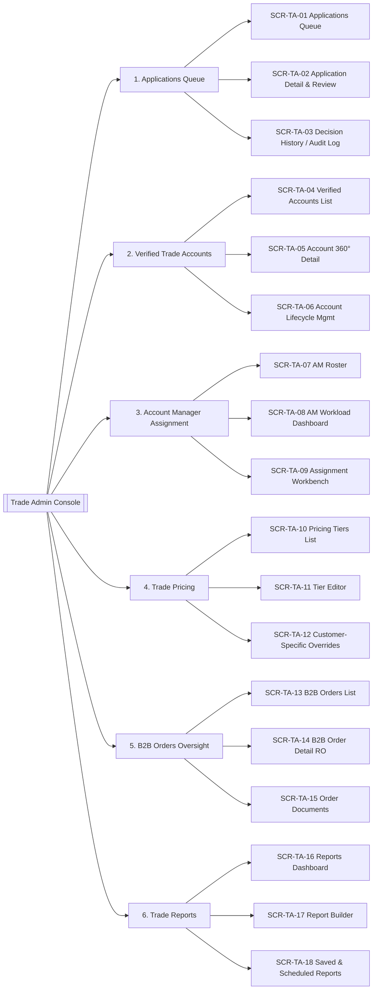

# Trade Admin — Screen Catalogue

```
Document Type:   Screen / IA Specification
Version:         0.1
Status:          Draft
Author:          [BA — placeholder]
Last Updated:    2026-05-06
Stakeholders:    Product Owner, Admin — Trade lead, B2B Operations,
                 UX Lead, Engineering, Finance (pricing approver)
Role in scope:   Admin — Trade (per Section 2 of HomeStyle BA standard)
```

## 1. Purpose

Define every screen the **Admin — Trade** role needs to perform their four
duty pillars:

1. Vet and decide on **trade account applications**.
2. Maintain the **verified trade account base** (lifecycle, documents, segmentation).
3. Assign and rebalance **Account Manager (AM)** coverage.
4. Govern **trade pricing** (tiers + per-account overrides).
5. Oversee **B2B orders** (read-only on fulfilment per scope).
6. Run **trade reports** to track activation, AOV, AM performance.

The information architecture below organises **18 screens into 6 navigation groups**,
matching Admin — Trade's mental model of "applications → accounts → coverage →
pricing → orders → insights".

## 2. Permission Boundaries (recap)

Per BR-005, BR-009, BR-010, BR-011 and Section 2 of the BA standard:

- Admin — Trade **can** approve/reject trade applications, manage trade pricing,
  assign AMs, and view B2B orders.
- Admin — Trade **cannot** edit catalogue content, modify B2C pricing, change
  fulfilment status on B2B orders (read-only), or alter roles & permissions
  (Super Admin only).
- All decisions on trade accounts must be auditable (BR-005).

## 3. Information Architecture



---

## Group 1 — Applications Queue

Funnel for incoming trade-account applications through a triage → review → decision workflow.

### SCR-TA-01 · Applications Queue

| Field | Value |
|---|---|
| **Purpose** | Triage list of all trade applications pending review or recently decided. |
| **Primary actor** | Admin — Trade |
| **Entry points** | Sidebar `Applications`, dashboard tile "Pending applications". |
| **Key components** | (1) Status tabs: `New` / `In Review` / `Awaiting Info` / `Approved` / `Rejected`. (2) Filter bar: region (US/UK/EU), business type, submission date, assigned reviewer. (3) Saved-view selector. (4) Bulk-action toolbar. (5) Data table: applicant, business name, country, submitted-on, SLA timer, reviewer, status. (6) Row actions: Open, Claim, Reassign. |
| **Key data** | Application ID, business legal name, country, VAT/EIN, applied tier, submission timestamp, SLA countdown (days remaining vs. SLA), current reviewer. |
| **Primary actions** | Open application, Claim review, Reassign reviewer, Bulk reject (with mandatory reason). |
| **Business rules** | BR-005 (decision audit), assumption A1 (review SLA TBD). |
| **Navigation out** | → SCR-TA-02 (open), → SCR-TA-03 (audit). |

### SCR-TA-02 · Application Detail & Review

| Field | Value |
|---|---|
| **Purpose** | Single-application workspace for KYC review and decision. |
| **Primary actor** | Admin — Trade |
| **Entry points** | Row open on SCR-TA-01. |
| **Key components** | (1) Header: applicant + status pill + SLA. (2) Tab `Business Profile` — legal name, trading name, registration #, VAT/EIN, addresses, website. (3) Tab `Contacts` — primary contact, billing contact, phone/email. (4) Tab `Documents` — uploaded business proof, tax certificate, ID; preview + verify checkbox per doc. (5) Tab `Trade Profile` — declared annual spend, segments (residential / hospitality / corporate), portfolio links. (6) Tab `Internal Notes` — threaded comments by reviewers. (7) Decision panel (sticky right rail): Approve → assign tier + AM; Reject → reason taxonomy + free text; Request more info → email template + checklist. |
| **Key data** | All applicant-supplied fields + uploaded artefacts + reviewer activity. |
| **Primary actions** | Approve, Reject, Request more info, Save draft, Add note, Reassign. |
| **Business rules** | BR-005 (only Admin — Trade decides); A2 (decision triggers email). |
| **Navigation out** | → SCR-TA-05 on approval (newly verified account), → SCR-TA-09 to assign AM, → SCR-TA-03 audit. |

### SCR-TA-03 · Decision History / Audit Log

| Field | Value |
|---|---|
| **Purpose** | Append-only ledger of every application state change for compliance & SLA reporting. |
| **Primary actor** | Admin — Trade (read), Super Admin (read). |
| **Key components** | Filter (date range, reviewer, decision type, application ID). Read-only table: timestamp, application ID, applicant, actor, action, before-state, after-state, reason code, free-text reason. Export CSV. |
| **Primary actions** | Filter, Export. (No edits — append-only.) |
| **Business rules** | BR-005, GDPR retention (BR-012 reference). |
| **Navigation out** | → SCR-TA-02 (read-only deep link from row). |

---

## Group 2 — Verified Trade Accounts

Operational base of approved B2B customers.

### SCR-TA-04 · Verified Accounts List

| Field | Value |
|---|---|
| **Purpose** | Browse, search and segment verified trade accounts. |
| **Key components** | Search (name, VAT, AM). Filters: tier, AM, region, status (Active / Suspended / Re-verification due), last-order recency. Saved segments. Data table: account name, tier, AM, country, lifetime GMV, last order, status. Bulk actions: reassign AM, change tier (with approval), export. |
| **Key data** | Account record summary + commercial KPIs (lifetime GMV, AOV). |
| **Primary actions** | Open account, Bulk reassign AM, Bulk export, Add segment. |
| **Business rules** | BR-003 (trade pricing visibility scope), BR-008. |
| **Navigation out** | → SCR-TA-05, → SCR-TA-09. |

### SCR-TA-05 · Account 360° Detail

| Field | Value |
|---|---|
| **Purpose** | Single-pane view of one trade account for the AM and Trade Admin. |
| **Key components** | Header: account name, tier badge, AM avatar, status. Tabs: `Overview` (KPIs, recent orders, open quotes), `Contacts` (designers/buyers), `Projects & Wishlists` (linked B2B project carts), `Pricing` (effective tier + overrides — link to SCR-TA-12), `Orders` (links into SCR-TA-14), `Documents` (business proof, signed terms), `Activity Timeline` (status changes, AM changes, login events), `Notes` (CRM-style). |
| **Primary actions** | Edit profile, Change tier (audit), Change AM (→ SCR-TA-09), Suspend (→ SCR-TA-06), Trigger re-verification, Add note. |
| **Business rules** | BR-003, BR-004 (VAT exemption flag), BR-005, BR-008. |
| **Navigation out** | → SCR-TA-06, SCR-TA-09, SCR-TA-12, SCR-TA-14. |

### SCR-TA-06 · Account Lifecycle Management

| Field | Value |
|---|---|
| **Purpose** | Dedicated workflow for status transitions: suspend, reinstate, re-verify, off-board. |
| **Key components** | Current status banner. Action panel with reason taxonomy: `Suspend` (fraud / non-payment / customer request / re-verify required), `Reinstate`, `Schedule re-verification`, `Off-board / archive`. Required documents per action. Confirmation modal. Effective-date picker. Notification preview (account email + AM email). |
| **Primary actions** | Suspend, Reinstate, Schedule re-verification, Off-board. |
| **Business rules** | BR-005, BR-012 (right-to-erasure interplay on off-boarding). |
| **Navigation out** | → SCR-TA-05. |

---

## Group 3 — Account Manager Assignment

Coverage and load-balancing for the AM team.

### SCR-TA-07 · AM Roster

| Field | Value |
|---|---|
| **Purpose** | Master list of Account Managers with coverage attributes. |
| **Key components** | Table: AM name, region(s), languages, segments (residential/hospitality), capacity (max accounts), current load, status (active/leave). Filter by region/language/segment. Add/Edit/Deactivate AM (writes to AM master). |
| **Primary actions** | Add AM, Edit AM, Mark on leave, Deactivate. |
| **Business rules** | A3 (AM master managed by Trade Admin; confirm with HR). |
| **Navigation out** | → SCR-TA-08, → SCR-TA-09. |

### SCR-TA-08 · AM Workload Dashboard

| Field | Value |
|---|---|
| **Purpose** | Visual capacity view to spot under/overloaded AMs before assigning. |
| **Key components** | Bar chart: load vs. capacity per AM. Heat map: accounts by region × AM. Filters: region, segment, tier. Drill-down: click an AM bar → list of their accounts (links to SCR-TA-05). KPI cards: avg accounts/AM, accounts unassigned, AMs over 100% capacity. |
| **Primary actions** | Drill into AM, Open Assignment Workbench. |
| **Navigation out** | → SCR-TA-09, SCR-TA-05. |

### SCR-TA-09 · Assignment Workbench

| Field | Value |
|---|---|
| **Purpose** | Single and bulk (re)assignment of accounts to AMs. |
| **Key components** | Left pane: filterable list of accounts (incl. "unassigned" filter). Right pane: AM picker with capacity warnings. Reason field (mandatory on reassignment). Effective date. Notification toggles (notify account, notify outgoing AM, notify incoming AM). Bulk import (CSV: account_id, am_id, reason). Preview-before-commit step. |
| **Primary actions** | Assign, Reassign, Bulk assign via CSV, Cancel. |
| **Business rules** | BR-005 (audit), A4 (AM change emails). |
| **Navigation out** | → SCR-TA-05, SCR-TA-08. |

---

## Group 4 — Trade Pricing

Tier governance and per-customer overrides — the commercial lever for B2B.

### SCR-TA-10 · Pricing Tiers List

| Field | Value |
|---|---|
| **Purpose** | Catalogue of trade pricing tiers (e.g., Tier 1, 2, 3, Custom). |
| **Key components** | Table: tier name, default discount %, category overrides count, # accounts on tier, status (active/draft/archived), last edited by/at. Actions: New tier, Duplicate, Archive. |
| **Primary actions** | Open tier, Create, Duplicate, Archive. |
| **Business rules** | BR-003 (visibility), A5 (pricing changes may need Finance approval — confirm). |
| **Navigation out** | → SCR-TA-11. |

### SCR-TA-11 · Tier Editor

| Field | Value |
|---|---|
| **Purpose** | Define rules that compose a tier's effective discount. |
| **Key components** | (1) Tier metadata: name, code, currencies in scope (USD/GBP/EUR — BR re multi-currency), description. (2) Default discount %. (3) Category overrides (table: category → discount %). (4) SKU overrides (search + grid). (5) MOQ rules (optional). (6) Effective date range. (7) Approval workflow panel: "Submit for Finance approval" if approval required (A5). (8) Preview pane: sample SKUs with computed prices. (9) Versioning: see prior versions. |
| **Primary actions** | Save draft, Submit for approval, Publish, Compare with previous version. |
| **Business rules** | BR-003, A5. |
| **Navigation out** | → SCR-TA-10, SCR-TA-12. |

### SCR-TA-12 · Customer-Specific Pricing Overrides

| Field | Value |
|---|---|
| **Purpose** | Per-account custom pricing that supersedes the assigned tier. |
| **Key components** | Account picker. Override grid: SKU/category, override %, fixed price (alt), effective dates, reason. Bulk import (CSV). Override conflict warning if tier + override conflict. Approval state. Audit trail of changes. |
| **Primary actions** | Add override, Bulk import, Submit for approval, Expire override. |
| **Business rules** | BR-003, BR-005, A5. |
| **Navigation out** | → SCR-TA-05, SCR-TA-11. |

---

## Group 5 — B2B Orders Oversight (Read-only on fulfilment)

Visibility without operational control: Admin — Trade can see and report on B2B orders but cannot alter fulfilment state (that's Admin — Operations).

### SCR-TA-13 · B2B Orders List

| Field | Value |
|---|---|
| **Purpose** | Filterable list of all B2B orders for monitoring and reporting. |
| **Key components** | Filters: account, AM, tier, currency, date range, fulfilment status, value band. Table: order #, account, AM, currency, total, fulfilment status (read-only badge), payment status, created-on. Bulk export. |
| **Primary actions** | Open, Export, Save view. (No status edit — BR-009 boundary). |
| **Business rules** | BR-009 (no fulfilment edits), BR-004 (VAT-exempt indicator visible). |
| **Navigation out** | → SCR-TA-14. |

### SCR-TA-14 · B2B Order Detail (Read-only)

| Field | Value |
|---|---|
| **Purpose** | Full order record visible to Trade Admin without edit on fulfilment. |
| **Key components** | Header: order #, account, AM, status pills (payment, fulfilment, returns). Tabs: `Line Items` (SKU, qty, applied trade price, override applied?, lead time), `Customer & Addresses`, `Payment & VAT` (VAT-exempt evidence per BR-004), `Fulfilment` (carrier, tracking — read-only), `Returns` (linked RMAs — read-only), `Documents` (link to SCR-TA-15), `Activity`. Comment thread (Trade Admin can add internal notes only). |
| **Primary actions** | Add internal note, Open documents, Open account 360° (SCR-TA-05). |
| **Business rules** | BR-004, BR-009. |
| **Navigation out** | → SCR-TA-15, SCR-TA-05. |

### SCR-TA-15 · Order Documents

| Field | Value |
|---|---|
| **Purpose** | Inventory of formal docs tied to a B2B order: proforma, invoice, delivery note, customer PO. |
| **Key components** | Documents table: type, version, generated-on, generated-by, language, currency. Preview pane. Re-issue invoice (with reason, audit). Resend by email. Download. |
| **Primary actions** | Preview, Download, Resend, Re-issue (audited). |
| **Business rules** | BR-005. |
| **Navigation out** | → SCR-TA-14. |

---

## Group 6 — Trade Reports

Insight layer for activation, retention, AM performance, pricing health.

### SCR-TA-16 · Reports Dashboard

| Field | Value |
|---|---|
| **Purpose** | At-a-glance KPI overview for the trade business. |
| **Key components** | KPI cards: trade activation rate (applied → approved → first order), trade AOV, trade GMV, # active accounts, churn rate, avg time-to-decision on applications, AM coverage %. Charts: GMV by tier, GMV by region, applications funnel, top 10 accounts. Filters: date range, region, tier. |
| **Primary actions** | Drill-through to filtered list, Set as homepage, Export PNG/PDF. |
| **Business rules** | KPI definitions per `references/kpis.md`. |
| **Navigation out** | → SCR-TA-04, SCR-TA-13, SCR-TA-17. |

### SCR-TA-17 · Report Builder

| Field | Value |
|---|---|
| **Purpose** | Create custom reports across the trade dataset. |
| **Key components** | Dataset picker (Applications / Accounts / Orders / Pricing audit / AM activity). Field selector. Filter builder. Group-by + measures. Visualisation type (table/bar/line/pivot). Save as report. Share with role(s). Export CSV/XLSX/PDF. |
| **Primary actions** | Run, Save, Share, Export, Schedule (→ SCR-TA-18). |
| **Business rules** | Data scope respects role (BR-009/010 boundaries). |
| **Navigation out** | → SCR-TA-18. |

### SCR-TA-18 · Saved & Scheduled Reports

| Field | Value |
|---|---|
| **Purpose** | Manage report subscriptions and history. |
| **Key components** | Tab `My Reports` (saved). Tab `Scheduled` (frequency, next run, recipients). Tab `Run history` (downloads, status, file size). Subscribe team members (within Trade Admin scope). |
| **Primary actions** | Edit schedule, Run now, Unsubscribe, Download past run. |
| **Navigation out** | → SCR-TA-17. |

---

## 4. Cross-cutting UI Conventions

- **Header**: global search + role badge ("Admin — Trade") + environment chip.
- **Audit footer** on every detail screen: "Last edited by … at …".
- **Currency display**: respects user's display preference per multi-currency rules; settlement currency shown on order/invoice screens.
- **Empty states**: every list has a helpful empty state describing the next action.
- **Permissions guard**: any action restricted by RBAC renders disabled with tooltip, never silently missing.
- **Confirmation**: destructive or audited actions (suspend, reject, re-issue invoice, override price) require modal + reason.

## 5. Traceability — Screens × Capabilities

| Capability (skill Section 2) | Screens |
|---|---|
| Approve/reject trade applications | SCR-TA-01, 02, 03 |
| Trade pricing management | SCR-TA-10, 11, 12 |
| AM assignment | SCR-TA-07, 08, 09 |
| B2B order oversight | SCR-TA-13, 14, 15 |
| Verified account base | SCR-TA-04, 05, 06 |
| Reporting & KPIs | SCR-TA-16, 17, 18 |

## 6. Assumptions

- **A1.** Application review SLA exists but exact value (e.g., 3 business days) is **TBD** — confirm with Product Owner.
- **A2.** Decision events trigger templated emails managed by Admin — Content; Trade Admin selects template.
- **A3.** AM master record ownership is Admin — Trade; HR provides the personnel list.
- **A4.** AM reassignment notifies all three parties (account, outgoing AM, incoming AM).
- **A5.** Tier publication and per-customer overrides may require Finance counter-approval — workflow exists in Tier Editor pending confirmation.
- **A6.** B2B fulfilment status is owned by Admin — Operations; Trade Admin remains read-only there (BR-009 boundary).
- **A7.** All audit events are stored ≥ 7 years for tax/compliance; right-to-erasure (BR-012) anonymises but retains aggregated audit.

## 7. Open Questions

1. Exact SLA durations for application stages (`New` → `In Review` → `Decision`)?
2. Does tier publication require Finance approval in all markets, or only EU?
3. Are per-customer pricing overrides allowed below cost? If yes, what guardrail/approval?
4. Can Admin — Trade resend a tax invoice that has already been recognised in revenue, or only proforma?
5. Should AM workload include open quotes/projects in load calculation, or only active accounts?
6. Will trade reports cover B2C cross-sell metrics (designer's personal account), or strictly B2B?
7. Granularity of the audit log: per-field diff, or per-action snapshot?
8. Are bulk pricing imports allowed for tiers, or only for customer-specific overrides?

## 8. Next BA Artefacts to Produce (suggested)

- BPMN: "Trade Application — Submission to First Order" (covers SCR-TA-01 → 02 → 05 → 09).
- Use cases: UC-TA-01 Approve Application, UC-TA-02 Reassign AM, UC-TA-03 Publish Tier.
- User stories per screen with Gherkin acceptance criteria.
- Data model: TradeAccount, TradeApplication, AccountManager, PricingTier, PricingOverride, B2BOrder, AuditEvent.
- RACI matrix for trade pricing changes (Trade Admin / Finance / Super Admin).
